# Build and deploy a Java project with IntelliJ and Azure DevOps Services

> [!NOTE]
> These Hands-On Labs use a virtual machine with a Java environment configured by our partner, [Northwest Cadence](https://www.nwcadence.com/).
>
> **[Learn how to connect to the Java VM environment here](https://github.com/nwcadence/java-dev-vsts)**.

In this exercise, you are going to see a typical end-to-end workflow for a Java developer using IntelliJ. You should have completed the labs that set up automated build and release (this is a CI/CD pipeline). 

In this scenario, you will open the running MyShuttle application and discover a bug. You will then use the [Exploratory Testing extension](https://marketplace.visualstudio.com/items?itemName=ms.vss-exploratorytesting-web) to create a Bug work item in Azure DevOps Services. You will then branch the code for fixing the bug. Once the bug is fixed on the branch, you will merge the code in via a Pull Request and code review. This will then automatically queue the build/release pipeline and your fix will be deployed.

This exercise assumes you have completed the exercises to create a Team Project and have set up the Docker private Azure DevOps Services agent. You should also have completed the labs to set up an automated build for both the MyShuttleCalc and the MyShuttle2 repos. You should also have complete the release management lab. This exercise uses a team project named **jdev**, though your team project name may differ.

## Install the Exploratory Testing Extension for Chrome

In this task you will install the [Exploratory Testing extension](https://marketplace.visualstudio.com/items?itemName=ms.vss-exploratorytesting-web) into Chrome.

1. Open chrome and navigate to `https://chrome.google.com/webstore`. Enter "exploratory testing" into the search box. Find the "Test & Feedback" extension from Microsoft Corporation and click "Add to Chrome". Click Install in the dialog.

    

1. Once installed, a beaker icon appears in the top right of the Chrome toolbar. Click it to open the UI.

2. Click on the gear icon to open the settings. Select "Connected" and enter your organization URL and click Next.

    

3. Select your team project and expand it and select the default team (which should have the same name as your team project). Click Save.

    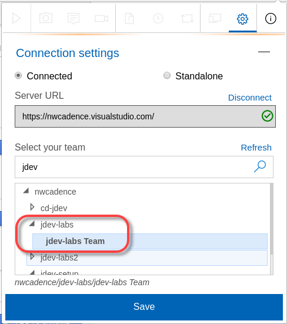

    > **Note**: Your team name may be different

## Configure Branch Policies

In this task you will enforce quality on the master branch by creating branch policies.

1. In Chrome, connect to your Azure DevOps Services Team Project. Click on Code to open the Code Hub.

1. Click the Repo dropdown and select "Manage Repositories".

    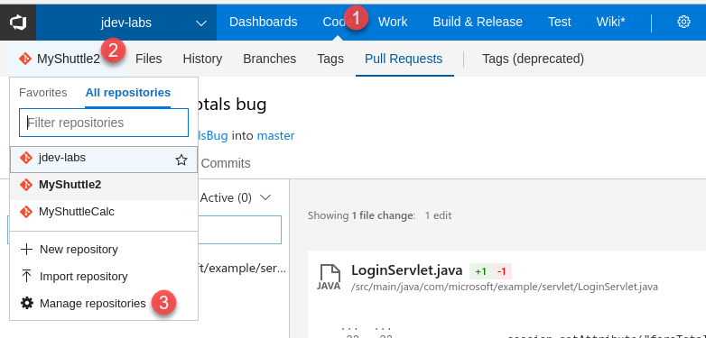

1. In the tree, expand the MyShuttle2 repo and click on the master branch. Click the Branch Policies tab.

    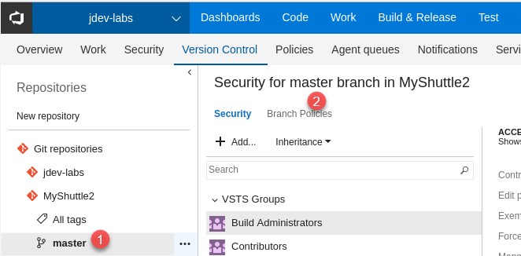

1. Check the Protect this branch checkbox.

1. Check "Check for linked work items" and set the radio to required.

1. Under Build validation, click Add build policy. Select MyShuttle2 from the list of build pipelines and click Save.

    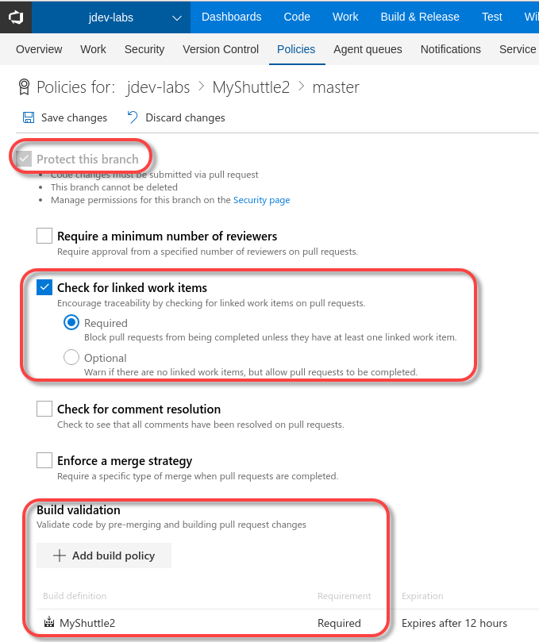

    > **Note**: You can enforce other policy options like comment resolution and minimum number of reviewers, as well as specify the merge options (like squashing). You can also add default reviewers.

## Log a Bug using the Exploratory Test Extension

In this task you will start a test session, discover a bug in the MyShuttle app and log it to Azure DevOps Services.

1. In the Test extension toolbar of the Exploratory Test extension, click the Play icon to start a testing session.

    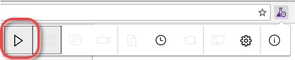

    > **Note**: The test extension is now recording all of your interactions. You can see the test icon beaker has a green dot indicating that a session is currently running.

1. Enter `http://localhost:8081/myshuttledev` in the toolbar to navigate to the application. Enter `fred` for the username and `fredpassword` for the password and click Log In.

    

1. On the Dashboard page, click "Access Your Fare History" to navigate to the fare history page.

1. If you look at the totals for the Fare and Driver column in the table, you will note that the total for the driver column is incorrect.

1. Click the Test Extension beaker icon and click the Camera icon (capture image).

    

1. Capture the grid with the incorrect total. Annotate the image appropriately and click the tick (accept) icon.

    

1. Click the Test Extension beaker icon and click flyout (lower right) of the icon with the page and exclamation mark (new bug). From the menu click Create bug.

    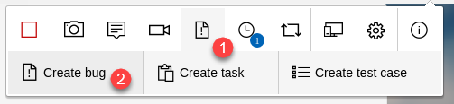

1. In the title box, enter "Driver total incorrect" and click Save.

    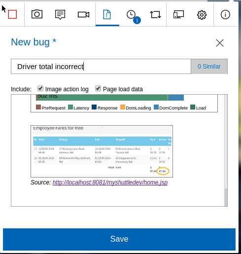

    > **Note**: All the pages visited, notes, screenshots and other information from the test session is included as details for the Bug, so you don't have to add these details manually. You also should see a button next to the title box reading "0 Similar". Azure DevOps Services checks to see if there are bugs already logged with similar titles, therefore minimizing duplicate bugs being logged.

1. Once the bug has been created, click the Stop button in the Test Extension toolbar to end the test session.

1. Navigate to your Azure DevOps Services team project. Click Work to navigate to the Work Hub. In the toolbar, enter "driver" into the Search Work Items box and press enter or click the magnifying glass icon.

    

1. You should see the Bug that you logged. Take a moment to look at the Repro Steps.

    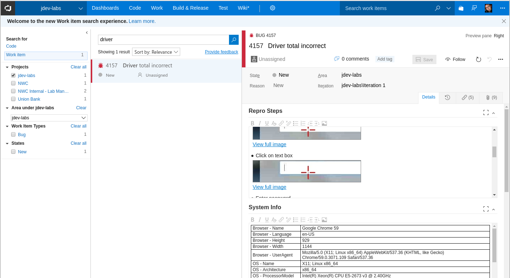

1. Assign the Bug to yourself and change the state to Active. Click Save.

    

## Fix the Bug

In this task you will create a branch of the code to fix the Bug. You will then checkout the branch, fix the bug and commit the code. You will then create a Pull Request to merge the fix into master and see that this triggers the CI/CD pipeline to automatically deploy the fix to the dev environment.

1. Open IntelliJ if it is not already open. Open the MyShuttle2 project.

1. Click VCS->Git->Show History to show the Version Control panel. In the panel, click Work Items. You should see the Bug.

    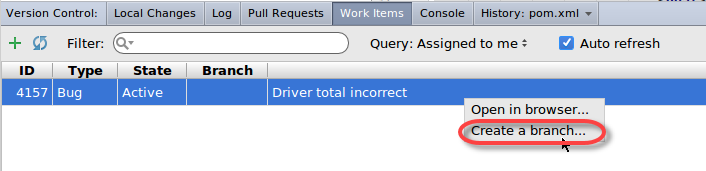

    > **Note**: If you do not see the bug, ensure that it is assigned to you, since by default only work items assigned to you will appear in the work item list.

1. In the dialog, change the branch name to "totalsBug" and click Create.

    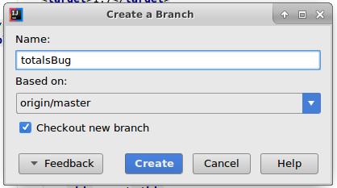

1. The branch is created both locally and in the remote (on Azure DevOps Services). The Azure DevOps Services extension informs you that the new branch has been created and that it has been associated with the Bug.

    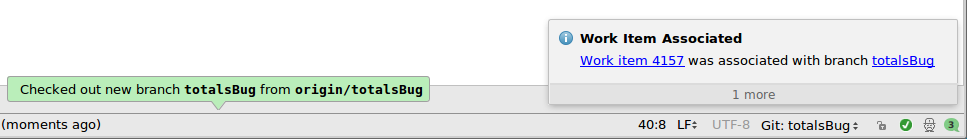

1. In the project view, browse to src/main/java/com.microsoft.example/servlet and open the LoginServlet class.

1. Around line 35, you will see what is causing the bug: the `totalDriverFee` is being calculated but the `driverFeeTotal` session attribute is being set to `totalFareForDriver` (this looks like a classic copy/paste error).

    Change this line of code:
    ```java
        session.setAttribute("driverFeeTotal", totalFareForDriver);
    ```
    to
    ```java
        session.setAttribute("driverFeeTotal", totalDriverFee);
    ```

1. Commit your changes by selecting VCS->Git->Commit File. Enter "Fixing totals bug" as the Commit message.

1. On the upper right of the Commit message box there is an Azure DevOps Services icon. Click it to open the Work Item dialog. This dialog would allow you to associate your commit with a work item. Close the dialog by pressing Cancel.

    > **Note**: In this case we don't need to associate the checkin with the Bug since the branch is already associated with the Bug.

    

1. Hover the mouse over the Commit button and select "Commit and Push" to push the changes to Azure DevOps Services. In the Push commits dialog click the Push button.

    

1. Now that the fix has been pushed to Azure DevOps Services on a branch, you can create a Pull Request. In the Code History panel click the Pull Request tab. Click the green + button to add a new Pull Request. Accept the defaults and click Create Pull Request.

    

1. Once the PR has been created, right-click it in the PR list and click Open in Browser. You should see that the build is running (this is the build mandated by the Branch Policy you set up earlier).

    

    > **Note**: If there was a merge conflict, Azure DevOps Services would warn you on the overview page. If there is no warning to this effect, then Git will be able to auto-merge the PR into the target branch.

    > **Note**: You configured the release to only trigger when successful builds off the master branch are available. Since this build is not building from the master branch, these changes will not yet be deployed.

1. Click on the Files tab to open the file compare. Note the changes.

    

    > **Note**: You can comment on code or files in the PR and have conversations with the team throughout the review process.

1. Click Approve to approve the PR.

1. Now that the policies have been fulfilled, you can complete the PR which will merge the changes into master (the target branch). Click Complete to do the merge.

1. In the dialog, accept the defaults and click Complete merge.

    

1. The PR completion triggers a new build off the master branch, which in turn will trigger a release. _It also transitions the Bug work item to Resolved_.

1. Click on Builds to watch your build. When the build completes, you will see the unit test and code coverage results as well as SonarQube analysis and quality gates (if you have configured SonarQube integration).

1. Click on Releases and open the latest release which should have triggered off the PR merge build completion event.

1. On the Release Summary page, you will see the linked Bug work item.

    

1. Click on commits to see the incoming commits for this release. There is the commit to fix the bug as well as the commit to merge into master.

    

1. Click on the Tests tab to see the test results. The UI tests should be passing.

1. Open the MyShuttle2 app by navigating to `http://localhost:8081/myshuttledev`. Log in again and verify that the totals column is correct and the Bug has been fixed.

    
