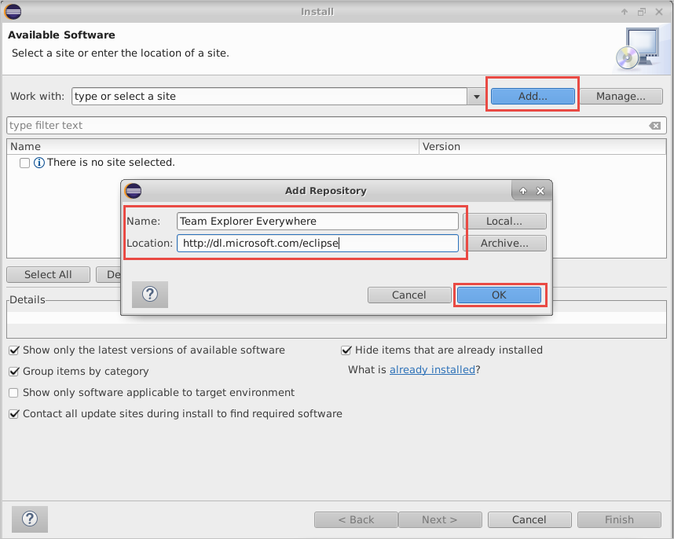
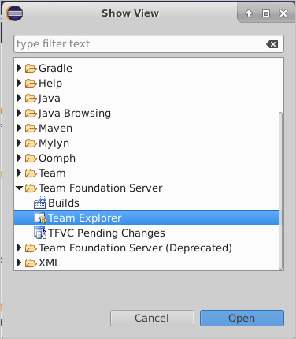
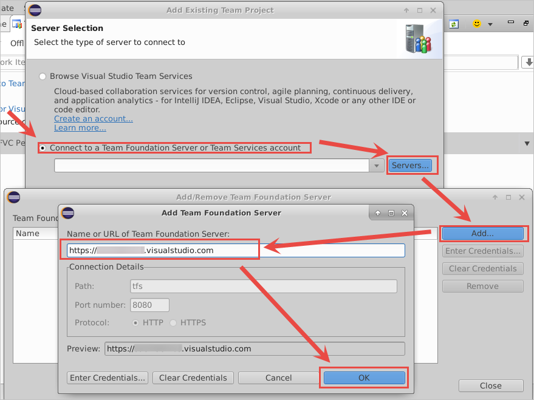
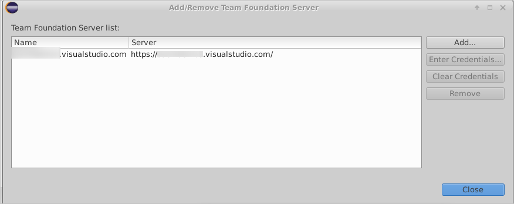
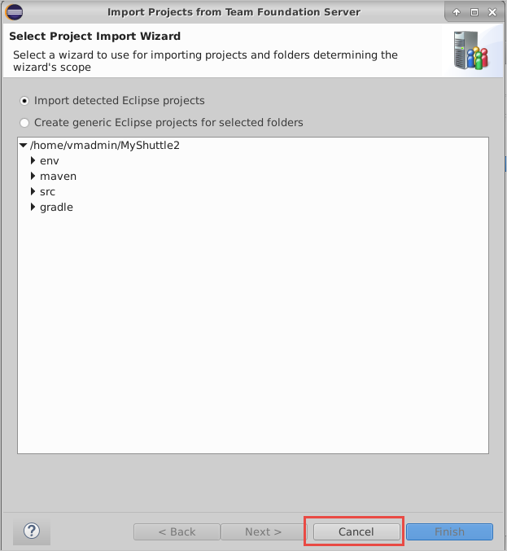
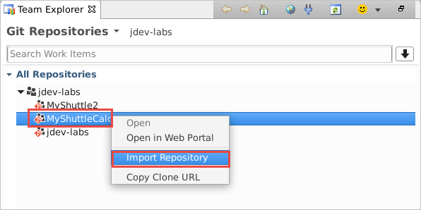
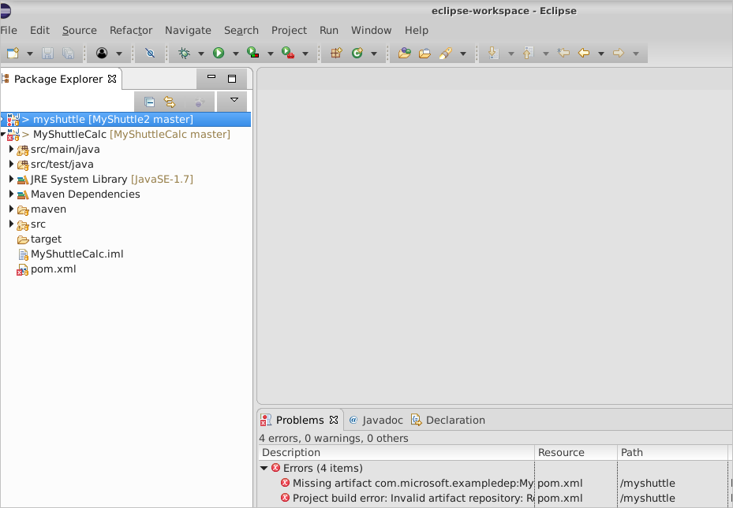

# Clone an Azure DevOps Services Git repo using Eclipse

In this exercise, you are going to import the MyShuttle2 repo within your organization into to your VM for editing in Eclipse.

> [!NOTE]
> These Hands-On Labs use a virtual machine with a Java environment configured by our partner, [Northwest Cadence](https://www.nwcadence.com/).
>
> **[Learn how to connect to the Java VM environment here](https://github.com/nwcadence/java-dev-vsts)**.

## Prerequisites

This exercise assumes you have completed [the Azure DevOps Services Java project setup tutorial](../settingvstsproject/index.md), have created a Team Project that uses Git for version control, and imported the MyShuttle2 GitHub repo into your team project. This exercise uses a team project named **jdev**, though your team project name may differ.

## Connect to Azure DevOps Services from Eclipse

1. Click on the Eclipse icon in the toolbar to open the Eclipse Java IDE.

    

2. The first time you run Eclipse, it will prompt for default workspace. Click on the box "Use this as the default and do not ask again" to use the default workspace on startup.

    

3. When the Welcome dialog appears, on the Help Menu select Install New Software.

    

4. Choose the Add button to add a new repository.  Use Team Explorer Everywhere as the name. The location of the update site is `https://dl.microsoft.com/eclipse`. 

    

5. Choose the OK button.

6. In the list of features in the Install dialog box, select the check box that corresponds to the Team Explorer Everywhere plugin. If you don't see this option, use the pull-down menu for "Work with:" and find the update site URL you just entered in the list and select it, then select the check box beside the plug-in mentioned above.

    

7. Choose Next two times. Accept the license agreement and choose Finish

8. Eclipse will need to restart.

9. When Eclipse restarts, the Welcome dialog will appear again. Choose Windows > Show View and select Other...

    

10. Search for Team Explorer, select the Team Explorer View, and select OK.

    

11. Click on "Connect to Azure DevOps Services ..." to sign in to your organization.

    

12. Choose the radio button next to "Connect to a Team Foundation Server or Azure DevOps Services" then press the "Servers..." button. In the "Add/Remove Team Foundation Server" panel, click "Add..." and type in the name of the organization (`https://{your-account-name}.visualstudio.com`) in the "Add Team Foundation Server" panel. Then press the OK button.

    

13. The "Follow the instructions to complete sign-in" window will pop up. Click on the hyperlink to be redirected to the Device Login page in a browser on the VM (may have a black background for security purposes).

    

14. Copy the code in the text field in Eclipse and paste it into the browser page, then press the "Continue" button. Then sign in with your credentials used to access Azure DevOps Services. If you get the credentials wrong you can try again by closing Eclipse, deleting ~/.microsoft/Team Explorer/4.0/*, and restarting Eclipse.

    

    

15. Back in Eclipse, press the OK button in the device login window. The organization should now show up in the list of servers to connect to. Press the "Close" button to close the current window.

    

## Clone MyShuttle2 from Azure DevOps Services with Eclipse

1. Once you have authenticated, click the "Next" button in the "Add Existing Team Project Window" to view team projects in Azure DevOps Services.

    

    Select the appropriate team project in Eclipse, then press the "Finish" button.

1. In the Team Explorer Everywhere panel, choose the "Git Repositories" panel, then select the MyShuttle2 repo in the team project and right-click the repo and select "Import Repository."

    

    

1. Leave the defaults for the parent directory and repo folder name, then press the next button. This will clone the repo onto the VM.

    

1. In the "Import Projects from Team Foundation Server" window, click the cancel button. We will instead import the project as a Maven project instead of Eclipse project.

    

1. In Eclipse, navigate to File -> Import... to open the "Import" window.

    

1. In the Import window, expand the Maven folder and choose "Existing Maven projects." Then press the Next button.

    

1. For the root directory, click on the Browse button or type in the root directory path of /home/vmadmin/MyShuttle2. The pom.xml file should appear under projects to indicate the Maven project. Additionally, click the checkbox next to "Add project(s) to working set" to add myshuttle to the working set to access in the Package Explorer window as a separate project. Then click the Finish button.

    

1. Click on Window -> Show View -> Package Explorer in the toolbar at the top of Eclipse to view the myshuttle project in Eclipse in Package Explorer. You may have to minimize other windows to view the Package Explorer view cleanly.

    

   > **Note**: The project will not currently compile and there may be build errors temporarily, since it has a dependency on a library (MyShuttleCalc) that it cannot resolve. You will fix this in the Package Management lab.

## Clone MyShuttleCalc from Azure DevOps Services with Eclipse

1. Repeat cloning a repository for MyShuttleCalc.

1. In the Team Explorer Everywhere panel, choose the "Git Repositories" panel, then select the MyShuttleCalc repo in the team project and right-click the repo and select "Import Repository."

    

    

1. Leave the defaults for the parent directory and repo folder name, then press the next button. This will clone the repo onto the VM.

    

1. In the "Import Projects from Team Foundation Server" window, click the cancel button. We will instead import the project as a Maven project instead of Eclipse project.

    

1. In Eclipse, navigate to File -> Import... to open the "Import" window.

    

1. In the Import window, expand the Maven folder and choose "Existing Maven projects." Then press the Next button.

    

1. For the root directory, click on the Browse button or type in the root directory path of /home/vmadmin/MyShuttleCalc. The pom.xml file should appear under projects to indicate the Maven project. Additionally, click the checkbox next to "Add project(s) to working set" to add myshuttle to the working set to access in the Package Explorer window as a separate project. Then click the Finish button.

    

1. Click on Window -> Show View -> Package Explorer in the toolbar at the top of Eclipse to view the myshuttle project in Eclipse in Package Explorer. You may have to minimize other windows to view the Package Explorer view cleanly.

    
