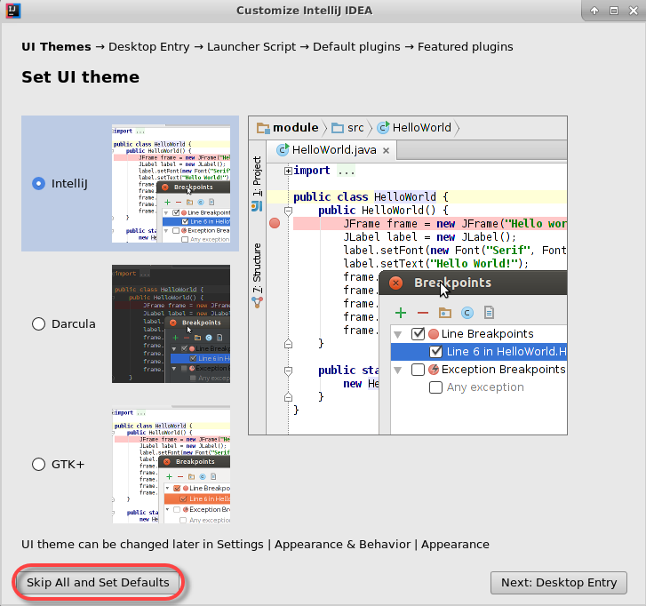
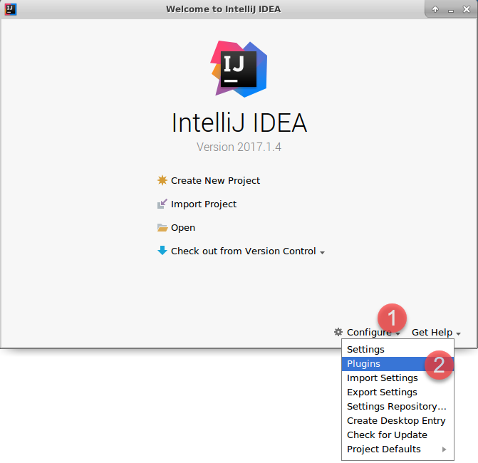
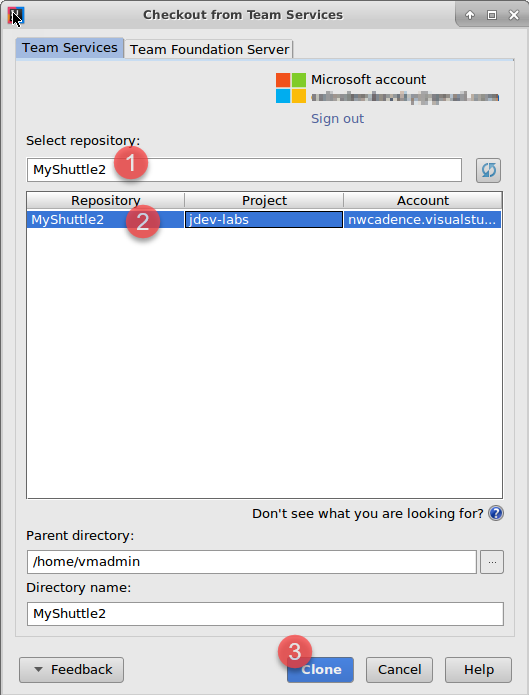
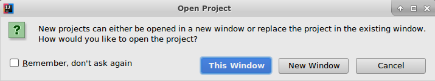
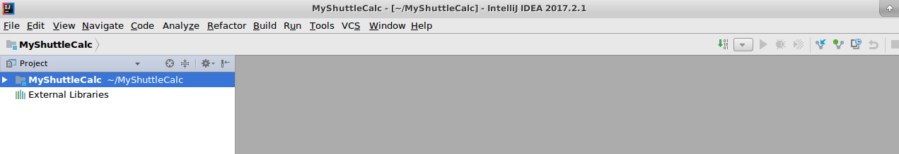

# Clone an Azure DevOps Services Git repo using IntelliJ

In this exercise, you are going to open the MyShuttle2 repo from your organization in your VM for editing in IntelliJ.

> [!NOTE]
> These Hands-On Labs use a virtual machine with a Java environment configured by our partner, [Northwest Cadence](https://www.nwcadence.com/).
>
> **[Learn how to connect to the Java VM environment here](https://github.com/nwcadence/java-dev-vsts)**.

## Prerequisites

This exercise assumes you have completed [the Azure DevOps Services Java project setup tutorial](../settingvstsproject/index.md), have created a Team Project that uses Git for version control, and imported the MyShuttle2 GitHub repo into your team project. This exercise uses a team project named **jdev**, though your team project name may differ.

## Connect to Azure DevOps Services from IntelliJ

1. Click on the IntelliJ icon in the toolbar to open IntelliJ IDEA.

    

2. The first time you run IntelliJ, it will prompt for IntelliJ settings and theme settings. Click on "Do not import settings," then click on "Skip All and Set Defaults" to use the defaults.

    

3. When the Welcome dialog appears, click Configure and then select Plugins.

    

4. In the search box type `Azure DevOps Services` and click the "Search in repositories" link in the main window.

    

5. Click install to install the extension. The install button will change to a "Restart" button - click it to restart IntelliJ.

    

6. When IntelliJ restarts, the Welcome dialog will appear again. Click "Check out from Version Control" and select "Azure DevOps Services Git".

    

7. Click on "Sign in..." to sign in to your organization.

    

## Clone MyShuttle2 from Azure DevOps Services with IntelliJ

1. Once you have authenticated, enter "MyShuttle2" into the search bar and select the MyShuttle2 repo from your team project. Click the Clone button to clone the repo to the VM.

    

1. IntelliJ detects a Maven project file (pom.xml) and asks if you want to open it. Click "Yes" to open the project. You can dismiss the Tip of the Day dialog that appears.

1. Press "Alt-1" to open the Project View.

1. Expand `src\main\java\com.microsoft.example` and click on "DataAccess" to open the DataAccess class.

1. A yellow warning appears in the main editor window prompting you to "Setup SDK". Click on the link.

    

1. In the Select Project SDK dialog, click "Configure..."

    

1. In the upper left, click the green "+" icon to add a new SDK.

    

1. Select `java-8-openjdk-amd64` from the folder list and click OK. Click OK back through the rest of the dialogs.

    

    > **Note**: The project will not currently compile, since it has a dependency on a library (MyShuttleCalc) that it cannot resolve. You will fix this in the Package Management lab.

## Clone MyShuttleCalc from Azure DevOps Services with IntelliJ

1. While the MyShuttle2 project is open in IntelliJ, in the toolbar at the top of IntelliJ, select File -> New -> Project from Version Control -> Azure DevOps Services Git.

    

1. Enter "MyShuttleCalc" into the search bar and select the MyShuttleCalc repo from your team project. Click the Clone button to clone the repo to the VM.

    

1. IntelliJ will prompt to open the project in the same or a new window. Choose "New Window" to open another instance of IntelliJ with the MyShuttleCalc project.

    

1. IntelliJ should open in a new instance with the project loaded.

    
