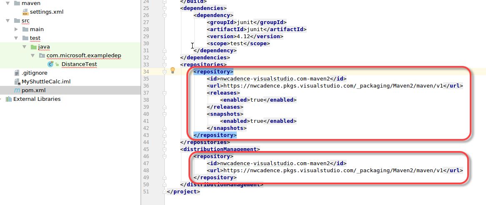
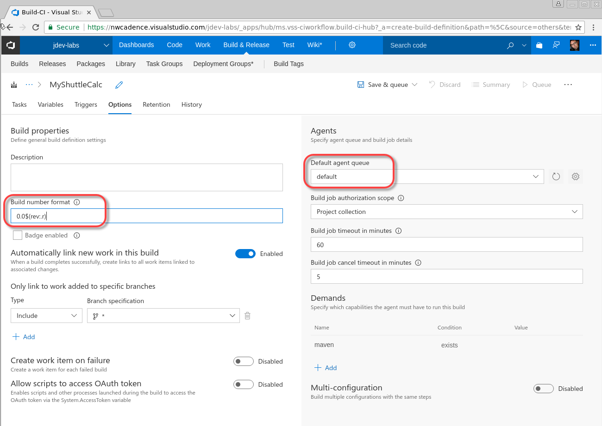
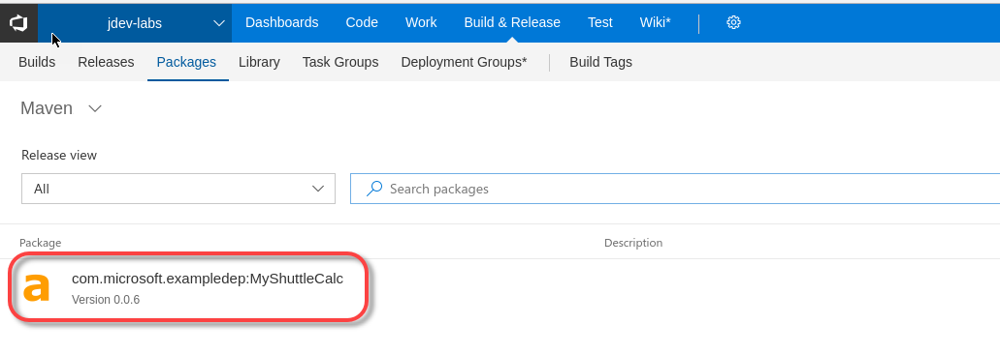

# Configure Azure DevOps Services for Maven package management

In this exercise, you are going to set up package management with Maven in Azure DevOps Services. This repo contains a class library (MyShuttleCalc) that is used by the MyShuttle2 application. You will configure an Azure DevOps Services build to publish the MyShuttleCalc package to an Azure DevOps Services Maven Package feed so that it can be consumed by MyShuttle2 and any other applications that require the calculation code.

> [!NOTE]
> These Hands-On Labs use a virtual machine with a Java environment configured by our partner, [Northwest Cadence](https://www.nwcadence.com/).
>
> **[Learn how to connect to the Java VM environment here](https://github.com/nwcadence/java-dev-vsts)**.

## Prerequisites

This exercise assumes you have completed the exercises to create a Team Project, have set up the Docker private Azure DevOps Services agent, and imported the MyShuttleCalc and MyShuttle2 GitHub repos into your Azure DevOps Services team project. This exercise also assumes that you have cloned the repos in either [IntelliJ](../intellijgit/index.md) or [Eclipse](../eclipsegit/index.md) This exercise uses a team project named **jdev**, though your team project name may differ.

> **Note**: This exercise shows how to do a Maven build using just Azure DevOps Services. To see how to perform a Maven build using Jenkins that still integrates into the Azure DevOps Services Package Feed, please refer to the Maven Package Management with Azure DevOps Services Team Build lab.

## Create a Maven Package Feed

In this task you will create a Maven package feed. You will publish packages to this feed as well as consume packages from this feed.

1. In Azure DevOps Services, click on "Build & Release" and then Packages to go to the Package Hub. Click "+ New Feed" to create a new feed.

    

1. Enter "Maven" for the feed name and click "Create".

    

You now have a feed that you can publish package to.

## Create a Maven Settings File with the Feed Credentials

In this task you will create credentials for the Maven feed. You will then create a settings.xml file containing the credentials.

1. In the Packages Hub, make sure you have selected the Maven feed and click "Connect to Feed".

1. In the left menu, click on Maven.

> **Note**: At the time of writing, Maven package feeds are a preview feature. You will need to enable the Maven package feed feature in order to connect to Package Management to/from Maven.

1. Click "Generate Maven Credentials"

    

1. Azure DevOps Services creates a credentials snippet. Click the Copy to Clipboard button to copy the snippet to the clipboard.

    

1. In your editor, open the `MyShuttleCalc\maven\settings.xml`.

1. Delete the comment `<!-- paste maven package feed credentials section here !-->` and replace it with the snippet between the `<servers>` and `</servers>` tags so that the final result looks like this:

    

1. Press Ctrl-S (or File->Save) and save the file.

1. In Azure DevOps Services, go back to the Connect to Feed dialog on your Maven feed. Click on the copy button in the section labeled `Add this feed to your project pom.xml inside the <repositories> tag`.

    

1. In your editor, open the `pom.xml` file. Update the `<repositories>` tag as well as the `<distributionManagement>` tag so that they point to your feed.

    

1. Commit your changes to the repo.

    > **Note**: If this is your first commit to Azure DevOps Services, you will be prompted to update your display name and email address for the repo. These are simply for display purposes, but usually are matched to your Azure DevOps Services profile.

**IntelliJ**

Click VCS->Commit Changes to commit your changes to the repo.


- Enter "Adding maven credentials" to the commit message.

- Click the drop-down next to the Commit button and select "Commit and Push".

**Eclipse**

>Note: Use the personal access token (PAT) generated from the "Set up a Docker Build" lab that should be located at: `home/vmadmin/pat.txt`. Otherwise, follow the instructions from that lab again to generate a new PAT.

- In Eclipse, right click on the project or the pom.xml file and select Team->Commit.

- Enter "Adding maven credentials" to the commit message.

- Click the "Commit and Push" button.

- Verify that the correct remote is being pushed to, then click the "Next" button.

- If a window pops up that prompts for credentials, use the following values:

    | Name | Value |
    |---|---|
    | User | `_Azure DevOps Services_Code_Access_Token` |
    | Password | `{PAT that you copied earlier}` |

  

1. **Important**: Copy the maven settings file to the .m2 directory so that local Maven operations will succeed by running the following command in a terminal:

    ```sh
    cp ~/MyShuttleCalc/maven/settings.xml ~/.m2/
    ```

1. **Important**: If you have the MyShuttle2 project already open in IntelliJ or Eclipse, close the instance of the IDE and reopen it.

## Creating an Azure DevOps Services Build for Publishing a Maven Package

In this task you will create a build that will publish the MyShuttleCalc library to the Maven feed.

1. Open Azure DevOps Services and connect to your team project. Click on the Build & Release Hub and then click Builds. Click on +New to create a new build pipeline.

    

1. In the templates window, type "maven" into the search box. Click apply on the Maven template.

    

1. In the Process page, change the name of the build to "MyShuttleCalc".

    

1. Click on Options.

1. Update the Build number format to `0.0$(rev:.r)` and update the build queue to `default` (this is the queue that the Azure DevOps Services agent in the container is joined to).

    

1. Click on Tasks. Click on the Maven task. Edit the following settings:

    | Field | Value | Notes |
    |---|---|---|
    | Options | `--settings ./maven/settings.xml` | Required to authenticate when pushing the Maven package to the feed. |
    | Goal(s) | `deploy -Dbuildversion=$(Build.BuildNumber)` | Tell Maven to publish the package, passing in the build number |
    | Code Coverage Tool | `JaCoCo` | Change the code coverage format |
    | Source Files Directory | `src/main` | These files must be included in the coverage results |

    

1. Click Save and Queue. Accept the defaults to queue the build.

1. A green status bar indicates that the build has been queued. Click the build number to follow the logs in real time.

    

1. When the build completes successfully, you can click on the build number to view the summary. Note the test results and code coverage.

    

   > **Note**: Each time you run the build, the patch number (the last of the 3-digit version numbers) will increment. In the image above, the build has run 6 times so the latest build number is 0.0.6. The package version matches the build number because we supplied the build version number to Maven in the Maven task.

1. Navigate back to the Maven package feed. There you will see the MyShuttleCalc package.

    
