# Configure SonarQube for your Azure DevOps Services Java project

In this exercise, you are going to configure integration between the build system and SonarQube. [SonarQube](https://www.sonarqube.org/) is a well established technical debt management system. Keeping tabs on your technical debt gives you objective measures that you can use to make informed decisions about maintenance, refactoring and enhancements to your code base.

> [!NOTE]
> These Hands-On Labs use a virtual machine with a Java environment configured by our partner, [Northwest Cadence](https://www.nwcadence.com/).
>
> **[Learn how to connect to the Java VM environment here](https://github.com/nwcadence/java-dev-vsts)**.

## Prerequisites

This exercise assumes you have completed the exercises [to create a Team Project](../settingvstsproject/index.md) and have [set up the Docker private Azure DevOps Services agent](../dockerbuildagent/index.md). You should also have [created an Azure DevOps Services Team Build for MyShuttle2](../builddocker/index.md). This exercise uses a team project named **jdev**, though your team project name may differ.

> [!NOTE]
> SonarQube is running in a docker container on your VM. It is only accessible from within the VM. It is therefore not secure - this is not a recommended production configuration.

## Create a SonarQube Endpoint in Azure DevOps Services

In this task you will create a Generic SonarQube Endpoint in Azure DevOps Services. This endpoint abstracts authentication from the build tasks themselves. After obtaining a token from SonarQube, you will create the endpoint in Azure DevOps Services.

1. Connect to the virtual machine with the user credentials which you specified when creating the VM in Azure.

1. Open Chrome and browse to `http://localhost:9000` to open SonarQube. Click on Login.

    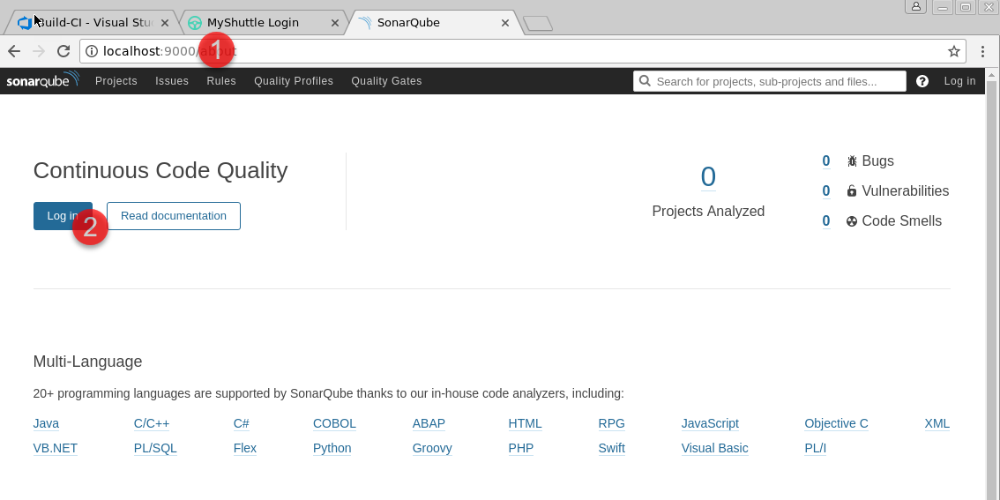

1. Log in as the administrator using username `admin` and password `admin`.

1. Open a new tab in Chrome and browse to `http://<youraccount>.visualstudio.com` (where `youraccount` is the account you created in Azure DevOps Services).

1. Click on the `jdev` team project to navigate to it.

1. Click on the gear icon and select Services to navigate to the service connection configuration page. Click "+ New service connection" and select Generic from the list of options. Enter the following information and click OK.

    | Property | Value | Notes |
    | --------------- | ---------------------------- | ----------------------------------------------------------- |
    | Connection name | `Azure VM SonarQube` | Display name for the endpoint |
    | Server URL | `http://10.0.0.4:9000` | The URL for the SonarQube server. Use the Azure internal network IP address so that the build agent running in the Docker container can reach Sonarqube. |
    | User name | `admin` | This could be anything - it won't be used for SonarQube since the token is sufficient |
    | Password/Token Key | `admin` | The default password for admin user in SonarQube |

    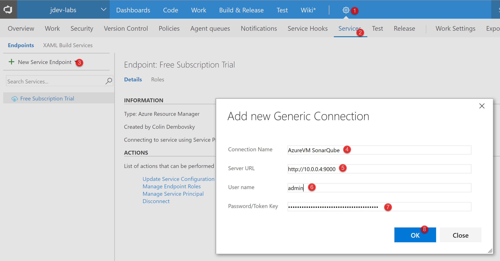

## Create a SonarQube Project

In this task you will create a SonarQube project.

1. In Chrome, go back to SonarQube (http://localhost:9000) and log in as administrator if you are not already logged in.

1. Click on Administration in the toolbar and then click on the Projects tab.

1. Click the Create Project button.

    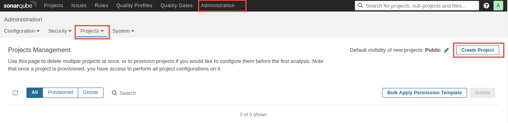

1. Enter `MyShuttle2` for both the name and key of the project (name is the display name and key is the unique identifier within SonarQube).

    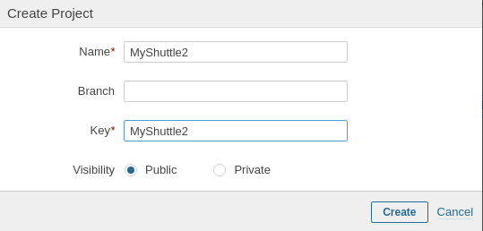

## Modify the Build to Integrate with SonarQube

In this task you will modify the MyShuttle2 build to integrate with SonarQube.

1. In Azure DevOps Services in your browser, click on Build & Release and then Builds to view your builds. Click on the MyShuttle2 build. Click on the "..." to the right of the build pipeline, then click the "Edit" button.

    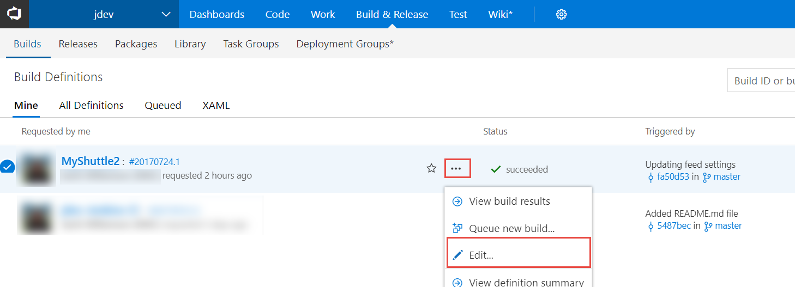

1. Click on the Maven task.

1. Scroll down to the Code Analysis section.

1. Check the "Run SonarQube Analysis" checkbox

1. Configure the remaining settings as follows:

    | Parameter | Value | Notes |
    | --------------- | ---------------------------- | ----------------------------------------------------------- |
    | SonarQube Endpoint | `<your endpoint>` | The generic service connection to SonarQube you just created |
    | SonarQube Project Name | `MyShuttle2` | The name of the project in SonarQube |
    | SonarQube Project Key | `MyShuttle2` | The key of the project in SonarQube |
    | SonarQube Project Version | `1.0` | A major version number |
    | Include full analysis report... | Checked | Waits for SonarQube analysis to complete before proceeding |
    | Fail the build on quality gate failure... | Checked | Fails the build if SonarQube quality gates fail |

    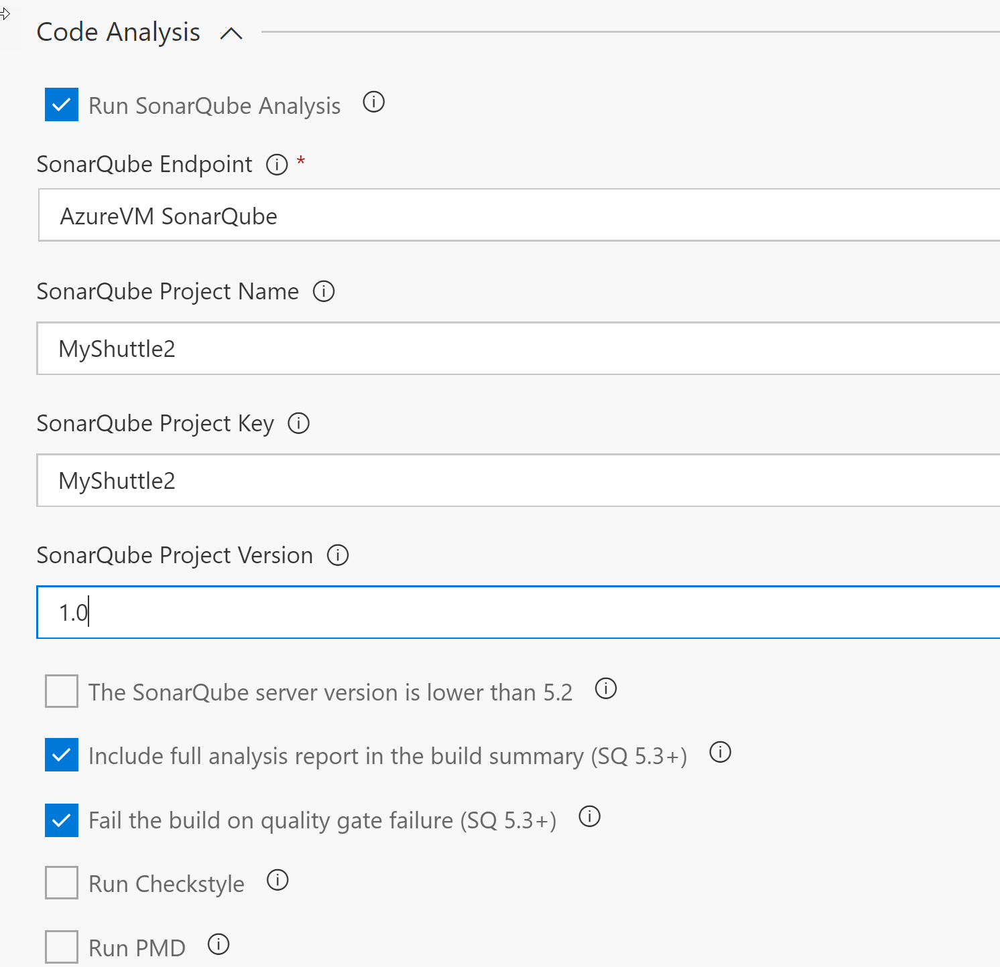

1. Save and queue the build.

1. When the build completes, there will be a new SonarQube section in the summary page. Click on the build number and scroll below issues to see the SonarQube status.

    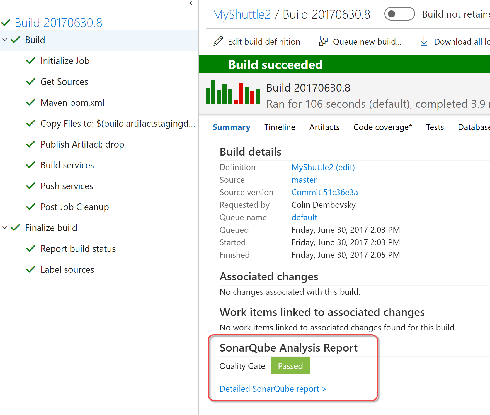

1. Click on the Detailed Report link to open the project in SonarQube.

    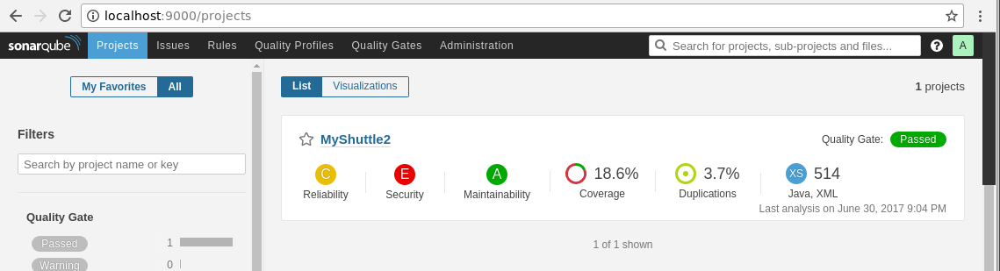

1. You can click on the MyShuttle2 project to get details of the analysis for the project.

## Updating a Quality Gate

In this task you will update a quality gate in SonarQube and see that failing the quality gate fails the build. You will then update the gate to warn rather than fail.

1. In SonarQube (http://localhost:9000) click on the Quality Gates in the top toolbar. Click on "SonarQube Way" (the default quality gate) to see its settings. Click on the "Add Condition" dropdown at the bottom of the list of rules and select Coverage.

    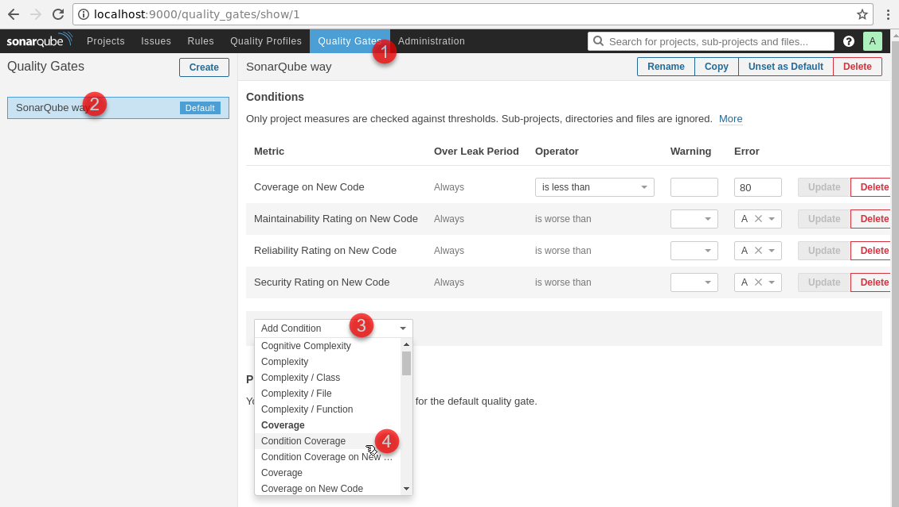

1. Enter 50 for the Warning value and 30 for the Error value and click add.

    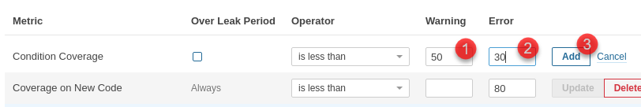

1. Back in Azure DevOps Services, queue another MyShuttle2 build.

1. When the build completes, it should have a failed result. Click on the build number and look for the SonarQube section in the summary page.

    

1. Go back to SonarQube and edit the Quality Gate that you just modified. Clear the Error value so that you only get a warning if the coverage < 50% instead of failing the build, then click the update button. Additionally, under the Coverage on New Code metric, move the 80% to a warning message instead of error and update. In the Reliability Rating on New Code metric, change the error threshold from A to blank (click on the "X" next to the A), then click on **Update**.

1. Queue a new build and see that now the build succeeds, but there is a Quality Gate warning.

    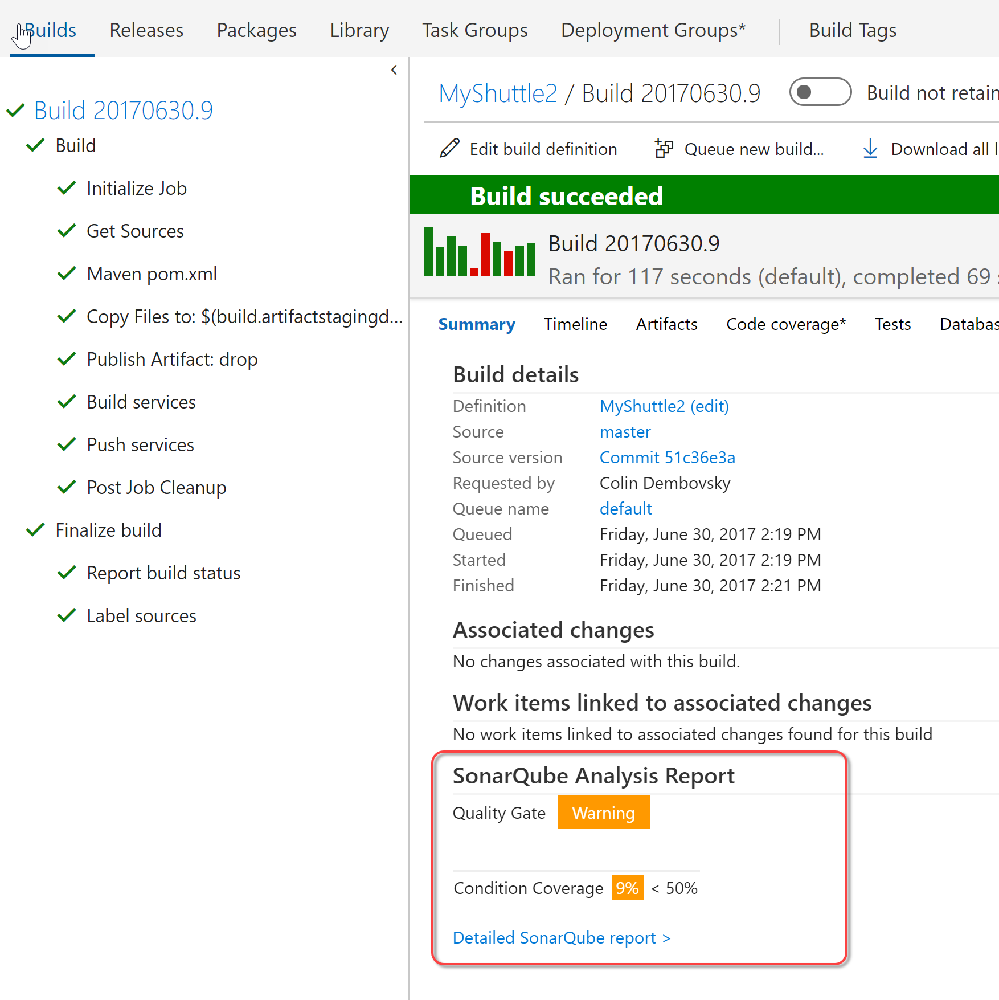
