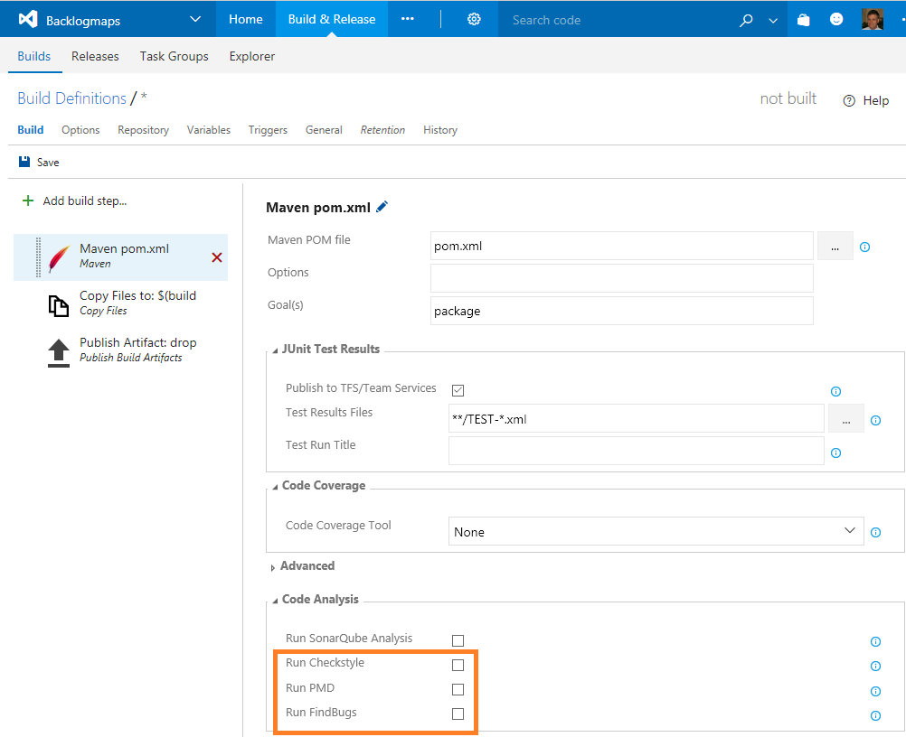

---
title: Use standalone static analysis
description: Learn how to use PMD, Checkstyle, and FindBugs with Azure DevOps Services and TFS for Java development
ms.prod: devops
ms.technology: devops-cicd
ms.topic: conceptual
ms.custom: java
ms.manager: mijacobs
ms.author: dastahel
author: davidstaheli
ms.date: 01/22/2018
monikerRange: '>= tfs-2017'
---

# Use PMD, Checkstyle, and FindBugs with Azure DevOps Services and TFS for Java development

Use [PMD](https://pmd.github.io/), [CheckStyle](http://checkstyle.sourceforge.net/), and [FindBugs](http://findbugs.sourceforge.net/) standalone static analysis during a Maven or Gradle build using TFS 2017+ or Azure DevOps Services. 

## Enabling analysis

To use these tools you simply check the corresponding checkbox in the **Static Analysis** section of a [Maven build task](/azure/devops/pipelines/tasks/build/maven) or [Gradle build task](/azure/devops/pipelines/tasks/build/gradle).

> [!div class="mx-imgBorder"]
> 

## Reviewing the build summary and artifacts

The build summary reports the number of issues found by each of the tools you have activated.

> [!div class="mx-imgBorder"]
> 

Detailed issue logs are available under the build artifact tab of the build summary. If you analyze a multi-module Maven project, the results are split by module.

> [!div class="mx-imgBorder"]
> 

PMD, CheckStyle and FindBugs support for Maven and Gradle is currently available in Azure DevOps Services or TFS 2017 Update 1 or later.

## Next Steps

For more detailed instructions on enabling static analysis tools, which default rules are activated and how to configure them, see the following blog posts:
 - [Maven and Gradle build tasks support powerful code analysis tools](https://devblogs.microsoft.com/devops/maven-and-gradle-build-tasks-support-powerful-code-analysis-tools/)
 - [The Maven build task now supports PMD analysis out of the box](https://devblogs.microsoft.com/devops/the-maven-build-task-now-supports-pmd-analysis-out-of-the-box/)
 - [Maven and Gradle build task support Checkstyle analysis](https://devblogs.microsoft.com/devops/gradle-build-task-supports-checkstyle-analysis/)

