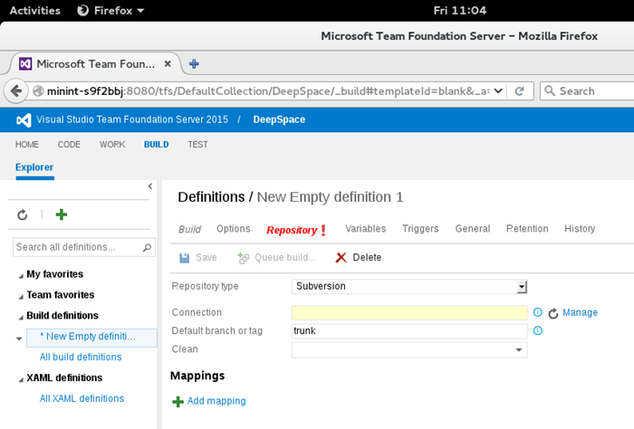
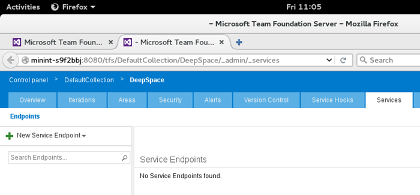
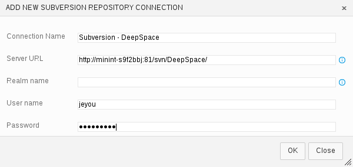
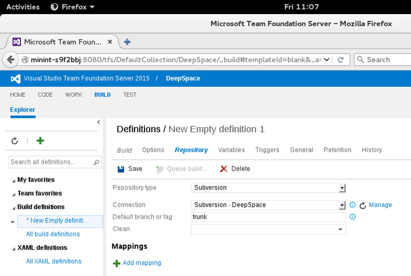
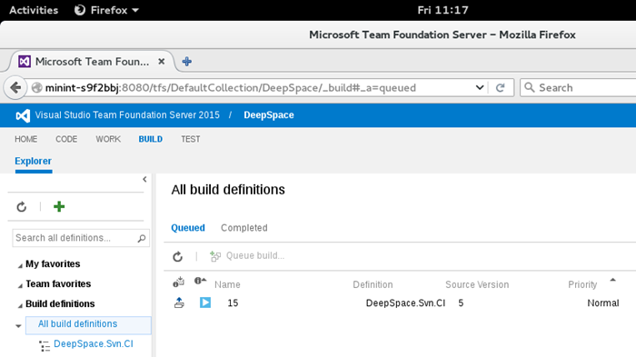

# Use Subversion with Azure DevOps or Team Foundation Server (TFS) for Java development

Use Subversion for source control with Azure DevOps Services or TFS for your Java project.

## Prerequisites

 - You have an Azure DevOps Services Team Foundation  team project available. If you don't, check out our [Azure DevOps Projects for Java topic](/azure/devops-project/azure-devops-project-java). (Note: This will also create an Azure DevOps Services Git repo, which you do not need to use. We will use the Azure DevOps Services or TFS Team)
 - If you would rather use your own Subversion repository, you'll need the connection details for it and should be prepared to commit a change.

In this guide, you will build a Java project (create a WAR file) using Maven. We will lead you through the steps to: 
   1. Create a new build pipeline that uses code in a Subversion repository; 
   2. Add a build step to run Maven; 
   3. Configure the Maven build options; 
   4. Set up continuous integration for the project; 
   5. Queue a manual build of the project; 
   6. Commit a change to the Subversion repository and get a continuous integration build via polling.

## Create a new Build Pipeline
From within your team project, click on the **Build** menu option at the top left of the webpage. Now let's create the build pipeline we'll use to build the DeepSpace solution stored in our Subversion repository.

> [!div class="mx-imgBorder"]

Click the green + sign in the left build pane (appears above the build pipelines list). Once you click, the "Create New Build Pipeline" dialog will appear. In that dialog, select the "Empty" build template (at the bottom of the list) and click **OK**.

> [!div class="mx-imgBorder"]

## Add the Maven build task
Next, add a new build step by clicking **Add build step** under the "Pipelines" window.

> [!div class="mx-imgBorder"]

The "Add Tasks" window will appear. Within this window, select **Maven (Build with Apache Maven)**, click the **Add** button associated with Maven, and then click **Close** (as shown in the image below).

> [!div class="mx-imgBorder"]

## Configure the Maven build
Once you have created the new build pipeline with the single build step for Maven, you need to configure one of the Maven options. In the Maven POM file text box, enter `pom.xml`. This should be the only option you need to configure.

> [!div class="mx-imgBorder"]

## Choose Subversion as the Repository type
Click on the **Repository** tab and change the **Repository type** to "Subversion". Notice that the **Connection** property requires a value which is indicated by the background color of the textbox changing to yellow. This is the name of the **Connection** (or "service connection") that will be used to connect to the Subversion repository.

> [!div class="mx-imgBorder"]

To create the necessary endpoint, click the **Manage** link. This will open the services administration page for the team project.

> [!div class="mx-imgBorder"]

Select **+ New service connection** in the left pane and choose **Subversion** from the dropdown list. Once you click, the "Add New Subversion Repository Connection" dialog will appear.

> [!div class="mx-imgBorder"]

Enter the friendly name you wish to use for this connection. The name should be unique in the list of connect services and something easy to remember (e.g, "Subversion - DeepSpace"). Next, enter the Server URL, User name and Password used to connect to the desired Subversion repository. Click **OK**.

Go ahead and close the services administration web page to get back to the build pipeline. Now that you're back on the **Repository** tab, click the **Refresh** button next to the **Manage** link. Once you do, the **Connection** property will be populated with the "Subversion - DeepSpace" value. If you have more than one value in the **Connection** drop down, ensure that you select the one pointing to the Subversion repository. When complete, your repository tab should look similar to the image below.

> [!div class="mx-imgBorder"]

## Optional: Add Mappings
If you are using your own repository (and not the DeepSpace repository), you can optionally add mappings which define the server-side folders that will be checked out on the build machine. This allows you to only bring down the necessary code to build a portion of the repository. If you do not add any mappings, the entire Subversion repository will be downloaded (and this is what we will do for the DeepSpace project).
If you do add mappings for your repository, you will need to provide the **Server path** (the path in the Subversion repository), a **Local path** (a relative path for mapping the solution on the build agent), the **Revision** you want to pull from that path, the **Depth** (Empty, Files, Children or Infinity) and whether to **Ignore externals**.

## Enable Continuous Integration and Scheduled Triggers
Next, click on the **Triggers** tab. If you selected the **Continuous integration (CI)** checkbox during the creation of the build pipeline, the Triggers tab should look like the image below. If it does not, go ahead and select the **Continuous integration (CI)** checkbox now. For the purposes of this walkthrough, set the **Polling interval (seconds)**" to 60 seconds. Also, if you'd like, check the box next to** Scheduled** and select a date+time period you'd like a build to start.

> [!div class="mx-imgBorder"]

Save the pipeline by clicking the **Save** button. Give the pipeline a name like "DeepSpace.Svn.CI".

## Queue a Manual Build
Now that you have created a build pipeline, let's manually queue our first build of the project. Click on the **Queue build...** menu option under your "DeepSpace.Svn.CI" build pipeline. This will display a window titled "Queue Build For DeepSpace.Svn.CI" giving you an option to pick a build queue to use (for now, leave this as the default). Click **OK**. A build progress console window will appear and reflect the output of the Maven build task (you will see that the code is being pulled from the Subversion repository). The build can take a few seconds to a minute to begin and may last a few minutes. You will know the build is complete when a green bar is displayed showing "Build Succeeded" as in the image below.

> [!div class="mx-imgBorder"]

## Commit a change to the Subversion repository
Now that the manual build has completed, let's ensure that the polling trigger can identify our changes and build them automatically. On a development machine with the Subversion client tools, check out the DeepSpace repo (or your own) so you can make a change. If you're using the DeepSpace repository, update the "src/main/webapp/js/directivesFlyingStars.js" file by uncommenting line 44 to show the slider for the star count. If you're using your own repository, make some change in that source. Commit the change and provide a commit message. After the change has been committed, the polling trigger will detect the changes in the repository and queue a build.
Here's what the build queued via polling will look like in the build queue: 

> [!div class="mx-imgBorder"]

The image below shows the four builds that were run during this walkthrough.

> [!div class="mx-imgBorder"]

Build 12 was the manual build we ran in the previous step. Build 13 is the initial build performed by the polling trigger (the polling trigger ran and found that it needed to queue a build). Build 15 is the build performed by the polling trigger when it detected the commit we made during this step (Source Version is 5). Finally, Build 16 was the scheduled build we set up in a previous step.

Congratulations! You've successfully created a build pipeline that polls for changes in a Subversion repository and queues a build for those changes.

## Frequently Asked Questions (FAQ)

**Q: What does the value of "Default branch or tag" represent?**

**A:** You can change this value to build a default branch (or tag) in your Subversion repository with this build pipeline. For instance, if you want to create a Release build pipeline to build a "branches/releases/v14.0" branch, you would set the value of "Default branch or tag" to "branches/releases/v14.0".

**Q: What does "Batch changes" do? And what if I uncheck it?**

**A:** When "Batch changes" is enabled, a build will be queued for the latest source in the repository whenever a commit occurs. Let's assume that while a batched build is running, three commits are made to the repository. When that batched build completes, another build will be queued containing those three commits. In this scenario, if "Batch changes" is unchecked, each of those three commits will be built individually (this is also known as an "Individual CI" build).

**Q: What are the valid values for the polling interval?**

**A:** The minimum polling interval is 60 seconds. The maximum is 86,400. If you need an interval larger than that, a Scheduled build is what you want.

**Q: Can I use the Subversion support with a hosted provider?**

**A:** Yes. When you set up the Subversion endpoint, simply use the URL of your hosted repository and provide the proper credentials.

