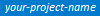

# Use Visual Studio Code with Azure DevOps Services

Visual Studio Code (VS Code) is a code editor produced by Microsoft. You can find out more about it at https://code.visualstudio.com. The Azure DevOps extension allows you to connect to Azure DevOps Services, monitor your builds and manage your pull requests and work items for your Azure DevOps Services Git and TFVC repositories.

> [!div class="mx-imgBorder"]

## Prerequisites

 - You already have an organization in Azure DevOps. If you do not already have an organization, [sign up](/azure/devops/organizations/accounts/create-organization-msa-or-work-student).
 - You have Visual Studio Code 1.11.1 or later installed on your machine (if not, [download and install it](https://code.visualstudio.com/Download)).
 - You have already [cloned an Azure DevOps Services Git repository](/azure/devops/repos/git/clone?tabs=command-line) to your computer locally.

> [!VIDEO https://www.youtube.com/embed/HnDNdm1WCIo]

## Install the extension

To install the extension with the latest version of Visual Studio Code, bring up the **Visual Studio Code Command Palette** (press **F1**), type `install` and choose **Extensions: Install Extensions**. In the **Search Extensions in Marketplace** text box, type team. Find the Azure DevOps Services extension published by Microsoft and click the **Install** button. 

Restart Visual Studio Code.

## Acquire a personal access token

If you are connecting to Azure DevOps Services or TFS, you may need a *personal access token* (PAT) to securely access your account. 
If you do not have a personal access token yet, you will need to [create one on your organization](/azure/devops/organizations/accounts/use-personal-access-tokens-to-authenticate). 

## Connect to your Azure DevOps Services Git repo

Once you have installed the extension, open either the root folder or a sub-folder of the cloned Git repository. Once an Azure DevOps Services or Team Foundation Server 2015 Update 2 (or later) repository is detected by the extension, provide your credentials (if credentials weren't already found). If you are required to provide your credentials, there will be an indicator in the status bar whose message will indicate that you need to login in.

The indicator looks like this:

> [!div class="mx-imgBorder"]

To log in to your account, run the `team signin` command. If your repository is an Azure DevOps Services repository, you will be prompted to enter your personal access token. When you do, it will be stored securely on your computer and used to connect to Azure DevOps Services. 

> [!NOTE]
> If your repository is on Team Foundation Server 2015 Update 2 or later, you will be prompted to enter your username and password.
> After both are provided, they will be stored securely on your computer and used to connect to your TFS server.

Once your credentials are verified, the status bar indicators will be active and the remaining commands will be ready to use. The stored credentials will be used for each connection to the server until they are either removed by the `team signout` command or overwritten by a subsequent team signin command.

> [!NOTE]
> In order for the extension to be activated, a repository folder must be opened. The extension won't be activated if only a single file in the repository is opened.

## Status bar indicators

> [!div class="mx-imgBorder"]

 This status bar item is populated with the name of the team project to which the Git repository belongs. Clicking on the item will open your browser to the team website.

> [!div class="mx-imgBorder"]

 This status bar item is a count of active pull requests that you either requested yourself or were added to explicitly as a reviewer. Clicking the item will display that list of pull requests in the quick pick list. Choosing one will take you to that pull request in your browser. This indicator will update its status every 5 minutes.

> [!div class="mx-imgBorder"]

 This status bar item shows the status of the build for this particular repository and branch. Hovering over the item will provide additional information about which build was referenced (if any). Clicking on the item will take you to that build's summary page in your browser. This indicator will update its status every 5 minutes.

> [!div class="mx-imgBorder"]

 This status bar item shows the number of items returned by your pinned work item query. If you have not configured a pinned query it defaults to the work items assigned to you. Clicking the item will show you the work items the query returns. This indicator will update its status every 5 minutes.

## Commands
In addition to the status bar integrations, the extension also provides several commands for interacting with Azure DevOps Services and Team Foundation Server. In the Command Palette (F1), type team and choose a command.

- `team create bug` - Opens your browser to the webpage used to create a new bug. If a single line of text is highlighted in Visual Studio Code, it will be used as the title of the bug. The bug will be assigned to you. You can then choose to update the fields, save, cancel, etc.
- `team create pull request` - Opens your browser for a new pull request based on the current repository and branch. Before creating the pull request, ensure that you save, commit and push any changes you have before running the command. Doing so will ensure that all of your latest changes are part of the pull request.
- `team create task` - Opens your browser to the webpage used to create a new task. If a single line of text is highlighted in Visual Studio Code, it will be used as the title of the task. The task will be assigned to you. You can then choose to update the fields, save, cancel, etc.
- `team create work item` - Prompts you to choose a work item type from the list available in your team project. Once you make a selection, your browser is opened to the webpage used to create the work item. If a single line f text is highlighted in Visual Studio Code, it will be used as the title of the task. The work item will be assigned to you. You can then choose to update the fields, save, cancel, etc.
- `team send feedback` - Prompts you to either send a smile or a frown. After choosing, you can provide us feedback of up to 1000 characters. Optionally, provide your email address so we can contact if you needed. If you do not want to provide your email address, just leave it empty (we'll still get your feedback). Note: Feedback can be sent even if telemetry reporting is disabled.
- `team view blame`- If a file in the repository is opened in the editor, it will open your browser to the blame page for that file in the current branch in the server repository.
- `team view build summary` - Same behavior as clicking on the Build Status status bar item.
- `team view history` - If a file in the repository is opened in the editor, it will open your browser to the history page for that file in the current branch in the server repository. Otherwise, the history of the current branch in the server repository will be opened.
- `team signin` - Use this command to log in to an organization or Team Foundation Server 2015 Update 2 (and later) server. When your credentials are provided, they will be stored securely on your computer. The saved credentials will be used for that account until they are removed by the team signout command or overwritten by a subsequent team signin command. See the "Secure Credential Storage" topic below for more details.
- `team signout` - Use this command to log out from an organization or Team Foundation Server 2015 Update 2 (and later) server. Logging out will remove your credentials from your local computer. To log back in, you will need to run the team signout command again.
- `team view pull requests` - Same behavior as clicking on the Pull Requests status bar item.
- `team view website` - Same behavior as clicking on the team project status bar item.
- `team view work items` - Prompts you to choose a work item that is assigned to you, sorted by ChangedDate descending. Choosing a work item will open it in your browser. This command will return a maximum of 200 results with an option to "Browse additional work items...". Choosing that option will open your browser to show all of the results of your query.
- `team view work item queries` - Prompts you to choose a query stored in your "My Queries" folder in your team project. Choosing a query will run it and display the results in the Quick Pick list. Choosing one of the results will open that work item in your browser. This command will return a maximum of 200 results with an option to "Browse additional work items...". Choosing that option will open your browser to show all of the results of your query.

## Secure credential storage
When you run the `team signin` command, the credentials that you provide will be stored securely on your computer. On Windows, your credentials wil be stored by Windows Credential Manager. 
 - On macOS, your credentials will be stored in the Keychain. 
 - On Linux, your credentials will be stored in a file on your local file system in a subdirectory of your home folder. That file is created only with RW rights for the user running Visual Studio Code. It is not encrypted on disk.

## Next steps
Check out the [README.md in the GitHub repository](https://github.com/Microsoft/vsts-vscode/blob/master/README.md) for more details on the extension.

## Frequently asked questions (FAQ)

**Q: What platforms does the extension run on?**
**A:** The extension runs on Linux, macOS, and Windows (we've tested on Red Hat, Ubuntu, and CentOS).

**Q: Does the Visual Studio Code extension support Team Foundation Server (on-premises)?**
**A:** Yes! With version 1.103.0 the extension supports Team Foundation Server 2015 Update 2 and later.

**Q: Where can I find the source code for the extension?**
**A:** The code is open source on GitHub at [Microsoft/vsts-vscode](https://github.com/Microsoft/vsts-vscode). We welcome feedback and contributions!
