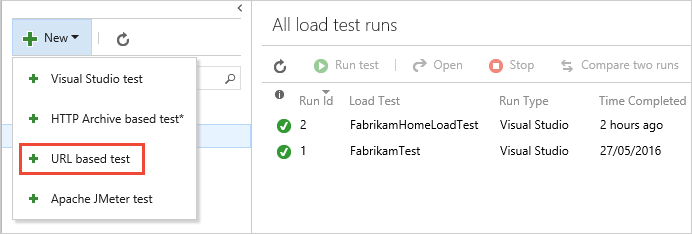
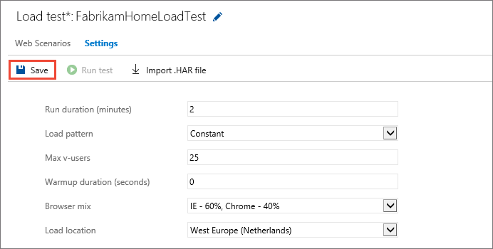
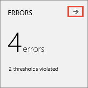
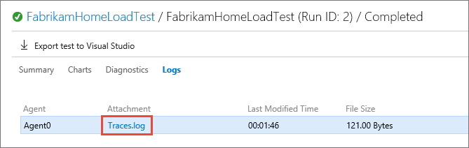

# Run URL-based load tests with VSTS

[!INCLUDE [version-header-ts](_shared/version-header-ts.md)] 

You can run a load test on your web app or site directly
using Visual Studio Team Services (VSTS).

## Prepare your environment

* You will need a [Visual Studio Enterprise subscription](https://www.visualstudio.com/products/visual-studio-enterprise-vs)
  (monthly, annual, or MSDN) to run URL-based load tests.

* [Create your VSTS account](https://www.visualstudio.com/products/visual-studio-team-services-vs), 
  if you don't have one already. 

## Run a URL-based load test

1. Sign in to your VSTS account (**https://**your-account-name**.visualstudio.com**).

1. Go to the **Load test** hub, open the **+ New** 
   menu and choose **URL based test**.

   

1. Type a name for the load test, and enter the URL you want to test
   in the center column and in the details pane on the right. For a simple
   load test, leave the **HTTP method** set to **GET**.

   

   You can add multiple URLs and select the method for each one, such as 
   **POST** or **PUT**. You can also add headers and querystring values
   if you need to send these as part of the request. The URL Load Test
   accesses each of these URLs multiple times using the parameters you 
   specify, and records the results.

1. Open the **Settings** tab. Here you can change the parameters of
   the test such as the duration, load pattern, number of users, and
   more. To run the test near to your users, select a **Load location**.
   Then choose **Save**. 

   
 
1. When you have set up all the URLs and parameters for your test, start it by
   choosing **Run test**.

   

1. As the test runs, you see live information about the progress
   of the test. You can stop the test by using the **Abort** link on the
   toolbar.

   

## View the results of the load test

1. When your test is done, look at the results to see how 
   well your app performed. For example, you can see an overview
   of your app's performance in the **Summary** tab.
   This tab shows all of the main metrics such as average response
   time, user load, requests per second, failed requests, any errors
   that might have occurred, and test usage.

   
 
   The lower section of the **Summary** tab shows the settings used
   for the test, and details of the five slowest requests during the test.
   If there are any transaction tests, the tab will also show the five slowest of these.
   Use the 
   icon above a column to sort the list based on the contents of that column.

1. Open the **Charts** tab to see a graphical representation of 
   the test results over time. The charts show the average
   performance, throughput, errors, and the results of each test 
   request. Hover your mouse pointer over a chart to 
   see more details. 

   

1. Open the **Diagnostics** tab to see detailed information such as a list
   of errors and status messages.

   

   You can also use the 
   icon in the **Errors** section of the **Summary** tab to go directly to the 
   **Diagnostics** tab.

   

1. Open the **Logs** tab to see a list of test runs. Choose the link in
   the **Attachment** column to download the detailed log as a text file.

   

1. To run the same test again, choose **Rerun**.

   

### Key metrics

* **Response Time**. The time it takes for your app to respond to requests
  is one of the key metrics for measuring app performance.
  Most apps perform well when a single user is accessing them, but the response
  time can increase dramatically when the app is under load. This can happen
  if resources such as CPU, database or other services are at peak capacity,
  resulting in longer response times.

* **User Load**. The peak user load encountered during the load test run.

* **Failed Requests**. The number of requests that failed, either because
  the app did not respond or due to other issues such as connectivity errors.
  Your app might start throttling requests when under load by discarding new
  requests in order to allow existing requests to be processed.

## Next step

> [!div class="nextstepaction"]
> [View and compare load test runs](performance-reports.md)
