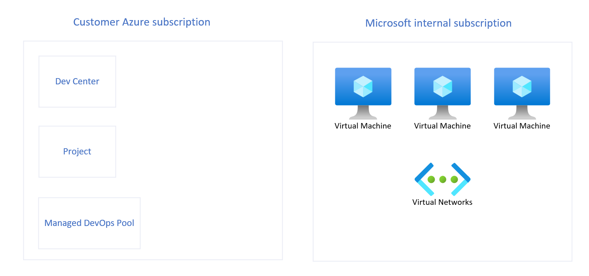

# Microsoft Managed DevOps Pools architecture overview

> [!IMPORTANT]
> Managed DevOps Pools is currently in PREVIEW.
> See the [Supplemental Terms of Use for Microsoft Azure Previews](https://azure.microsoft.com/support/legal/preview-supplemental-terms/) for legal terms that apply to Azure features that are in beta, preview, or otherwise not yet released into general availability.

In this article, you learn about the architecture and key concepts for Microsoft Managed DevOps Pools. Microsoft Managed DevOps Pools gives developers self-service access to managed compute resources to run their CI/CD workloads. You can configure the service to meet your development team and project structure, and manage security and network settings to access resources securely. 

## Microsoft Managed DevOps Pools architecture

The *hosted on behalf of* architecture lets Microsoft services, after they’re delegated appropriate and scoped permissions to a virtual network by a subscription owner, attach hosted Azure services to a customer subscription. This connectivity model lets a Microsoft service provide software-as-a-service and user licensed services as opposed to standard consumption-based services.

Managed DevOps Pools service uses the *hosted on-behalf* architecture, which means that the virtual machines exist in a subscription owned by Microsoft. Therefore, Microsoft incurs the costs for running and managing this infrastructure, the customer paying for the usage.

Managed DevOps Pools service manages the capacity and in-region availability in the Managed DevOps Pools service subscriptions.

Inside the internal subscription, the resources for a pool are isolated to a dedicated virtual network.
For the network connection, you can also choose between a Microsoft-hosted network connection, and an Azure network connection that you create in your own subscription.

The following diagrams show the logical architecture of Managed DevOps Pools service.

### Network connectivity

Network connectivity is determined by which virtual network the agents are connected to.

By default, all pools use a Microsoft-provided virtual network, which restricts all inbound traffic and allows all outbound traffic.

You can choose to bring your own virtual network, so that you can access company resources and set up custom security policies (like setting up a firewall). In this scenario, you'll need to [delegate a subnet](/azure/virtual-network/subnet-delegation-overview) on the virtual network to the Managed DevOps Pools service and associate the subnet with your pool. From that point, all virtual machines created for the pool will use that subnet. No other resources will be able to use the subnet.

### User connectivity

Currently you can't access the virtual machines provided by Managed DevOps Pools.

## Related content

- [What is Managed DevOps Pools service?](overview.md)
- [Quickstart: Get started with Managed DevOps Pools](quickstart-azure-portal.md)

