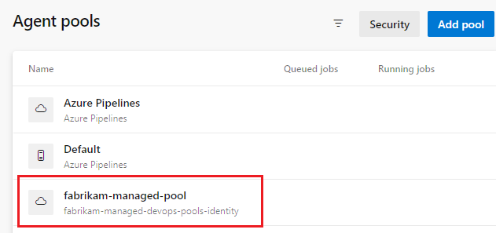
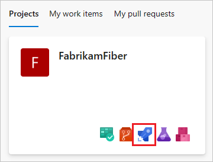
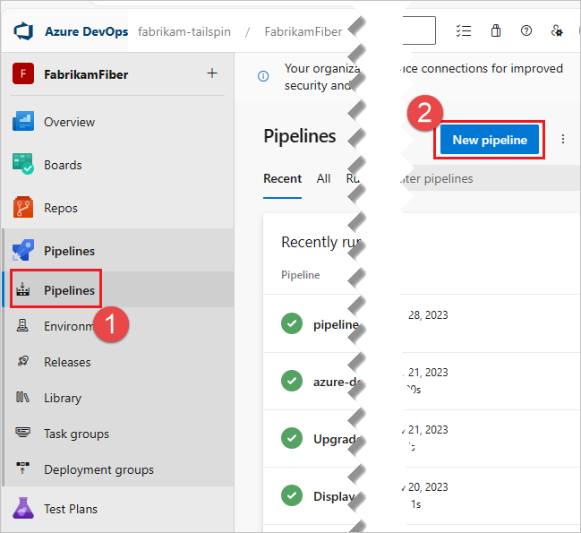
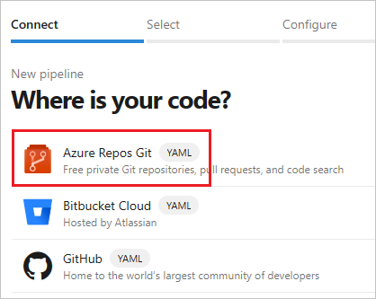
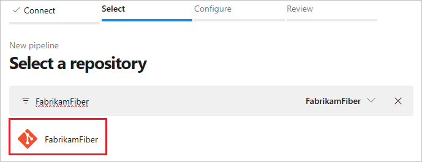
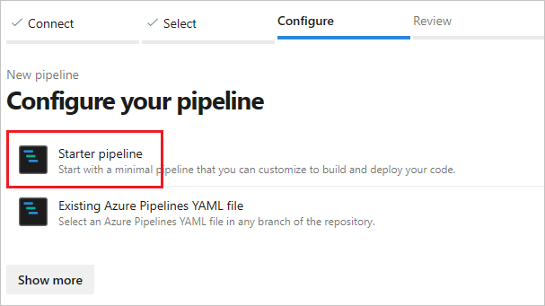
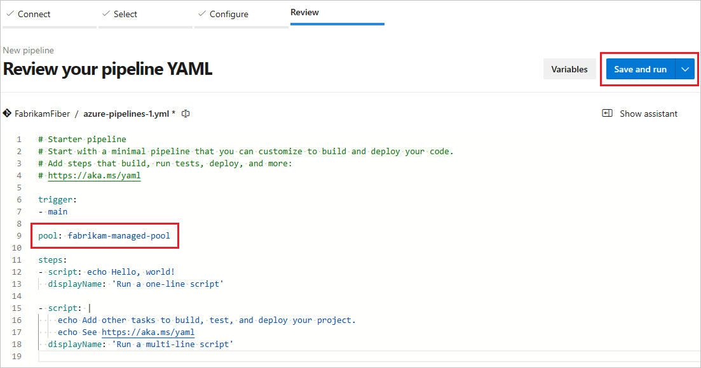

# Create your first Managed DevOps Pool

This article shows you how to create a Managed DevOps pool and run a pipeline in it.

## Prerequisites

Before completing the steps in this article, you must have configured your Azure subscription and Azure DevOps organization for use with Managed DevOps Pools, as described in the [Prerequisites](./prerequisites.md) article. These steps need to be completed only once per Azure subscription and Azure DevOps organization.

## Create the Managed DevOps Pools resource

1. Sign in to the [Azure portal](https://portal.azure.com/).
1. Search for **Managed DevOps Pools** and select it from the available options.
1. Choose **Create**, or **Create Managed DevOps Pools** if this is your first pool.

   :::image type="content" source="./media/get-started/create-managed-devops-pools-button.png" alt-text="Screenshot of Create Managed DevOps Pools button.":::

1. Specify the **Subscription**, **Resource group**, **Dev Center**, and **Dev Center project**. If you haven't yet created a resource group, Dev Center, or Dev Center project, you can create them in this step.
   :::image type="content" source="./media/get-started/create-managed-devops-pools-initial-settings.png" alt-text="Screenshot of Create Managed DevOps Pools initial configuration settings.":::

1. Specify the Azure DevOps organization you want to use with your pool, the name of the pool, and the region for your pool. By default pools are configured for all projects in a single organization. You can configure additional organizations or limit the projects on the [Security](./configure-security.md) tab. Choose a region that is close to the other Azure resources you're using for [best cost and performance](./manage-costs.md#pool-region-co-location).

   :::image type="content" source="./media/get-started/azure-devops-organization-and-pool.png" alt-text="Screenshot of Azure DevOps organization field.":::

1. Specify the maximum number of agents you wish to be available ([Maximum agents](./configure-pool-settings.md#maximum-agents)), the virtual machine size of the agents ([Agent size](./configure-pool-settings.md#agent-size)), and the [OS disk type](./configure-pool-settings.md#os-disk-type) for the agents. [D2adsV5](/azure/virtual-machines/dasv5-dadsv5-series#dadsv5-series) is the default **Agent size**; choose **Change size** to pick a different size if desired.

   :::image type="content" source="./media/get-started/agent-size-count-os-disk-type.png" alt-text="Screenshot of agent size, count, and OS disk type.":::

   Agent sizes (SKUs) with available Managed DevOps Pools quotas are marked as **Available**. You can request more quota for **Not Available** SKUs. Once a quota request for a **Not Available** SKU is approved, it will then be listed as **Available**. [Learn more about Managed DevOps Pools quotas](./prerequisites.md#view-your-quotas).

1. Configure the images for your pool. By default pools are created with a [single image](./configure-images.md). To change the image or [configure multiple images](./configure-images.md#use-multiple-images-per-pool-with-aliases), choose **Add from Image Library** and select the image or images you want to use for your pool.

   :::image type="content" source="./media/configure-images/configure-pool-image.png" alt-text="Screenshot if Images section.":::

1. Configure any desired additional settings for your pool by choosing the corresponding tab. View each tab to see the default settings for Managed DevOps Pools, and see the following links for more information about the settings available on each tab. To use the default settings, continue to **Review + create**.

   :::image type="content" source="./media/get-started/create-managed-devops-pools-tabs.png" alt-text="Screenshot of tabs of settings.":::

   * [Scaling](./configure-scaling.md) - Configure scaling settings to manage the performance and cost of your Managed DevOps Pool.
   * [Networking](./configure-networking.md) - Add agents from your Managed DevOps Pool to your virtual network.
   * [Storage](./configure-storage.md) - Attach an empty data disk to your agents.
   * [Security](./configure-security.md) - Configure organization and project access, specify pool permissions, and configure interactive mode for testing.
   * [Tags](/azure/azure-resource-manager/management/tag-resources) - Use tags to organize your Azure resources and management hierarchy.

1. Choose **Review + create**, and choose **Create** to confirm.

      :::image type="content" source="./media/get-started/create-managed-devops-pools-settings.png" alt-text="Screenshot of Review + create for Managed DevOps Pools initial configuration settings.":::

      The provisioning process can take a few moments. When the agent pool creation is complete, you can view the pool in Azure DevOps and run pipelines in that pool.

      If your subscription doesn't have the capacity to configure your pool with desired Azure VM SKU and maximum agents count, pool creation fails with an error similar to the following message. `Cores needed to complete this request is 8, which exceeds the current limit of 0 for SKU family standardDDSv4Family in region eastus. Please choose a different region if possible, or request additional quota at https://portal.azure.com/#view/Microsoft_Azure_Support/NewSupportRequestV3Blade/issueType/quota/subscriptionId/subscription_id_placeholder/topicId/3eadc5d3-b59a-3658-d8c6-9c729ba35b97`. To resolve the issue, see [Review Managed DevOps quotas](./prerequisites.md#review-managed-devops-pools-quotas).

## View the agent pool in Azure DevOps

1. Go to the Azure DevOps portal and sign in to your Azure DevOps organization (`https://dev.azure.com/{your-organization}`).

1. Go to **Azure DevOps** > **Organization settings**.

   :::image type="content" source="./media/prerequisites/organization-settings.png" alt-text="Screenshot of Organization settings button.":::

1. Go to **Pipelines** > **Agent pools**, and verify that your new pool is listed. If you just created the Managed DevOps Pool, it can take a few moments for the new pool to appear in the agents list.

   

## Run a pipeline in your new pool

In this step, we'll create a simple pipeline in the default repository of an Azure DevOps project and run it in your new Managed DevOps Pool.

1. Go to the Azure DevOps portal and sign in to your Azure DevOps organization (`https://dev.azure.com/{your-organization}`).
1. Go to the project where you want to run the pipeline, and choose Pipelines.

   

1. Choose **New pipeline** (or **Create Pipeline** if this is your first pipeline).

   

1. Choose **Azure Repos Git**.

   

1. Choose the repository that has the same name as your project. In this example, the project is named FabrikamFiber, so we choose the repository with the same name.

   

1. Choose Starter pipeline.

   

1. By default the starter template uses a Microsoft hosted Linux agent. Edit the pipeline template and change the `pool` section so that it refers to the pool you created in the previous steps.

   ```
   # Change these two lines as shown in the following example.
    pool:
     vmImage: ubuntu-latest
   ```

   In this example, the Managed DevOps Pools is named `fabrikam-managed-pool`, so replace `vmImage: ubuntu-latest` with `name: fabrikam-managed-pools`, and specify the name of your Managed DevOps Pool.

   ```
   # Replace fabrikam-managed-pools with the name
   # of your Managed DevOps Pool.
   pool:
     name: fabrikam-managed-pool
   ```

1. Choose **Save and run**, and choose **Save and run** a second time to confirm.

   

1. If this is the first pipeline run in this pool, you may be asked to grant permissions before the pipeline runs.

1. Watch the [pipeline run](../pipelines/create-first-pipeline.md#view-pipeline-run-details) in Azure DevOps, and you can switch over to the Azure portal and see the running agent in the [Agents](./view-agents.md) view.
