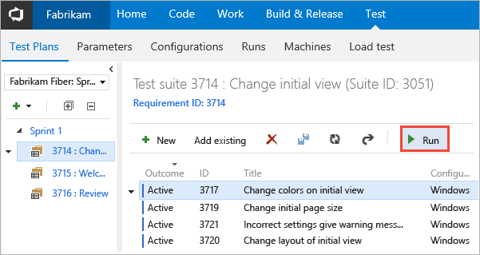
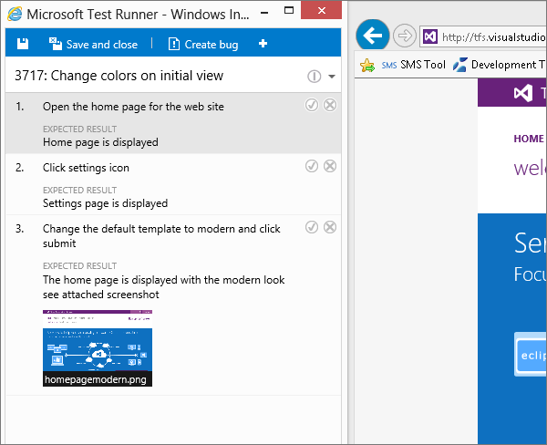
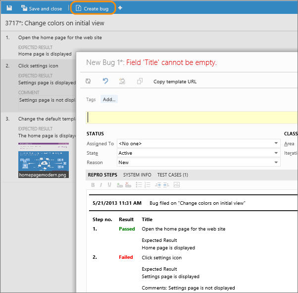
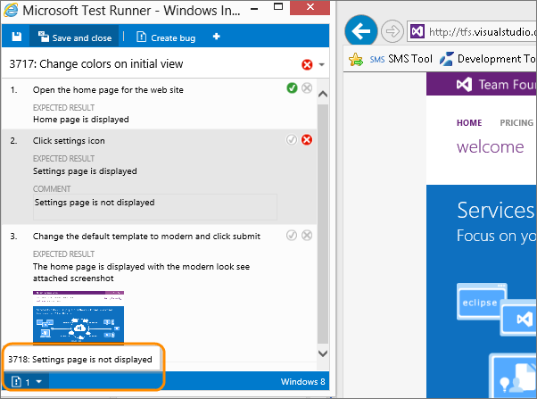
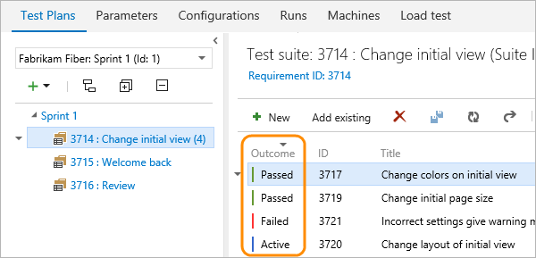
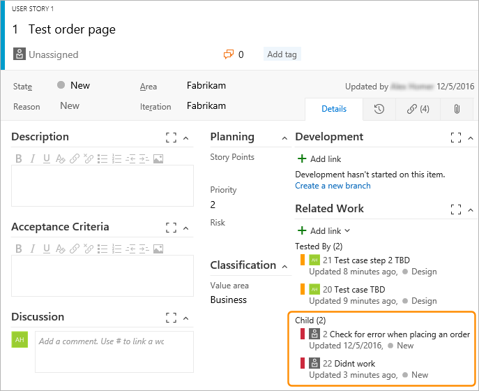

# Run manual tests

[!INCLUDE [version-header-vs-ts-tfs](../_shared/version-header-vs-ts-tfs.md)] 

Run your manual tests and record the test results for each test step 
using Microsoft Test Runner. If you find an issue when testing, 
use Test Runner to create a bug. Test steps, screenshots, and comments 
are automatically included in the bug. 

> You just need [Basic access](https://www.visualstudio.com/team-services/compare-features/) 
to run tests that have been assigned to you with Visual Studio Team Services (VSTS). 
Learn more about the [access](https://www.visualstudio.com/pricing/visual-studio-online-pricing-vs) 
that you need for more advanced testing features.

## Run tests for web apps

1. If you haven't already, [create your manual tests](create-test-cases.md#test-cases).

1. Select a test from a test suite and run it.
      
   

   Microsoft Test Runner opens and runs in a new browser.

1. Start the app that you want to test. Your app doesn't have to run on 
   the same computer as Test Runner. You just use Test Runner to record which 
   test steps pass or fail while you manually run a test. For example, you 
   might run Test Runner on a desktop computer and run your Windows 8 store 
   app that you are testing on a Windows 8 tablet.

   

1. Mark each test step as either passed or failed based on the expected results. 
   If a test step fails, you can enter a comment on why it failed.

   

1. Create a bug to describe what failed.

   

   The steps and your comments are automatically added to the bug. Also, 
   the test case is linked to the bug.

   If Test Runner is running in a web browser window, 
   you can copy a screenshot from the clipboard directly into the bug.

1. You can see any bugs that you have reported during your test session.

   

1. When you've run all your tests, save the results and close Test Runner. 
   All the test results are stored in VSTS.
   [How do I resume testing, or run one or more tests again?](../reference-qa.md#qanda)

1. View the testing status for your test suite.
   You see the most recent results for each test.

   

1. Open a test and choose the test case in the **Related Work** section.
   Then use the **Child** links in the **Related Work** section of that 
   work item to view the bugs filed by the tester.
   
     

[Can I run tests offline and then import the results?](../reference-qa.md#runoffline)

## Run tests for desktop apps

If the only data you want to collect from your desktop app
is screen recordings, use the web-based Microsoft Test Runner 
in the same way as [described above](#run-web) for web apps.

However, if you want to collect more types of data, run your tests using
[Microsoft Test Manager client](../mtm/run-manual-tests-with-microsoft-test-manager.md).

1. Launch the test runner 
   client from the **Test** hub by choosing **Run with options**
   from the **Run** menu.

   

1. In the **Run with options** dialog, select **Microsoft 
   Test Runner 2017 or later**, choose the data collectors you 
   want to enable, and optionally select a build to associate 
   with your test run.

   

1. Choose **OK** to start testing. For more information, see
   [Collect diagnostic data](../collect-diagnostic-data.md#collect-desktop).

[Can I run tests offline and then import the results?](../reference-qa.md#runoffline)

## See also

*  [FAQs for manual testing](../reference-qa.md#runtests)

## Next step

> [!div class="nextstepaction"]
> [View your test progress](track-test-status.md)
