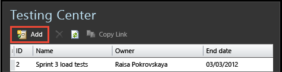
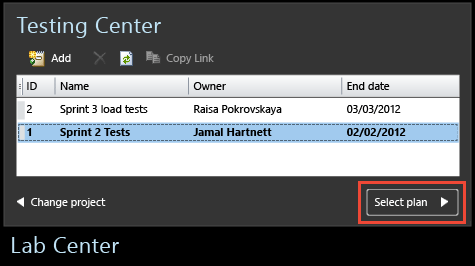

# Connect Microsoft Test Manager to your team project and test plan

[!INCLUDE [version-header-vs-ts-tfs](../_shared/version-header-vs-ts-tfs.md)] 

Use Microsoft Test Manager (MTM) to help you test the application you built. MTM stores your test plans and results on Team Foundation Server (TFS).  
  
### Connect Microsoft Test Manager to your Team Project and Test Plan  
  
1. If you don't have MTM, download and install [Visual Studio Enterprise](https://www.visualstudio.com/downloads/) or [Visual Studio Test Professional ](https://www.visualstudio.com/vs/test-professional/).  
  
   Don't have a team project? [Set up a team project](../../accounts/create-team-project.md)  
  
1. Connect to TFS and choose your team project.  
  
     
  
     
  
1. Create a new test plan, unless there's already a plan you want to use. Typically, you create a separate test plan for each sprint.  
  
     
  
1. Select a plan.  
  
     
  
If you want to connect to a different team project or test plan later, choose **Home**.   
  
Signed in with the wrong user name? Choose **Home**&nbsp; , **Change project**, **Sign out**.  
  
## Try this next 
 
[Exploratory testing](exploratory-testing-using-microsoft-test-manager.md)  
  
[Plan manual tests with Microsoft Test Manager](plan-manual-tests-with-microsoft-test-manager.md)

[!INCLUDE [help-and-support-footer](../_shared/help-and-support-footer.md)] 
