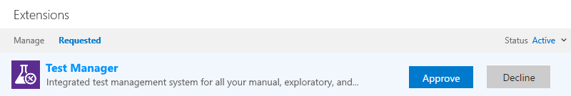
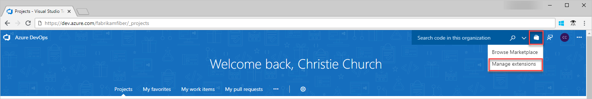

# Approve extension requests

[!INCLUDE [version-vsts-tfs-all-versions](../_shared/version-vsts-tfs-all-versions.md)]

As a project collection administrator, you receive an email when another project member requests an extension. When you approve the request, the extension is automatically installed to Azure DevOps Services or Team Foundation Server (TFS).

## Prerequisites

To approve extensions, you must have [**edit collection-level information** permissions](../organizations/security/permissions.md#collection).

## Approve requests

::: moniker range=">= azure-devops-2019"

1. Go to your Azure DevOps Services or TFS home page, then go to your project:

   * Azure DevOps Services:```https://dev.azure.com/{organization}/{project}```
   * TFS: ```https://{server}:8080/tfs/{team-project-collection}/{team-project}```

2. Select the shopping bag icon and **Manage extensions**.

   

3. Review and approve your requested extensions.

   > [!div class="mx-imgBorder"] 
   > 

   After you approve extension requests, the extensions are automatically installed.

4. If you installed paid extensions, go to the next section to [assign those extensions](./assign-paid-extensions.md) to users who need access.

::: moniker-end

::: moniker range="<= tfs-2018"

1. Go to your Azure DevOps Services or TFS home page, then go to your project:

   * Azure DevOps Services:```https://dev.azure.com/{organization}/{project}```
   * TFS: ```https://{server}:8080/tfs/{team-project-collection}/{team-project}```

2. Select the shopping bag icon and **Manage extensions**.

   

3. Review and approve your requested extensions.

   > [!div class="mx-imgBorder"] 
   > 

   After you approve extension requests, the extensions are automatically installed.

4. If you installed paid extensions, go to the next section to [assign those extensions](./assign-paid-extensions.md) to users who need access.

::: moniker-end

Remember to tell your team about installed extensions, so they can start using their capabilities.
