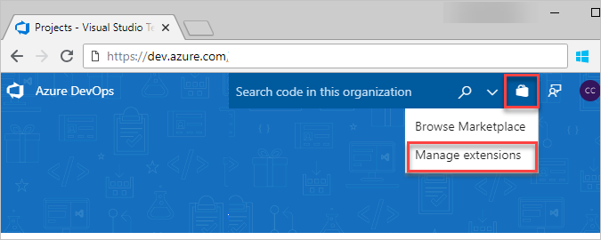

# Quickstart: Approve extension requests

[!INCLUDE [version-vsts-tfs-2015-on](../boards/_shared/version-vsts-tfs-2015-on.md)]

As a Project Collection Administrator, you get an email when another project member requests an extension. After you approve the request, the extension is automatically installed to Azure DevOps. In this quickstart, learn how to approve extension requests.

## Prerequisites

To approve extensions, you must have [**edit collection-level information** permissions](../organizations/security/permissions.md#collection).

## Approve requests

::: moniker range=">= azure-devops-2019"

1. Go to your Azure DevOps or TFS home page, then go to your project:

   * Azure DevOps:```https://dev.azure.com/{organization}/{project}```
   * TFS: ```https://{server}:8080/tfs/{team-project-collection}/{team-project}```

2. Select the shopping bag icon and **Manage extensions**.

   

3. Review and approve your requested extensions.

   > [!div class="mx-imgBorder"] 
   > 

   After you approve extension requests, the extensions are automatically installed.

4. If you installed paid extensions, go to the next section to [assign those extensions](./assign-paid-extensions.md) to users who need access.

::: moniker-end

::: moniker range="<= tfs-2018"

1. Go to your Azure DevOps or TFS home page, then go to your project:

   * Azure DevOps :```https://dev.azure.com/{organization}/{project}```
   * TFS: ```https://{server}:8080/tfs/{team-project-collection}/{team-project}```

2. Select the shopping bag icon and **Manage extensions**.

   

3. Review and approve your requested extensions.

   > [!div class="mx-imgBorder"] 
   > 

   After you approve extension requests, the extensions are automatically installed.

4. If you installed paid extensions, go to the next section to [assign those extensions](./assign-paid-extensions.md) to users who need access.

::: moniker-end

Tell your team about installed extensions, so they can start using their capabilities.

## Next steps

> [!div class="nextstepaction"]
> [Assign paid extensions](assign-paid-extensions.md)

## Related articles

- [FAQs](faq-extensions.md)
- [Set up billing](../organizations/billing/set-up-billing-for-your-organization-vs.md)
- [Azure DevOps pricing](https://azure.microsoft.com/pricing/details/devops/azure-devops-services/)
- [Azure DevOps billing support](https://azure.microsoft.com/support/devops/)
- [Assign access levels and extensions by group membership](../organizations/accounts/assign-access-levels-and-extensions-by-group-membership.md)


