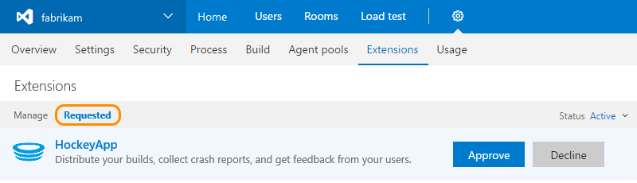

# Approve extension requests for your Team Services account

**Team Services**

If you're the Team Services project collection administrator or account owner, 
you'll get email when another Team Services account user requests an extension. 
When you approve the request, Team Services automatically installs the extension.

0.	Sign in to your Team Services account 
(```https://{youaccount}.visualstudio.com```).

0.	From your account toolbar, go to **Extensions**.

	

0.	Review and approve your requested extensions.

	

0.	After you approve extension requests, 
Team Services automatically installs those extensions. 

0.	If you installed paid extensions, 
go to the next section to [assign those extensions](./assign-paid-extensions.md), 
to users who need access so they can start using those extensions.


[Troubleshooting](faq-extensions.md)