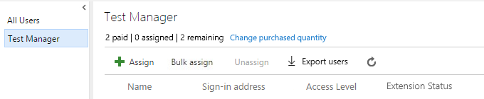
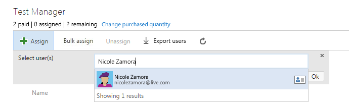
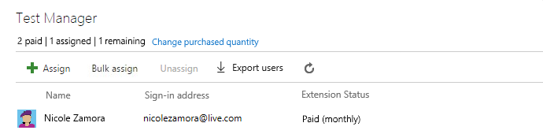

# Assign paid extension access to users for Visual Studio Team Services

After you install a paid extension, 
you must assign that extension to users who need access, 
so they can start using that extension's capabilities. 
To assign extensions, you'll need Team Services 
[project collection administrator or account owner permissions](./faq-extensions.md#find-owner).

> [!TIP]
> You only have to assign extensions to users who need access. 
> If you have [Visual Studio subscribers](https://marketplace.visualstudio.com/subscriptions), 
> they automatically get access to specific extensions that are included 
> with their subscriptions as benefits, like Test Manager. 
> If you installed these extensions, you don't have to assign 
> them to Visual Studio subscribers in your account. 

0.	Sign in to your Visual Studio Team Services account 
(```https://{youraccount}.visualstudio.com```).

0.	Go to **Users**.

	

0.	Most extensions require that users have at least Basic access, 
not Stakeholder. Check your users' access levels here:

	

	For example, Johnnie has a Visual Studio Enterprise subscription, 
	which includes access to the Test Manager extension.
	To find the access that your extension requires, see the extension's description 
	in the [Visual Studio Marketplace](https://marketplace.visualstudio.com).

0.	To assign the extension, 
go to the extension pane, for example, Test Manager.

	

0.	Assign the extension. 

	

	

	You can assign the extension to one user, specific users, 
	or to all users at the same time, up to the number allowed 
	for free extensions or the number that you purchased for paid extensions.

0.	Tell your team about this extension, 
	so they can start using its capabilities.


[Troubleshooting](faq-extensions.md)
