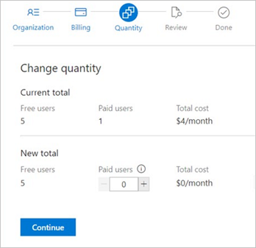

# Quickstart: Assign paid extension access to users

[!INCLUDE [version-vsts-tfs-2015-on](../boards/_shared/version-vsts-tfs-2015-on.md)]

After you install a paid extension, assign that extension to users who need access, so they can start using that extension's capabilities. In this quickstart, learn how to [assign a paid extension](#assign-extension) to a user and [change the number of paid users](#change-number-of-paid-users).

## Prerequisites

To assign extensions, you need [Project Collection Administrator or organization Owner permissions](faq-extensions.md#q-who-can-install-extensions-for-azure-devops).

## Assign extension

::: moniker range=">= azure-devops-2019"

1. Sign in to your organization, ```https://dev.azure.com/{yourorganization}```.

2. Select  **Organization settings**.

   

3. Select **Users**.

   
   
4. Most extensions require that users have at least Basic access, not Stakeholder. Check your users' access levels here:

   

   To find the access that your extension requires, see the extension's description in the [Marketplace > Azure DevOps](https://marketplace.visualstudio.com/azuredevops).

5. To assign the extension, right-click or choose the ellipses (...) for the user you want to assign access to. Select **Manage projects**.

   

6. Select the **Extensions** tab.

   

7. Assign the extension, and then **Save changes**.

   

   Assign the extension to specific users up to the number allowed for free extensions, or the number that you purchased for paid extensions. Ensure that any users you add in excess of what you've paid for, already have a license.

::: moniker-end

::: moniker range="<= tfs-2018"

1. Sign in to your organization: ```https://dev.azure.com/{organization}```.

2. Go to **Users**.

   

3. Most extensions require that users have at least Basic access, not Stakeholder. Check your users' access levels here:

   

   To find the access that your extension requires, see the extension's description in the [Marketplace](https://marketplace.visualstudio.com/azuredevops), Azure DevOps tab.

4. To assign the extension, right-click or select the ellipses (...) for the user you want to assign access to.

   

5. Assign the extension and **Save changes**.

   

   Assign the extension to specific users up to the number allowed for free extensions, or the number that you purchased for paid extensions.

Tell your team about this extension, so they can start using its capabilities.

::: moniker-end

::: moniker range=">= tfs-2013 < azure-devops"

## TFS

1.  From your TFS home page, go to your settings' User hub: (```https://{server}:8080/tfs/_admin/_userHub```)

    

2.  Select the extension from the extension pane and assign your extension to users who need access:

    

    You can assign the extension to one user, specific users, or to all users at the same time, even going above the number allowed 
    for your extension, if necessary.

3.  Tell your team about this extension, so they can start using its capabilities.

::: moniker-end

## Change number of paid users

1. Sign in to your organization (```https://dev.azure.com/{yourorganization}```).

2. Select  **Organization settings**.

   

3. Select **Users**.

   

4. Select **Change quantity** under the paid extension you want to change.

   

5. Update the total number of paid users, and then select **Continue**.

   

6. Review, and then select **Confirm**.

    

The number of paid extension users updates.

## Next steps

> [!div class="nextstepaction"]
> [Start a trial extension](start-trial-extension.md)

## Related articles

- [FAQs](faq-extensions.md)
- [Set up billing](../organizations/billing/set-up-billing-for-your-organization-vs.md)
- [Azure DevOps pricing](https://azure.microsoft.com/pricing/details/devops/azure-devops-services/)
- [Azure DevOps billing support](https://azure.microsoft.com/support/devops/)
- [Assign access levels and extensions by group membership](../organizations/accounts/assign-access-levels-and-extensions-by-group-membership.md)

