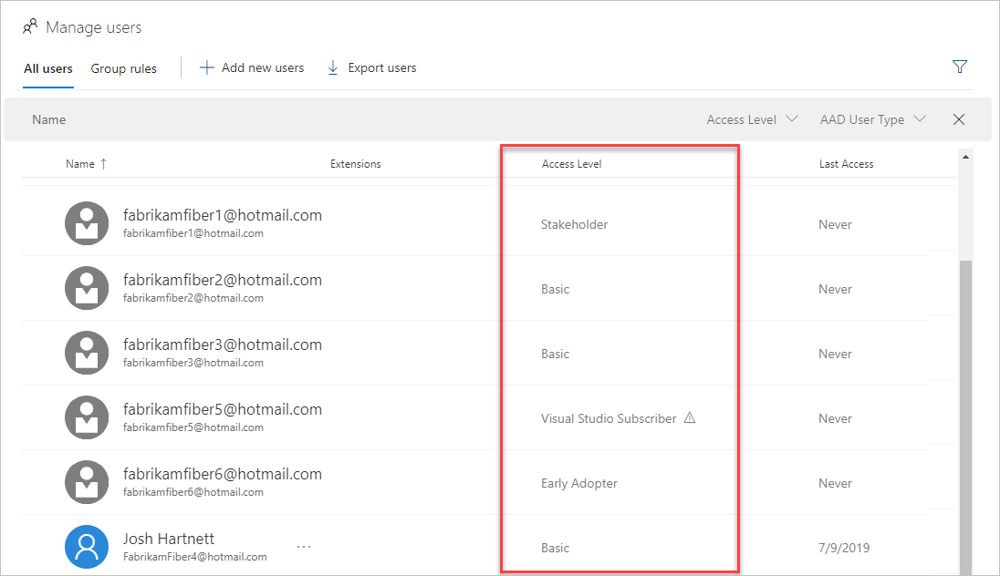
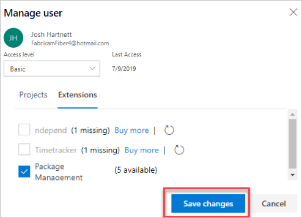

# Assign paid extension access to users

**Azure DevOps Services** | **TFS**

After you install a paid extension, you must assign that extension to users who need access, so they can start using that extension's capabilities. 
To assign extensions, you'll need Azure DevOps Services or TFS [project collection administrator or organization owner permissions](./faq-extensions.md#find-owner).

> [!TIP]
> You only have to assign extensions to users who need access. If you have [Visual Studio subscribers](https://marketplace.visualstudio.com/subscriptions), 
> they automatically get access to specific extensions that are included with their subscriptions as benefits, like Test Manager. If you installed these extensions, you don't have to assign them to Visual Studio subscribers in your organization. 

## Azure DevOps Services

::: moniker range=">= azure-devops-2019"

1. Sign in to your organization, ```https://dev.azure.com/{yourorganization}```.

2. Select  **Organization settings**.

   

3. Select **Users**.

   
   
4. Most extensions require that users have at least Basic access, not Stakeholder. Check your users' access levels here:

   

   To find the access that your extension requires, see the extension's description in the [Visual Studio Marketplace](https://marketplace.visualstudio.com/azuredevops), Azure DevOps tab.

5. To assign the extension, right click or choose the ellipses (...) for the user you want to assign access to. Select **Manage extensions**.

   

6. Assign the extension and **Save changes**.

   

   You can assign the extension to specific users up to the number allowed for free extensions or the number that you purchased for paid extensions. Ensure that any users you add in excess of what you've paid for, already have a license.

::: moniker-end

::: moniker range="<= tfs-2018"

1. Sign in to your Azure DevOps Services organization: ```https://dev.azure.com/{organization}```.

2. Go to **Users**.

   

3. Most extensions require that users have at least Basic access, not Stakeholder. Check your users' access levels here:

   

   To find the access that your extension requires, see the extension's description in the [Visual Studio Marketplace](https://marketplace.visualstudio.com/azuredevops), Azure DevOps tab.

4. To assign the extension, right click or click the ellipses (...) for the user you want to assign access to.

   

5. Assign the extension and **Save changes**.

   

   You can assign the extension to specific users up to the number allowed for free extensions or the number that you purchased for paid extensions.

Tell your team about this extension, so they can start using its capabilities.

::: moniker-end

::: moniker range=">= tfs-2013 < azure-devops"

## TFS

1.  From your TFS home page, go to your settings' User hub: (```https://{server}:8080/tfs/_admin/_userHub```)

    

2.  Select the extension from the extension pane and assign your extension to users who need access:

    

    You can assign the extension to one user, specific users, or to all users at the same time, even going above the number allowed 
    for your extension, if necessary.

3.  Tell your team about this extension, so they can start using its capabilities.

::: moniker-end
