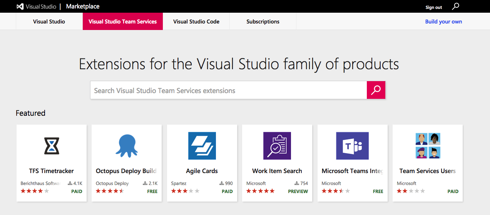

# Install Visual Studio Team Services extensions and set up integrations with other services

>[!NOTE]
> This area covers installing extensions from the Marketplace and integrating Team Services with other services such as Slack and Jenkins. 
> To find information about developing your own custom extensions, check out the [Extension Development Documentation](../../integrate/extensions/overview.md).

Extending Visual Studio Team Services is the easiest way for users to get the most out of their 
devops environment. The [Visual Studio Marketplace](https://marketplace.visualstudio.com) is home to hundreds of extensions
that can be installed to help with:
- Planning and tracking of work items, sprints, scrums, etc. 
- Build and release flows
- Code testing and tracking
- Collaboration amongst team members

## Installing extensions from the Marketplace
The Visual Studio Marketplace is home to hundreds of **extensions** that can be installed to truly customize your experience
in Team Services. 

Adding extensions to your Team Services account is incredibly easy:

1. Search and find extensions for your account in the [Visual Studio Marketplace](https://marketplace.visualstudio.com).
2. Install the extension from the Marketplace and start using it in Team Services.

For more information on extensions and the Marketplace, [get started here](./overview.md).

## Integrating Team Services with other services
Integrating Team Services with other services is done by creating subscriptions with service hooks. There are two steps to integrating Team Services:

1. Create a subscription in Team Services
2. Set up the integration with your external service of choice

### Available Services

<table class="table table-striped">
<thead class="thead-inverse">
    <tr>
        <th>Build and release</th>
        <th>Collaborate</th>
		<th>Customer support</th>
		<th>Plan and track</th>
		<th>Integrate</th>
    </tr>
</thead>
<tbody>
    <tr>
        <td>[AppVeyor](./integrate/service-hooks/services/appveyor.md)</td>
        <td>[Campfire](./integrate/service-hooks/services/campfire.md)</td>
		<td>[UserVoice](./integrate/service-hooks/services/uservoice.md)</td>
		<td>[Trello](./integrate/service-hooks/services/trello.md)</td>
		<td>[Azure Service Bus](./integrate/service-hooks/services/azure-service-bus.md)</td>
    </tr>
	<tr>
		<td>[Bamboo](./integrate/service-hooks/services/bamboo.md)</td>
		<td>[Flowdock](./integrate/service-hooks/services/flowdock.md)</td>
		<td>[Zendesk](./integrate/service-hooks/services/zendesk.md) </td>
		<td></td>
		<td>[Azure Storage](./integrate/service-hooks/services/azure-storage.md)</td>
	</tr>
	<tr>
		<td>[Jenkins](./integrate/service-hooks/services/jenkins.md)</td>
		<td>[HipChat](./integrate/service-hooks/services/hipchat.md)</td>
		<td></td>
		<td></td>
		<td>[Web Hooks](./integrate/service-hooks/services/webhooks.md)</td>
	</tr>
	<tr>
		<td>[MyGet](./integrate/service-hooks/services/myget.md)</td>
		<td>[Hubot](./integrate/service-hooks/services/hubot.md)</td>
		<td></td>
		<td></td>
		<td>[Zapier](./integrate/service-hooks/services/zapier.md)</td>
	</tr>
	<tr>
		<td></td>
		<td>[Slack](./integrate/service-hooks/services/slack.md)</td>
		<td></td>
		<td></td>
		<td></td>
	</tr>
</tbody>
</table>

If you'd like to integrate your Team Services with any of these services, [get started here](./integrate/service-hooks/get-started.md).

