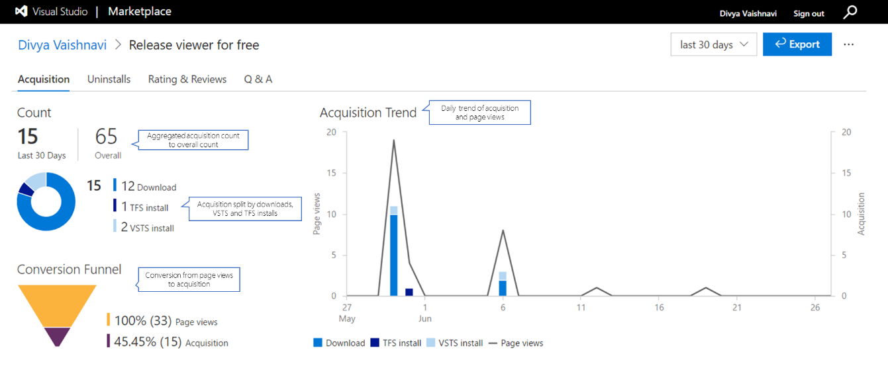
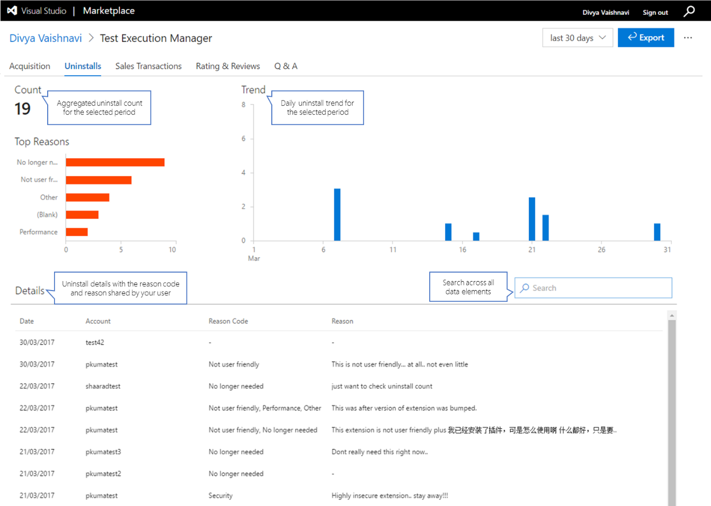
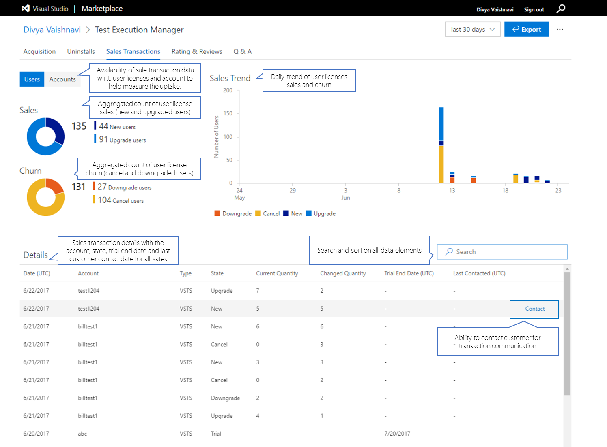
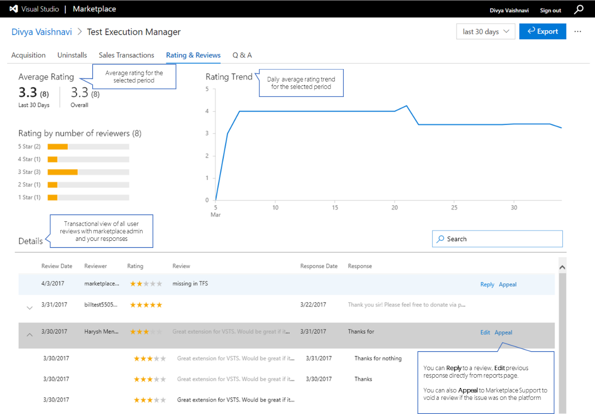
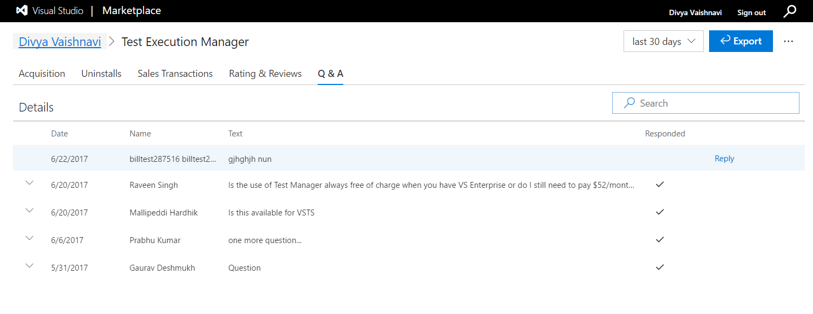

 

# Extension reporting hub

Extension developers have access to statistics and feedback about how their extension is performing in the [Visual Studio Marketplace](https://marketplace.visualstudio.com/azuredevops). Once you've created and published your extension to the Marketplace, you can use the **Reports** feature to track and analyze how the extension is performing and take required actions. 
To visit the extension hub, browse to your [publisher page](https://aka.ms/vsmarketplace-manage) and select the extension or click **Reports** link on the extension details page.

## Acquisition 
You can view all acquisition related data in this tab for the selected period. Based on the extension type, acquisition includes all events for install, buy, trial, download and get started clicks. 
* Aggregated acquisition in the selected period with respect to acquisition till date
* Aggregated acquisition in the selected period with respect to overall acquisition
* Aggregated acquisition split by extension downloads, Azure DevOps Services and TFS connected install for free extension
* Aggregated acquisition split by trials, Azure DevOps Services and TFS connected buy for paid extension
* Aggregated acquisition split by extension download from marketplace and VS IDE for VS extension 
* Daily trend of extension page views with acquisition 
* Conversion percentage from page views to acquisition

For paid extension, all transactional details for buy and trials is available with date, organization name, trial end date, and quantity. You can use the **Contact** action to reach out to your users for transactional communication. Refer [here](/azure/devops/extend/extension-report#contact) for more details. 

## Uninstall (Azure DevOps Services only)
You can view how many organizations have uninstalled your extension, daily trend of uninstall, detailed feedback shared during uninstall, and top uninstall reasons.
You can use search for text and dates to analyze and draw more insights from the detailed feedback. 

For Azure DevOps Services paid extension, all transactional details for buy and trials is available with date, organization name, trial end date, and quantity. You can use the **Contact** action to reach out to your users for transactional communication. Refer [here](/azure/devops/extend/extension-report#contact) for more details. 

## Sales transaction
This tab is only available for Azure DevOps Services paid extensions and gives the details of sales with respect to quantity and organizations to help understand how the extension is performing. Selection of the users button gives the aggregated details of sales and churn events, i.e. number of new, upgrade, downgrade and cancelled user licenses respectively with the trend. Selection of the organizations button gives similar aggregated details of sales and churn events with respect to organization and its trend. 

All transactional details for trials, new purchase, upgrade, downgrade and cancellations is available in details section. You can use search for text and dates to analyze and draw more insights. 
This data can also be pivoted by organization to understand the lifecycle of an organization or sorted to understand the top organization with respect to user licensees / resources purchased. **Contact** feature is also available. 

## Ratings and Review
This tab will give you the information of the average rating for the selected period with respect to overall rating, the average rating by number of reviewers, and the daily trend of average rating. The details section provides all the reviews and your responses in transactional view. 

You can **Reply** to a review or **Edit** a previous response and better manage engagement with your extension users.  You can also **Appeal** to void a rating if the issue reported is due to Marketplace or the underlying platform. If the issue is valid, we shall void the rating. 

## Q&A
This tab will give you snapshot of all questions by your extension users with the non-responded queries on the top. You can take actions of replying or editing a previous response and better manage engagement with your extension users.  

## Export to Excel
All data elements available in the reports page are also available for download in XLS format to aid creating your own custom reports. 

## Contact
For paid extension, you can use the **Contact** action to reach out to your users for transactional communication. this functionality is available only for publishers with contributor + access on the extension. 

Marketplace will broker the first communication with the user as our privacy policy doesn't allow direct sharing of customer email addresses. Only users who have opt-ed in for communication will be sent the email. 
Last contacted date for an organization is as also updated after sending a communication. 

**Important** Please follow the below guidance on transactional and promotional communication. A publisher found to do promotional communication or spamming users will be *blacklisted* and won't be able to use the **Contact** feature for any of his/her extensions. 

**Transactional Communication**: Transactional emails convey critical information necessary for the continued use of the extension or service. Examples include critical security notices, transaction confirmations, product recall notices, specific feedback request and service discontinuation notices.
**Promotional Emails**: Promotional emails are used to market your extension, product, service, website, or event. Examples include invitations to events or web casts, information about new marketing or partner programs and offers to prospect to obtain value-added content. Almost all newsletters fall into the promotional bucket as they generally contain at least some promotional content.

Refer the [Marketplace Publisher Agreement](https://aka.ms/vsmarketplace-agreement) for more guidance on communication with customers. 

# Terminology

* **Acquisition** is the total count of all applicable acquisition events for the extension; install, buy, trial, get started clicks and downloads
* **Page views** is the total number of extension detail page views. Repeated views by users are counted.
* **Azure DevOps Services Install** is the total number of organizations the extension is installed. Repeated installs on the same organization are counted. 
* **TFS Install** is the total number of TFS connected organizations the extension is installed. Repeated installs on the same organization are counted. TFS disconnected server data isn't available.  
* **Azure DevOps Services Trial** is the total number of organizations that started trial. In the same period if the organization makes a purchase, that would be counted too. 
* **Azure DevOps Services Buy** is the total number of buy events for organizations. Repeated buy on the same organization are counted. 
* **TFS Buy** is the total number of buy events for TFS connected organizations. Repeated buy on the same organization are counted. TFS disconnected server data isn't available.  
* **Download from IDE** is the total number of VS extension downloads from Visual Studio IDE to help understand extension uptake directly in VS IDE
* **Download from Marketplace** is the total number of VS extension downloads from the Marketplace
* **Conversion funnel** is the conversion ration from page views to acquisition from Marketplace. It excludes extension acquisition directly from the products. 
* **Top reasons for uninstall** is uninstall reasons categorized by reason code shared by users during the process of uninstall. Note: Reason code and reason are optional fields. 
* **Last contacted** is the most recent date the organization admin was contacted. 
* **New users** represents the count of users purchased by a new organization. 
* **Upgrade users** represents the count of users purchased by an existing organization. 
* **Downgrade users** represents the count of users reduced by an existing organization. 
* **Cancel users** represents the count of users cancelled when an existing organization cancelled.  
* **New organizations** represents the count of new organizations that purchased. 
* **Upgrade organizations** represents the count of existing organizations that purchased more users. 
* **Downgrade organizations** represents the count of existing organizations that reduced the quantity of users purchased. 
* **Cancel organizations** represents the count of organizations which cancelled their purchase. 

# Track Usage and Errors
The recommended way to track usage, load times and errors is with application insights.

- [How to setup with your extension](
https://blogs.msdn.microsoft.com/visualstudioalmrangers/2017/05/30/how-to-integrate-application-insights-monitoring-in-your-team-services-extension/)
- [How to setup application insights and get the instrumentation key.](/azure/application-insights/app-insights-create-new-resource)
- [Setting alerts in application insights - spike in exceptions, increase response times etc.](/azure/application-insights/app-insights-alerts)
- [More about application insights](/azure/application-insights/app-insights-overview)  

