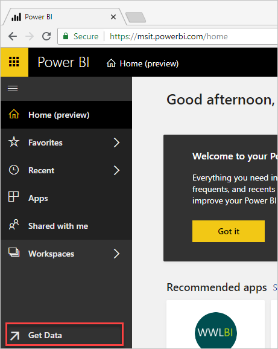
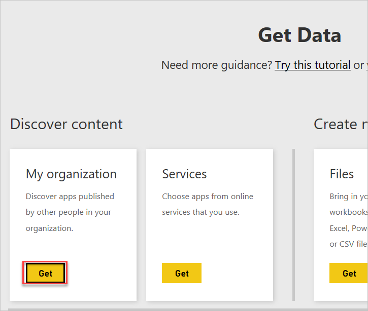
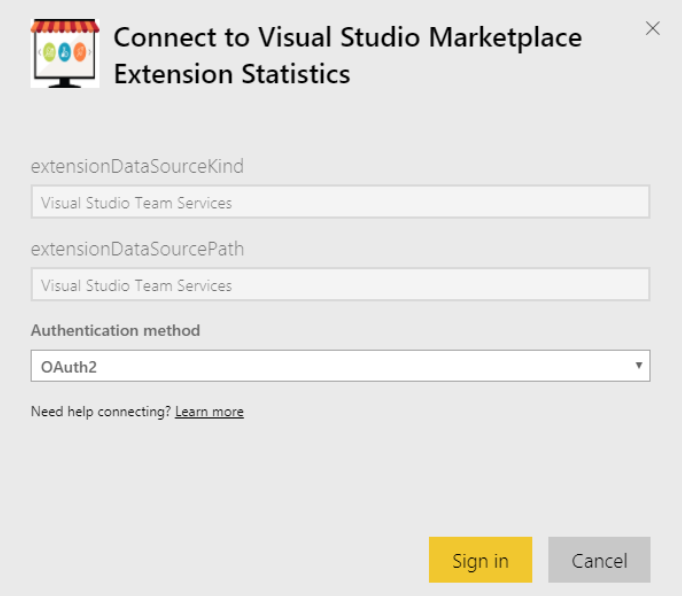

# Extension Statistics Power BI Content Pack

You can gain insight and analyze the progress of your extension by using Extension Statistics Power BI Content pack. All data elements available in the extension hub are also available in Power BI content pack.
The content pack contains a complete analytic data model (tables, relationships and measures), a set of default reports, and a default dashboard. Reports and dashboards are fully customizable but the data model is not.

## Connect to Power BI and get the Content Pack

1. Open a web browser and go to [http://powerbi.com](http://powerbi.microsoft.com/).

2. Choose **Sign In** in the upper right corner to sign in to Power BI.

3. In the lower left corner, select **Get Data**.

   

	If you don't have a Power BI account you can create one by entering your email address and choose **Use it free**.

4. Select **Get** under **Services** on the Get Data page.

	

5. Search for Marketplace and select the Visual Studio Marketplace Extension Statistics and **Get it now**.

	
	

6. Enter your desired Marketplace publisher ID that you want data for and select **Next**.

	  
	
	**Important**: Ensure you are logged in power BI using the same credentials you use on the Marketplace and you have access to the Publisher Id. 

7. Specify the authentication method. Only oAuth2 is supported. Choose **Sign In** to continue.

      

	**Important**: You won't be able to connect if your organization administrator disabled third party application access via OAuth. When enabled, it appears as follows on the Administration > Control panel > Settings page:  

	  

	Contact your organization administrator to determine if it needs to be enabled.

8. Successful authorization displays the following authorization dialog, which allows Power BI to retrieve data from your organization. Scroll down to the bottom and select **Accept**.

	  

9. Once Power BI is authorized, data will begin to load and you are presented with a loading screen until the data is complete. Depending on how much data there is, it may take a few minutes to complete the data load. All extension data associated with this publisher is downloaded.

## Available data and reports

After getting connected you will see an initial dashboard with details on all of your extensions. All data available in the Marketplace extension hub is available in the content pack. Details on the extension hub are available [here](/azure/devops/extend/extension-report).

The power BI content pack provides data for all extensions and you can use the filters to view data for an extension or use the extension report to compare data between extensions.

At a high level, the following data is available:

1. Acquisition
2. Uninstall
3. Rating and review

Using the report and available data elements, you can create your required reports and pin them to the dashboard.

To get started using Power BI, see the [knowledge base of articles](https://support.powerbi.com/).
