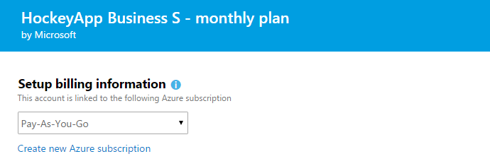
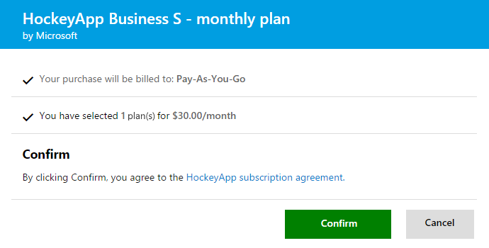

#	Get HockeyApp: Bring DevOps to mobile app development

Distribute mobile apps for testing, collect user metrics and feedback, 
and respond to crashes more easily by adding 
[HockeyApp](https://www.visualstudio.com/hockey-app-vs) 
to your Agile, continuous integration, and continuous delivery workflows.

Build apps for Android, iOS, Mac OS X, and the Windows platform using
Cordova, Unity, Xamarin, or native languages. Upload your apps to HockeyApp, 
so you can invite users to test them. Collect their feedback, metrics, 
and live crash reports at any development stage, even after releasing 
your apps through a store. Your users will always have the latest 
versions and get updates automatically. Your developers will always get 
the latest user feedback and crash reports.

HockeyApp works with tools that support team-based development 
and collaboration, work item and project management, continuous 
integration and delivery, such as Visual Studio Team Services, 
Team Foundation Server, GitHub, Bamboo, Jira, and more. 

Learn more about:

* HockeyApp at the 
[Visual Studio Marketplace](https://marketplace.visualstudio.com/items?itemName=ms.hockeyapp) 
or at the [HockeyApp.net website](http://hockeyapp.net/features/)

* Tools and apps that integrate with HockeyApp at the 
[HockeyApp Knowledge Base](http://support.hockeyapp.net/kb)

##	How do I get HockeyApp?

You'll need a HockeyApp plan for the number of apps and owners in your HockeyApp account. 
Owners can create and delete apps in your account.  Learn more about [HockeyApp plans](http://hockeyapp.net/pricing/).

For example, you can start for free with just 1 account owner and up to 10 apps when you sign 
up for the HockeyApp Free Plan.  If you have more than 1 account owner, you'll need a HockeyApp Business Plan, 
no matter how many apps you have. [Still not sure which plan to choose?](#choose-plan)

You can get the 
[HockeyApp Free plan](https://marketplace.visualstudio.com/items?itemName=ms.hockeyapp-free) 
or buy [monthly HockeyApp Business plans](https://marketplace.visualstudio.com/subscriptions) 
directly from the Visual Studio Marketplace. 
[Why buy from Visual Studio Marketplace?](#why-marketplace) 

To continue, you'll need:

*	A [Microsoft account](https://www.microsoft.com/account), like @outlook.com or @hotmail.com, 
or a work or school account, like @fabrikam.com

*	A [Microsoft Azure subscription](https://azure.microsoft.com/en-us/pricing/purchase-options/) 
to use for billing purchases from the Visual Studio Marketplace 

	For example, you can use the Azure subscription that's linked to 
	your Visual Studio Team Services account, if your account is already 
	[set up for billing](../setup-admin/team-services/set-up-billing-for-your-account-vs.md). 
	If you don't have an Azure subscription, you can 
	[sign up for Azure](https://account.windowsazure.com/Subscriptions) 
	before or during your first Marketplace purchase. Learn more about 
	[using Azure subscriptions to bill Marketplace purchases](#azure-billing).

###	Buy HockeyApp Business plans from the Visual Studio Marketplace

0. Sign in to [Visual Studio Marketplace > Subscriptions](https://marketplace.visualstudio.com/subscriptions) with your Microsoft account, or with your work or school account.

0. Choose the HockeyApp Business plan based how how many apps and owners that you'll have in your HockeyApp account. For example:

 

 

0. Select the Azure subscription that you want to use for billing. Or sign up for a new Azure subscription, if you don't have one.

 

0. Select 1 to buy the HockeyApp plan that you chose.

 

0. Finish your purchase.

 

 Congratulations, you completed your purchase successfully!

 

### Activate your HockeyApp plan after purchase

After you finish your purchase, you'll get a confirmation 
mail from HockeyApp with an activation link and instructions 
to choose a new or existing HockeyApp account.

If you purchased a HockeyApp plan from the Visual Studio 
Marketplace with an Azure subscription, sign in to your 
HockeyApp account with the same credentials that you used 
to purchase from the Visual Studio Marketplace. 
HockeyApp will recognize your purchase and show 
your plan in your HockeyApp account. 
Otherwise, wait for your confirmation mail to 
manually activate your HockeyApp plan. 

**Note**: If you're a new HockeyApp user, it might 
take up to 1 hour before your plan appears in your account.

**To review your plans**

0.	Sign in to your [HockeyApp account](https://rink.hockeyapp.net/users/sign_in) 
with the same credentials used to purchase from the Visual Studio Marketplace.

0.	Go to [Manage Account > Upgrade](https://rink.hockeyapp.net/manage/subscriptions).

###	Connect HockeyApp to your tools and workflows

HockeyApp integrates with tools that support team-based development 
and collaboration, project management, continuous integration, 
and continuous delivery. Learn how to integrate these tools with 
HockeyApp at the [HockeyApp Knowledge Base](http://support.hockeyapp.net/kb).

For example, when you use HockeyApp with Visual Studio Team Services, 
every code commit can trigger a build, upload your app to HockeyApp, 
and make your app available to testers. While your app runs, 
you'll collect user feedback and crash reports, 
which feed back into work items for your next cycle. 
Learn more about [HockeyApp and Visual Studio Team Services](http://hockeyapp.net/blog/2015/11/18/introducing-mobile-devops.html).

0.	Sign in to 
[Visual Studio Marketplace > Visual Studio Team Services > Build and release > HockeyApp](https://marketplace.visualstudio.com/items?itemName=ms.hockeyapp) 
as the Team Services account owner.

	If you're not the Team Services account owner,
	learn how to [request extensions](get-vsts-extensions.md#request).

0.	Install the [HockeyApp extension](https://marketplace.visualstudio.com/items?itemName=ms.hockeyapp) 
in your Team Services account. Learn more at 
[Get extensions for Team Services](get-vsts-extensions.md#install-extension).

	

0.	To start using HockeyApp with Team Services, follow the steps on the 
[HockeyApp extension page](https://marketplace.visualstudio.com/items?itemName=ms.hockeyapp).

For more details, visit 
[How to use HockeyApp with Visual Studio Team Services or Team Foundation Server](http://support.hockeyapp.net/kb/third-party-bug-trackers-services-and-webhooks/how-to-use-hockeyapp-with-visual-studio-team-services-vsts-or-team-foundation-server-tfs).

## Q & A

####Q:	How do I choose a HockeyApp plan?
 
A: Start with a plan that supports the number of apps 
that you want to host and the number of account owners 
that can create and delete apps in your HockeyApp account.
You can always change plans later. You have unlimited
storage and can upload as many versions of your app as you need.

**Note**: The same app for each platform counts as a separate app. 
For example, if you want to ship an app for both iOS and Android, 
this app counts as 2 apps, whether you build it with Cordova 
and a single code base, or build for each platform natively.

For example, if you have:

| HockeyApp account owners | Number of apps | Choose this HockeyApp plan |
| ------------------------ | -------------- | -------------------------- |
| Exactly 1                | Up to 10       | [Free plan](#free-plan) |
| More than 1              | Any            | [Business plan](http://hockeyapp.net/pricing/#business) |

Learn more about these plans at the 
[HockeyApp Knowledge Base](http://support.hockeyapp.net/kb/general-account-management-2/how-to-sign-up-for-a-paid-plan).

####Q:	What's the HockeyApp Free plan?

A: You can manage up to 10 apps free as the only HockeyApp account owner. 
Like other plans, you have unlimited storage and can upload as many 
versions of your apps as you need. Learn more about the 
[HockeyApp Free plan](https://marketplace.visualstudio.com/items?itemName=ms.hockeyapp-free), 
or [sign up to use HockeyApp for free at HockeyApp](https://rink.hockeyapp.net/users/sign_up).

####Q:	How do I buy for more than 500 apps or 100 owners?

A:	Contact [HockeyApp Support](http://support.hockeyapp.net/).

####Q:	Does HockeyApp have other plans?

A:	Yes, visit the HockeyApp 
[pricing page](http://hockeyapp.net/pricing/#personal). 
You can buy these plans through FastSpring. 
Learn more at the 
[HockeyApp Knowledge Base](http://support.hockeyapp.net/kb/general-account-management-2/how-to-sign-up-for-a-paid-plan).

####Q:	Why buy HockeyApp Business plans from Visual Studio Marketplace?

A: You can buy HockeyApp Business plans on a monthly basis 
from the Visual Studio Marketplace by selecting an 
[Azure subscription](https://azure.microsoft.com/en-us/pricing/purchase-options/) 
to use for billing your purchase. Just think of this subscription 
like a billing account.

If you don't have an Azure subscription, just 
[sign up](https://account.windowsazure.com/Subscriptions) 
before or during your first Marketplace purchase. You can also 
use your Azure subscription to buy other Azure services, 
like Cloud Services, compute instances, Visual Studio Team Services, 
and more. You get everything all in one convenient monthly bill 
that's charged to your credit card or invoiced to your organization.

Learn how to [buy monthly HockeyApp Business plans from Visual Studio Marketplace](#buy-hockeyapp-business) 
or about [billing Marketplace purchases with Azure](#azure-billing).

####Q:	How do I estimate the cost for HockeyApp Business plans?

A:	Use the [HockeyApp pricing calculator](https://azure.microsoft.com/en-us/pricing/calculator/) 
on the Azure website.

####Q:	How do I switch from paying through HockeyApp to paying through Azure?
 
A: Here's how:

0.	Sign in to 
[Visual Studio Marketplace > Subscriptions](https://marketplace.visualstudio.com/subscriptions), 
which uses Azure subscriptions for billing.

0. Buy the same plan that you have now.

	After you finish your purchase, 
	you'll get a HockeyApp confirmation mail with an activation link 
	and instructions to choose a new or existing HockeyApp account. 

0.	At any time, sign in to your old HockeyApp account, 
go to the billing page, and transfer your apps 
and data to your other HockeyApp account.

0.	After you confirm that everything transferred correctly, 
cancel your old plan.

[!INCLUDE [azure-billing](_shared/qa-azure-billing.md)]

####Q:	How often am I billed for HockeyApp Business plans?

A: We prorate monthly plans purchased from the 
Visual Studio Marketplace during the 1st month.
After that, monthly plans are billed on the 
1st day of the calendar month.

[!INCLUDE [azure-bill-larger](../_shared/qa-azure-bill-larger.md)]

####Q:	Where can I see my HockeyApp plans?

A:	Sign in to your [HockeyApp account](https://rink.hockeyapp.net/users/sign_in).
Go to [Account Settings > Upgrade](https://rink.hockeyapp.net/manage/subscriptions).

####Q:	How do I cancel or change my HockeyApp Business plan?
 
A: **To cancel your plan**

0.	Sign in to 
[Visual Studio Marketplace > Subscriptions](https://marketplace.visualstudio.com/subscriptions) 
with the credentials used to purchase your plan.

0.	Select the plan that you want to cancel. 

0.	Continue through the Buy page, and select the Azure 
subscription that was used to purchase your plan.

0.	Reduce your plan from 1 to 0. Confirm and finish your update.

**To change your plan**

0.	Sign in to 
[Visual Studio Marketplace > Subscriptions](https://marketplace.visualstudio.com/subscriptions) 
with the credentials used to purchase your plan.

0.	Cancel your current plan, then buy the new plan.

	We'll prorate the 1st month of charges for your new plan 
	based on the number of days remaining in the current month. 

	After you finish your purchase, 
	you'll get a HockeyApp confirmation mail with an activation link 
	and instructions to choose a new or existing HockeyApp account.

0.	To move your data at any time from your old plan to the new plan, 
use the activation link in your purchase confirmation email.

####Q:	How do I get more HockeyApp information or support?

A: Visit the 
[HockeyApp FAQ](http://support.hockeyapp.net/kb/general-account-management-2/general-questions),
or contact [HockeyApp Support](http://support.hockeyapp.net/).

[!INCLUDE [azure-billing-support](_shared/qa-azure-billing-support.md)]

[!INCLUDE [marketplace-support](_shared/qa-marketplace-support.md)]
