# Install extensions for on-premises servers

**Azure DevOps Server | TFS 2018 | TFS 2017 | TFS 2015.3**

To add new features and capabilities to your Azure DevOps Server or TFS, 
install extensions from the 
[Visual Studio Marketplace](https://marketplace.visualstudio.com/azuredevops). 

> [!TIP]
> To learn about building your own extensions, 
> see [developing](http://aka.ms/vsoextensions) 
> and [publishing](http://aka.ms/vsmarketplace-publish) extensions.

**What do I need to install extensions?**

[Project collection administrators](../organizations/security/set-project-collection-level-permissions.md) 
with [**Edit collection-level information** permissions](../organizations/security/permissions.md#collection) 
can install extensions. If you don't have permissions, you can [request extensions](request-extensions.md) instead.

For paid extensions, you'll need an 
[Azure subscription](https://azure.microsoft.com/pricing/purchase-options/) 
to bill your purchase. If you don't have an Azure subscription, 
you can create a new subscription when you make your first purchase. 

> [!NOTE]
> To use an existing Azure subscription for billing,
> you must have at least Co-administrator permissions for that subscription. 
> If you don't have permissions, have an Azure Account Administrator 
> or Service Administrator go to the Azure classic portal and 
> [add you as Co-administrator](/azure/billing-add-change-azure-subscription-administrator) 
> to the Azure subscription that you want to use for billing. 
> Co-administrator permissions are available only in the classic Azure portal.

Your project collection will reuse your Azure subscription 
for future Visual Studio Marketplace purchases. 
[Where can I find more info about Azure billing?](faq-extensions.md#troubleshooting-purchases--billing)

::: moniker range="<= tfs-2018"

<a name="connected-tfs"></a>

## Install Team Foundation Server extensions from Marketplace

::: moniker-end

::: moniker range="tfs-2017"

* [Connect to TFS](#connected-tfs), so you can install [free, preview, and paid extensions](faq-extensions.md#difference).

::: moniker-end

::: moniker range="tfs-2015"

* Working with TFS 2015 Update 3, or disconnected from TFS 2017? 
[Download extensions, then upload them to TFS](#disconnected-tfs) to 
[install free and preview extensions](faq-extensions.md#difference). 

::: moniker-end

::: moniker range="<= tfs-2018"

0.  From your TFS home page (```https://{server}:8080/tfs/```), 
go to the project collection where you want to install the extension.

0.  From your project collection, 
go to the Visual Studio Marketplace.

	

0.	Find and select the extension that you want to install.

   

   TFS is connected to the Marketplace, so the Marketplace automatically filters and shows on-premises extensions only.

0.	Based on the extension that you select, install or buy the extension.

	*	For free or preview extensions, click **Install**.
	*	For extensions that you haven't paid for access yet, click **Buy**.
	*	For extensions that you've already [paid for access](faq-extensions.md#paid-access), 
	expand **Buy**, and select **Install for paid users**.

   

0.	Confirm the project collection where you want to install this extension.

	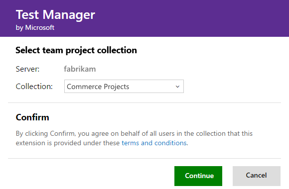

0.	If you chose a paid extension, 
select the [Azure subscription](https://azure.microsoft.com/pricing/purchase-options/) 
that you'll use to pay for extension access.

	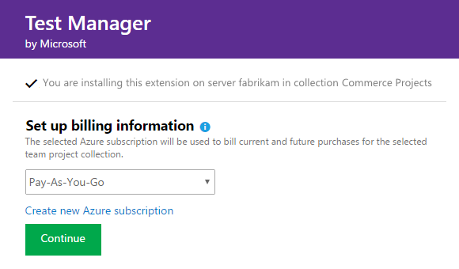

	Then select the number of users who will need paid access to the extension.

	

0.	Finish installing your extension. 

0.	If you installed a paid extension, 
make sure to [assign the extension to users who need access](faq-extensions.md#install-request-assign-and-access-extensions). 
Otherwise, you can go to your project collection to use your extension. 
Also, remember tell your team about this extension, 
so they can start using its capabilities too. 

	

   [Need help?](faq-extensions.md) 

<a name="disconnected-tfs"></a>
## Install Team Foundation Server extensions when disconnected

While you're disconnected from TFS, you can install free and preview extensions, 
but not paid extensions, by downloading them, uploading them to your TFS, 
and then installing them in a project collection.

### Who can upload extensions?

[Team Foundation administrators](/azure/devops/server/admin/add-administrator-tfs#server) 
with [**Edit instance-level information** permissions](../organizations/security/permissions.md#server) 
can upload extensions.

### Who can install extensions?

[Project collection administrators](../organizations/security/set-project-collection-level-permissions.md) 
with [**Edit collection-level information** permissions](../organizations/security/permissions.md#collection) 
can install extensions. If you don't have permissions, you can [request extensions](request-extensions.md) instead.

<a name="difference"></a>

### Download from Visual Studio Marketplace

0.  Sign in to [Visual Studio Marketplace > Azure DevOps Services](https://marketplace.visualstudio.com/azuredevops).

0.	Find the extension that you want to install.

		

		

0.	Download and save your extension.

	

::: moniker-end

::: moniker range="tfs-2015"

### Upload to Team Foundation Server

0.	Go to your TFS home page (```https://{server}:8080/tfs/```). 

0.	Browse for your downloaded TFS extensions (```https://{server}:8080/tfs/_gallery```).

	**TFS 2015 Update 3**

	

::: moniker-end

::: moniker range="tfs-2017"

### Upload to Team Foundation Server

0.	Go to your TFS home page (```https://{server}:8080/tfs/```). 

0.	Browse for your downloaded TFS extensions (```https://{server}:8080/tfs/_gallery```).

	

::: moniker-end

::: moniker range="<= tfs-2018"

### Upload to Team Foundation Server

0.	Go to your TFS home page (```https://{server}:8080/tfs/```). 

0.	Browse for your downloaded TFS extensions (```https://{server}:8080/tfs/_gallery```).

0.	Manage your extensions.

	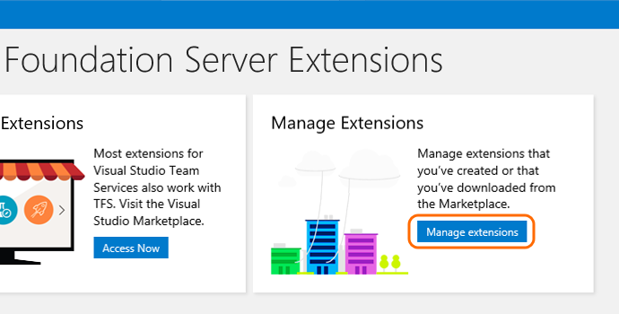

0. Upload the extension that you downloaded.

	

	[Why can't I upload extensions?](tfs-extension-faqs.md#q-why-cant-i-upload-extensions-to-tfs)

### Install in your project collection

0. Select and install the extension that you just uploaded. 

	

0. Choose the project collection where you want to install the extension.

	

0. Review the permissions that the extension will get when it's installed. Finish installing your extension.

	

   You can now go to your project collection to use your extension. Also, remember to tell your team about this extension, so they can start using its capabilities too. 

## Pre-installed extensions (first-party) for disconnected TFS

>[!NOTE] 
> This section is only for adding pre-installed extensions (first-party), if you're installing extensions that
> aren't pre-installed with TFS, head to the [Disconnected TFS section](#disconnected-tfs).

With first-party extensions that come pre-installed with TFS, there is an alternate method of installation that prevents compatibility issues.

In this case, you can manage extensions in disconnected TFS by following the steps below:
0. Hover over the shopping bag icon and select **Manage extensions**

	

0. Once on the Extensions page, select **Browse local extensions**

	

0.	Scroll down until you see the Plan and track category which will include **Delivery Plans**. Select **Delivery Plans**

	

0. This will redirect you to a local extension page for Delivery Plans where you will find the button to **Install**. This works when you are both online and offline

	

::: moniker-end

::: moniker range="> tfs-2018 < azure-devops"

<a name="connected-devops"></a>

## Install Azure DevOps Server extensions from Marketplace

0. Open your Azure DevOps Server home page (`https://{server}:DefaultCollection`).

0. Open the extensions menu and choose **Browse Marketplace**.

   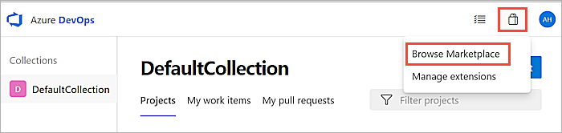

0. Find the extension that you want to install. Use the search box to filter the list of extensions.

   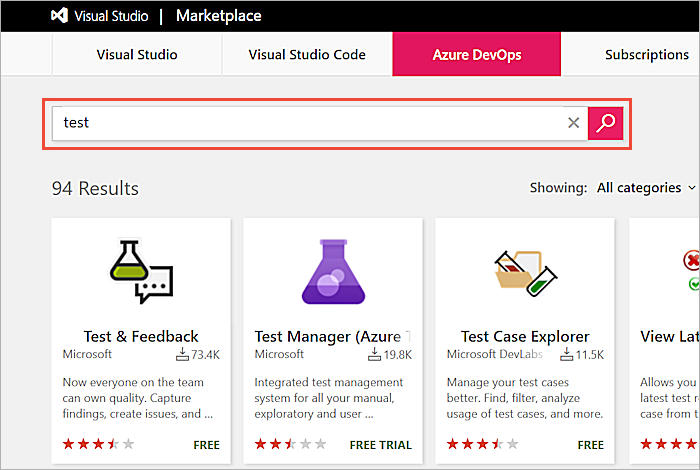

0. Select the extension and choose **Get** if it is a paid extension, or **Get it free**.
   Or, for some third-party extensions, choose **Get Started** to show pricing information
   and extension-specific installation instructions.

   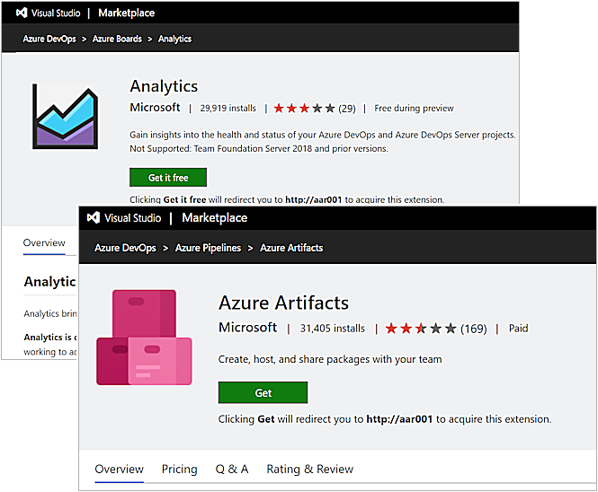

   If you do not have permission to install the extension, you can request an administrator
   install it for you. Your request is [stored in Azure DevOps Server](#review-ext)
   ready for attention from an administrator.

0. Select the project collection where you want to install this extension and choose **Install**.

   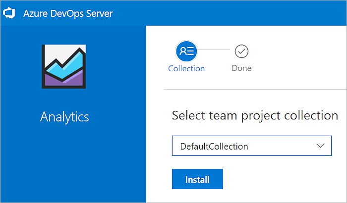

0. After installation is complete, go to the project collection or return to Marketplace to find other extensions. 

   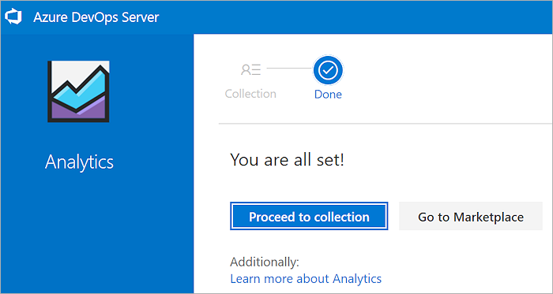

<a name="disconnected-devops"></a>

## Install Azure DevOps Server extensions from the local gallery

Several extensions are pre-installed in the local extensions gallery.
Users can install these extensions without requiring an external connection to Marketplace or the internet.

> [!TIP]
> Extensions that have previously been installed from Marketplace appear in the 
> local gallery automatically so that they can easily be installed into other project collections. 

0. Open the extensions menu and choose **Manage Extensions**.

   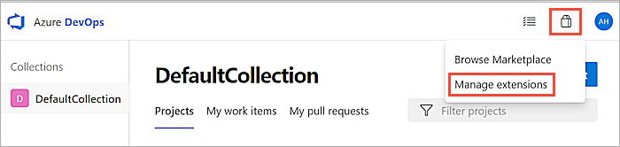

0. In the Extensions page, choose **Browse local extensions**

   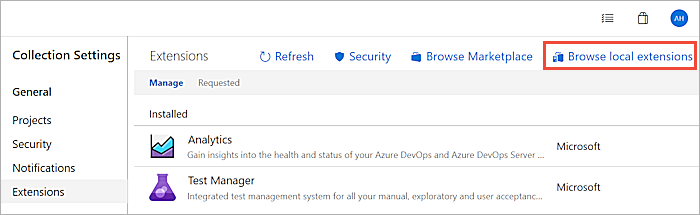

0. Choose the entension you want to install.

   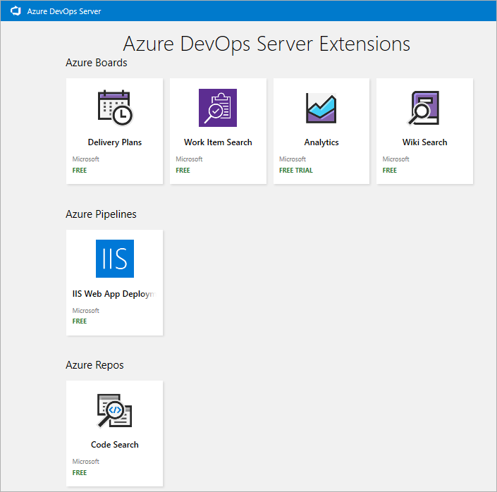

0. Select the project collection where you want to install this extension and choose **Install**.

   

0. After installation is complete, go to the project collection or return to Marketplace to find other extensions. 

   

## Manage Azure DevOps Server extensions

Use the **Extensions** page to manage installed extensions.

### Disable or uninstall an extension

0. Open the extensions menu and choose **Manage Extensions**.

   

0. In the **Manage** tab, open the shortcut menu for the extension.

   

0. Choose **Disable** or **Uninstall** as required.

<a name="review-ext"></a>

### Review and install requested extensions

0. Open the extensions menu and choose **Manage Extensions**.

   

0. Open the **Requested** tab, review requests, and approve or reject them as appropriate.

0. Filter the list of requests by using the **Status** drop-down list at the right end of the tabs bar.

   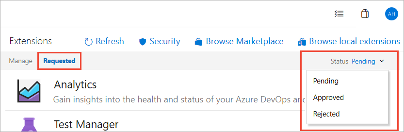

::: moniker-end
