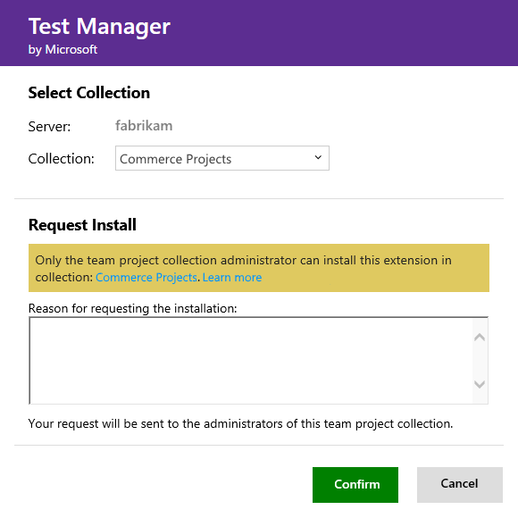
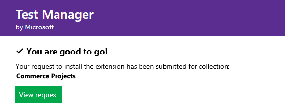
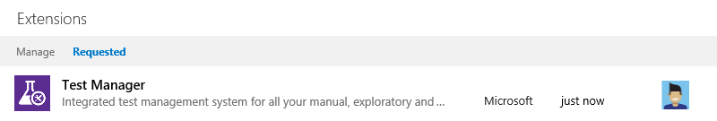
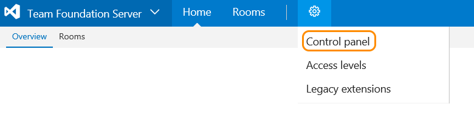
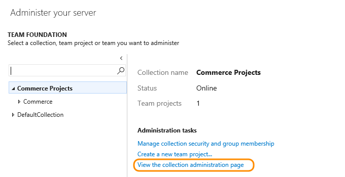
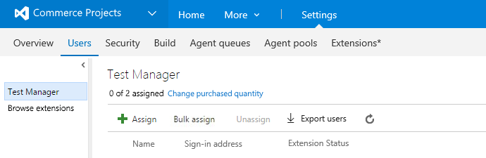
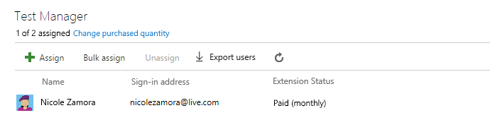

# Get extensions for Team Foundation Server (TFS)

**TFS 2017** | **TFS 2015 Update 3**

To add new features and capabilities to your TFS, 
install extensions from the 
[Visual Studio Marketplace](https://marketplace.visualstudio.com/vsts). 

*	Working with TFS 2017? [Connect to TFS](#connected-tfs), 
so you can install [free, preview, and paid extensions](#difference).

*	Working with TFS 2015 Update 3, or disconnected from TFS 2017? 
[Download extensions, then upload them to TFS](#disconnected-tfs) to 
[install free and preview extensions](#difference). 

> [!TIP]
> To learn about building your own TFS extensions, 
> see [developing](http://aka.ms/vsoextensions) 
> and [publishing](http://aka.ms/vsmarketplace-publish) extensions.

<a name="connected-tfs"></a>
## Install extensions while connected to TFS

### What do I need to install extensions?

[Project collection administrators](../setup-admin/add-administrator-tfs.md#project-collection) 
with [**Edit collection-level information** permissions](../setup-admin/permissions.md#collection) 
can install extensions. If you don't have permissions, you can [request extensions](#request) instead.

For paid extensions, you'll need an 
[Azure subscription](https://azure.microsoft.com/en-us/pricing/purchase-options/) 
to bill your purchase. If you don't have an Azure subscription, 
you can create a new subscription when you make your first purchase. 

> [!NOTE]
> To use an existing Azure subscription for billing,
> you must have at least Co-administrator permissions for that subscription. 
> If you don't have permissions, have an Azure Account Administrator 
> or Service Administrator go to the Azure classic portal and 
> [add you as Co-administrator](https://docs.microsoft.com/en-us/azure/billing-add-change-azure-subscription-administrator) 
> to the Azure subscription that you want to use for billing. 
> Co-administrator permissions are available only in the classic Azure portal.

Your team project collection will reuse your Azure subscription 
for future Visual Studio Marketplace purchases. 
[Where can I find more info about Azure billing?](#billing)

0.  From your TFS home page (```https://{server}:8080/tfs/```), 
go to the team project collection where you want to install the extension.

0.  From your team project collection, 
go to the Visual Studio Marketplace.

	

0.	Find and select the extension that you want to install.

   

   TFS is connected to the Marketplace, so the Marketplace automatically filters and shows on-premises extensions only.

0.	Based on the extension that you select, 
install or buy the extension.

	*	For free or preview extensions, click **Install**.
	*	For extensions that you haven't paid for access yet, click **Buy**.
	*	For extensions that you've already [paid for access](#paid-access), 
	expand **Buy**, and select **Install for paid users**.

   

0.	Confirm the team project collection where you want to install this extension.

	

0.	If you chose a paid extension, 
select the [Azure subscription](https://azure.microsoft.com/en-us/pricing/purchase-options/) 
that you'll use to pay for extension access.

	

	Then select the number of users who will need paid access to the extension.

	

0.	Finish installing your extension. 

0.	If you installed a paid extension, 
make sure to [assign the extension to users who need access](#assign-extension). 
Otherwise, you can go to your team project collection to use your extension. 
Also, remember tell your team about this extension, 
so they can start using its capabilities too. 

	

   [Need help?](#get-support)

<a name="disconnected-tfs"></a>
## Install extensions for disconnected TFS

While you're disconnected from TFS, you can install free and preview extensions, 
but not paid extensions, by downloading them, uploading them to your TFS, 
and then installing them in a team project collection.

### Who can upload extensions?

[Team Foundation administrators](../setup-admin/add-administrator-tfs.md#server) 
with [**Edit instance-level information** permissions](../setup-admin/permissions.md#server) 
can upload extensions.

### Who can install extensions?

[Project collection administrators](../setup-admin/add-administrator-tfs.md#project-collection) 
with [**Edit collection-level information** permissions](../setup-admin/permissions.md#collection) 
can install extensions. If you don't have permissions, you can [request extensions](#request) instead.

### Download from Visual Studio Marketplace

0.  Sign in to [Visual Studio Marketplace > Visual Studio Team Services](https://marketplace.visualstudio.com/vsts).

0.	Find the extension that you want to install.

		

		

0.	Download and save your extension.

	

	[Why doesn't the extension have a download button?](#no-download)

### Upload to Team Foundation Server

0.	Go to your TFS home page (```https://{server}:8080/tfs/```). 

0.	Browse for your downloaded TFS extensions 
(```https://{server}:8080/tfs/_gallery```).

	<div style="background-color: #f2f0ee;padding-top:10px;padding-bottom:10px;">

	<ul class="nav nav-pills" style="padding-right:15px;padding-left:15px;padding-bottom:5px;vertical-align:top;font-size:18px;">
		<li style="float:left;" data-toggle="collapse" data-target="#browse-extensions"></li>
		<li style="float: right;"><a style="max-width: 374px;min-width: 120px;vertical-align: top;background-color:#AEAEAE;margin: 0px 0px 0px 8px;min-width:90px;color: #fff;border: solid 2px #AEAEAE;border-radius: 0;padding: 2px 6px 0px 6px;outline-style:none;height:32px;font-size:14px;font-weight:400" data-toggle="pill" href="#tfs2017-0">TFS 2017</a></li>
		<li class="active" style="float: right"><a style="max-width: 374px;min-width: 120px;vertical-align: top;background-color:#007acc;margin: 0px 0px 0px 0px;min-width:90px;color: #fff;border: solid 2px #007acc;border-radius: 0;padding: 2px 6px 0px 6px;outline-style:none;height:32px;font-size:14px;font-weight:400" data-toggle="pill" href="#tfs2015-0">TFS 2015 Update 3</a></li>
	</ul>

	<div id="browse-extensions" class="tab-content collapse in fade" style="background-color: #ffffff;margin-left: 15px;margin-right:15px;padding: 5px 5px 5px 5px;">
	<div id="tfs2015-0" class="tab-pane fade in active">

	**TFS 2015 Update 3**

	

	</div><div class="tab-pane fade" id="tfs2017-0" style="background-color: #ffffff;margin-left: 15px;margin-right:15px;padding: 5px 5px 5px 5px;">

	**TFS 2017**

	

	</div></div></div>

0.	Manage your extensions.

	

0. Upload the extension that you downloaded.

	

	[Why can't I upload extensions?](#no-upload)

### Install in your team project collection

0. Select and install the extension that you just uploaded. 

	

0. Choose the team project collection where you want to install the extension.

	

0. Review the permissions that the extension will get when it's installed. 
Finish installing your extension.

	

   You can now go to your team project collection to use your extension. 
   Also, remember tell your team about this extension, 
   so they can start using its capabilities too. 

<a name="grant"></a>
## Grant permissions to manage extensions
To grant permissions for managing extensions to users or groups, use [TFSSecurity](../setup-admin/tfs/command-line/tfssecurity-cmd.md#permissions) command-line tool.

0.	At the server level, create a group, for example, "TFS Extension Publishers".<br/>
<code>
tfssecurity /gcg "TFS Extension Publishers" "publishers who can manage extensions for the server" /server:ServerURL
</code>
<br/>
0. 	Grant access to the "TFS Extension Publishers" group to manage extensions.<br/>
<code>
tfssecurity /a+ Publisher "//" CreatePublisher n:"[TEAM FOUNDATION]\TFS Extension Publishers" allow /server:ServerURL<br/>
tfssecurity /a+ Publisher "//" PublishExtension n:"[TEAM FOUNDATION]\TFS Extension Publishers" allow /server:ServerURL<br/>
tfssecurity /a+ Publisher "//" UpdateExtension n:"[TEAM FOUNDATION]\TFS Extension Publishers" allow /server:ServerURL<br/>
tfssecurity /a+ Publisher "//" DeleteExtension n:"[TEAM FOUNDATION]\TFS Extension Publishers" allow /server:ServerURL
</code>
<br/>
For Team Foundation Server "15" RC2 or earlier, use this syntax:<br/>
<code>
tfssecurity /a+ Publisher "//" Create n:"[TEAM FOUNDATION]\TFS Extension Publishers" allow /server:ServerURL<br/>
tfssecurity /a+ Publisher "//" Publish n:"[TEAM FOUNDATION]\TFS Extension Publishers" allow /server:ServerURL<br/>
tfssecurity /a+ Publisher "//" Write n:"[TEAM FOUNDATION]\TFS Extension Publishers" allow /server:ServerURL
</code>
0. Add existing users and groups to the "TFS Extension Publishers" group.<br/>
<code>
tfssecurity /g+ "[TEAM FOUNDATION]\TFS Extension Publishers" n:User /server:ServerURL
</code>
<br/>
You can add users later to "TFS Extension Publishers". This is a server-level permission, 
so updating and deleting an extension will affect all the team project collections that use the extension.


<a name="request"></a>
## Request extensions for a team project collection

Don't have permissions to install extensions? 
You can request extensions instead.

0. While you're [disconnected](#disconnected-tfs) 
or [connected](#connected-tfs) to TFS, 
try to install the extension.

   

0. Select the team project collection where you want to install the extension. 
If you don't have permissions to install the extension, 
you can request it now.

	

   You can review your requests after the 
   Visual Studio Marketplace sends the request 
   to the project collection administrator.	

	

   Your requests appear on your manage extensions page.

	

   Your project collection administrator 
   can review your request after they get it.

## Approve extensions for a team project collection

As a project collection administrator, 
you'll get email when another team project member requests an extension. 
When you approve the request, TFS automatically installs the extension.

To approve extensions, you must also have 
[**Edit collection-level information** permissions](../setup-admin/permissions.md#collection).

0.	Go to your TFS home page, 
then go to your team project (```https://{server}:8080/tfs/{team-project-collection}/{team-project}```).

0.	Manage your extensions.

	<div style="background-color: #f2f0ee;padding-top:10px;padding-bottom:10px;">

	<ul class="nav nav-pills" style="padding-right:15px;padding-left:15px;padding-bottom:5px;vertical-align:top;font-size:18px;">
		<li style="float:left;" data-toggle="collapse" data-target="#manage-extensions"></li>
		<li style="float: right;"><a style="max-width: 374px;min-width: 120px;vertical-align: top;background-color:#AEAEAE;margin: 0px 0px 0px 8px;min-width:90px;color: #fff;border: solid 2px #AEAEAE;border-radius: 0;padding: 2px 6px 0px 6px;outline-style:none;height:32px;font-size:14px;font-weight:400" data-toggle="pill" href="#tfs2015-02">TFS 2015 Update 3</a></li>
		<li class="active" style="float: right"><a style="max-width: 374px;min-width: 120px;vertical-align: top;background-color:#007acc;margin: 0px 0px 0px 0px;min-width:90px;color: #fff;border: solid 2px #007acc;border-radius: 0;padding: 2px 6px 0px 6px;outline-style:none;height:32px;font-size:14px;font-weight:400" data-toggle="pill" href="#tfs2017-02">TFS 2017</a></li>
	</ul>

	<div id="manage-extensions" class="tab-content collapse in fade" style="background-color: #ffffff;margin-left: 15px;margin-right:15px;padding: 5px 5px 5px 5px;">
	<div id="tfs2017-02" class="tab-pane fade in active">

	**TFS 2017**

	

	</div><div class="tab-pane fade" id="tfs2015-02" style="background-color: #ffffff;margin-left: 15px;margin-right:15px;padding: 5px 5px 5px 5px;">

	**TFS 2015 Update 3**

	

	</div></div></div>

0. Review and approve your requested extensions.

	

   After you approve extension requests, TFS automatically installs those extensions. 

0. If you installed paid extensions, 
go to the next section to [assign those extensions](#assign-extension), 
to users who need access so they can start using those extensions. 

0. Remember tell your team about installed extensions, 
   so they can start using their capabilities.

<a name="assign-extension"></a>
## Assign paid extension access to users

After you install a paid extension, 
you must assign that extension to users who need access, 
so they can start using that extension's capabilities.

> You only have to assign extensions to users who need access. 
> Most extensions require that users have at least Basic access, 
> not Stakeholder. If you have [Visual Studio Enterprise subscribers](https://marketplace.visualstudio.com/subscriptions), 
> they automatically get access to specific extensions that are included 
> with their subscriptions as benefits, like Test Manager. 
> If you installed these extensions, you don't have to assign 
> them to Visual Studio Enterprise subscribers in your team project. Visual Studio Test Professional subscribers 
> get access to the Test Manager extension included with their subscription. To grant them access just assign Test Manager.
> To learn more, see [change access levels](https://www.visualstudio.com/docs/work/connect/change-access-levels).
> To find the access that your extension requires, see the extension's description 
> in the [Visual Studio Marketplace](https://marketplace.visualstudio.com).

### Who can assign paid extensions to users?

[Project collection administrators](../setup-admin/add-administrator-tfs.md#project-collection) 
with [**Edit collection-level information** permissions](../setup-admin/permissions.md#collection) 
can assign paid extensions to users.

0.  From your TFS home page, go to your control panel (```https://{server}:8080/tfs/_admin```).

    

0.  Go to your team project collection settings (```https://{server}:8080/tfs/{team-project-collection}/_admin```).

    

0.  Go to your Users hub (```https://{server}:8080/tfs/{team-project-collection}/_admin/_userHub```).

    

0.  Go to the extension pane, for example, Test Manager.

    

0.  Assign your extension to users who need access. 

    

    

    You can assign the extension to one user, specific users, 
    or to all users at the same time, even going above the number allowed 
    for your extension, if necessary.

0.  Tell your team about this extension, so they can start using its capabilities.

    [Need help?](#get-support)

<a name="change-extension-quantity"></a>
##	Change number of paid extension users

To update the total number of extension users that you pay for, 
go to your Team Foundation Server Users hub.
To cancel paid access to an extension, 
reduce your users to zero (0). 
[How do you bill changes in users?](#bill-period)

### Who can change the number of paid extension users?

[Project collection administrators](../setup-admin/add-administrator-tfs.md#project-collection) 
with [**Edit collection-level information** permissions](../setup-admin/permissions.md#collection) 
can change the number of paid extension users whose access that you pay for.

0.  From your TFS home page, go to your control panel (```https://{server}:8080/tfs/_admin```).

    

0.  Go to your team project collection settings (```https://{server}:8080/tfs/{team-project-collection}/_admin```).

    	

0.  Go to your Users hub (```https://{server}:8080/tfs/{team-project-collection}/_admin/_userHub```).

    

0.  Go to the extension pane, for example, Test Manager. Change the number of extension users that you pay for.

    

0.  Update your total paid extension users.

    

    [Need help?](#get-support)

<a name="uninstall-disable-extension"></a>
## Uninstall or disable extensions in Team Foundation Server

When you don't need an extension anymore, 
you can uninstall or disable this extension.

> Charges will continue for a paid extension 
> until you [reduce all users to zero (0) for this extension](#change-extension-quantity). 

### Who can uninstall or disable extensions?

[Project collection administrators](../setup-admin/add-administrator-tfs.md#project-collection) 
with [**Edit collection-level information** permissions](../setup-admin/permissions.md#collection) 
can uninstall or disable extensions. 

0.	From your TFS home page (```https://{server}:8080/tfs/```), 
go to the team project collection where you want to uninstall or disable the extension.

0.	Manage your extensions.

	<div style="background-color: #f2f0ee;padding-top:10px;padding-bottom:10px;">

	<ul class="nav nav-pills" style="padding-right:15px;padding-left:15px;padding-bottom:5px;vertical-align:top;font-size:18px;">
		<li style="float:left;" data-toggle="collapse" data-target="#manage-extensions-02"></li>
		<li style="float: right;"><a style="max-width: 374px;min-width: 120px;vertical-align: top;background-color:#AEAEAE;margin: 0px 0px 0px 8px;min-width:90px;color: #fff;border: solid 2px #AEAEAE;border-radius: 0;padding: 2px 6px 0px 6px;outline-style:none;height:32px;font-size:14px;font-weight:400" data-toggle="pill" href="#tfs2015-03">TFS 2015 Update 3</a></li>
		<li class="active" style="float: right"><a style="max-width: 374px;min-width: 120px;vertical-align: top;background-color:#007acc;margin: 0px 0px 0px 0px;min-width:90px;color: #fff;border: solid 2px #007acc;border-radius: 0;padding: 2px 6px 0px 6px;outline-style:none;height:32px;font-size:14px;font-weight:400" data-toggle="pill" href="#tfs2017-03">TFS 2017</a></li>
	</ul>

	<div id="manage-extensions-02" class="tab-content collapse in fade" style="background-color: #ffffff;margin-left: 15px;margin-right:15px;padding: 5px 5px 5px 5px;">
	<div id="tfs2017-03" class="tab-pane fade in active">

	**TFS 2017**

	

	</div><div class="tab-pane fade" id="tfs2015-03" style="background-color: #ffffff;margin-left: 15px;margin-right:15px;padding: 5px 5px 5px 5px;">

	**TFS 2015 Update 3**

	

	</div></div></div>

0. On the extensions tab, 
select the extension, then uninstall or disable it.

	

	[Need help?](#get-support)

## Q & A

### General

<!-- BEGINSECTION class="m-qanda" -->

<a name="difference"></a>

[!INCLUDE [extensions-difference](_shared/qa-extensions-difference.md)]

[!INCLUDE [what-happened-preview-extensions](../_shared/qa-what-happened-preview-extensions.md)]

<!-- ENDSECTION --> 

### Install, request, assign, and access extensions

<!-- BEGINSECTION class="m-qanda" -->

<a name="paid-access"></a>
#### Q: When do I choose Install for paid extensions? 

A: You can just choose **Install** when: 

*	You want to install a free or preview extension. 
*	You paid for access, uninstalled the extension, 
and want to reinstall the extension. 
*	You just need the extension for 
[Visual Studio subscribers](https://marketplace.visualstudio.com/subscriptions) 
who have access for that extension included with their subscriptions. 
These subscribers get specific extensions, like Test Manager, 
included with their subscriptions as benefits. They can use 
these extensions after they're installed without paid access 
and assignment. You only have to buy and assign extensions 
for users who need access.

<a name="no-install"></a>
#### Q: Why can't I install extensions for TFS?

A: This might happen for these reasons: 

*	You must be a member of the 
[Project Collection Administrators group](../setup-admin/add-administrator-tfs.md#project-collection) 
with [**Edit collection-level information** permissions](../setup-admin/permissions.md#collection) 
in the team project collection where you want to install extensions.
If you don't have permissions, you can [request extensions](#request) instead.


*	If you get an error that your extension is already installed or 
requested, check with your project collection administrator 
and ask them to assign the extension to you.

	<!-- image placeholder -->

<a name="no-team-project collection"></a>

#### Q: Why don't I see the team project collection I want?

A:	You must be a member of your team project collection. 
Follow these steps to check your identity that you use 
to sign in to the Visual Studio Marketplace. 

0.	On your TFS web portal home page (```https://{server}:8080/tfs/```), 
go to the top right corner of the page, and click your user name to view your profile. 
0.	On the left side of your profile, make sure that your email address and directory are correct.
0.	Close all browser windows.
0.	Open a private or incognito browsing session.
0.	Sign in to your TFS home page (```https://{server}:8080/tfs/```) 
with the identity that's a user in the team project collection 
where you want to install the extension.

	> If you're asked to choose "work or school account" or 
	> "personal account", this means you used an email address 
	> that's the same for a Microsoft account and a "work or school account" 
	> that's managed by your organization in Azure Active Directory. 
	> Although these identities have the same email address, 
	> they're still separate identities with different profiles, 
	> security settings, and permissions.
	> 
	> Choose the identity that's the user in your team project collection. 

0.	From your team project collection, go to the Visual Studio Marketplace.

<a name="third-party-purchase-problems"></a>

[!INCLUDE [troubleshooting-purchases-shared-ts-tfs](_shared/qa-troubleshooting-purchases-shared-ts-tfs.md)]

<a name="no-download"></a>
#### Q: Why doesn't the extension I want show a download button?

A: Some extensions work only with Visual Studio Team Services, not TFS, for one of these reasons:

- The extension uses Team Services features that aren't released yet for TFS.
- The [extension manifest](../../integrate/extensions/develop/manifest.md) indicates that the extension 
is available only for Team Services (targets = Microsoft.Visualstudio.Services.Cloud).
- The extension manifest indicates that the extension is an integration (targets = Microsoft.Visualstudio.Services.Integration).

<a name="no-upload"></a>
#### Q: Why can't I upload extensions to TFS?

A: You must be a member of the 
[Team Foundation Administrators group](https://www.visualstudio.com/docs/setup-admin/add-administrator-tfs#server) 
with [**Edit instance-level information** permissions](https://www.visualstudio.com/docs/setup-admin/permissions#server) 
for the Team Foundation Server where you want to upload extensions.

<a name="extension-access"></a>

[!INCLUDE [no-access-extension-features](../_shared/qa-no-access-extension-features.md)]

<!-- ENDSECTION --> 

<a name="billing"></a>

### Purchases & billing

[!INCLUDE [azure-billing](_shared/qa-azure-billing.md)]

<a name="bill-period"></a>

[!INCLUDE [extension-billing-frequency](_shared/qa-extension-billing-frequency.md)]

[!INCLUDE [azure-bill-larger](../_shared/qa-azure-bill-larger.md)]

[!INCLUDE [azure-subscription-disabled-tfs](../_shared/qa-azure-subscription-disabled-tfs.md)]

[!INCLUDE [azure-billing-support](_shared/qa-azure-billing-support.md)]

<a name="get-support"></a>

[!INCLUDE [marketplace-support](_shared/qa-marketplace-support.md)]
