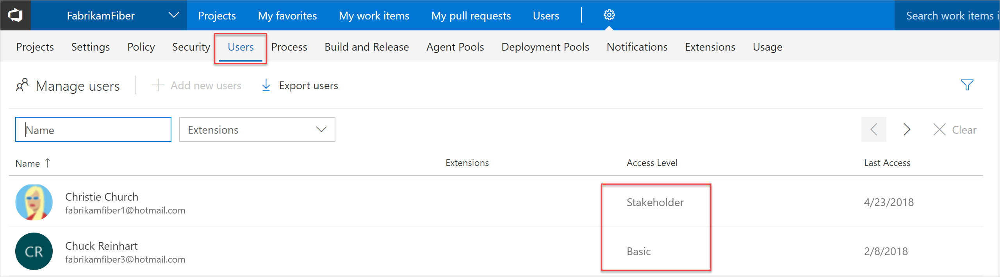

# Get extensions for Visual Studio Team Services

To add new features and capabilities to your Visual Studio Team Services account, 
install extensions from the [Visual Studio Marketplace](https://marketplace.visualstudio.com/vsts). 
You can install [free, preview, or paid](#difference) extensions, 
and you can [start extension trials](https://www.visualstudio.com/docs/setup-admin/team-services/try-additional-features-vs), 
if they're offered. 

> [!TIP]
> To learn about building your own Team Services extensions, 
> see [developing](http://aka.ms/vsoextensions) and 
> [publishing](http://aka.ms/vsmarketplace-publish) extensions.

<a name="install-extension"></a>
## Install an extension for your Team Services account

### What do I need to install extensions?
Team Services [project collection administrators or account owners](#find-owner) can install extensions. If you don't have permissions, 
you can [request extensions](#request) instead. 

Private extensions must be shared with your Team Services account to be installed. Check out the
[publishing documentation](../../integrate/extensions/publish/overview.md#upload) for information on how to share private extensions.

For paid extensions, you'll need an [Azure subscription](https://azure.microsoft.com/en-us/pricing/purchase-options/) 
to bill your purchase. If you don't have an Azure subscription, you can create a new subscription when you make your first purchase. 

> [!NOTE]
> To use an existing Azure subscription for billing,
> you must have at least Co-administrator permissions for that subscription. 
> If you don't have permissions, have an Azure Account Administrator 
> or Service Administrator go to the Azure classic portal and 
> [add you as Co-administrator](https://docs.microsoft.com/en-us/azure/billing-add-change-azure-subscription-administrator) 
> to the Azure subscription that you want to use for billing. 
> Co-administrator permissions are available only in the classic Azure portal.

Your Team Services account will reuse your Azure subscription 
for future Visual Studio Marketplace purchases 
or for team services purchased through Azure, 
like Cloud-based Load Testing.
[Where can I find more info about Azure billing?](#billing)

0.  Sign in to the [Visual Studio Marketplace > Visual Studio Team Services](https://marketplace.visualstudio.com/vsts).
	
	

0.	Find and select the extension that you want to install.

0.	Based on the extension that you select, 
install or buy the extension.
	
	*	For free or preview extensions, click **Install**.
	*	For extensions that you haven't paid for access yet, click **Buy**.
	*	For extensions that you've already [paid for access](#paid-access), 
	expand **Buy**, and select **Install for paid users**. 

	**Start Trial** appears only if the extension offers a trial. 
	Learn [how to try extensions](https://www.visualstudio.com/docs/setup-admin/team-services/try-additional-features-vs).

	

0.  Select your Team Services account to install this extension. 

	

	*	[Why don't I see any Team Services accounts?](#no-accounts) 

	*	[Why can't I install this extension?](#no-permissions) 

0.	If you chose a paid extension, 
select an [Azure subscription](https://azure.microsoft.com/en-us/pricing/purchase-options/) 
that you'll use to pay for extension access.
	
	

	Then select the number of users who will need paid access.

	

0.	Finish your installation. 

0.	If you installed a paid extension like Test Manager, 
make sure that you [assign the extension to users who need access](#assign-extension).
Otherwise, you can now go to your Team Services account to use your extension. 
Also, tell your team about this extension, so they can start using its capabilities too.

	

<a name="request"></a>
## Request extensions for your Team Services account

Don't have permissions to install extensions? 
You can request extensions instead.

0.  Sign in to [Visual Studio Marketplace > Visual Studio Team Services](https://marketplace.visualstudio.com/vsts).
	
	

0. Find and select the extension that you want to request.

0. Try to install the extension.

	

0. Select the Team Services account where you want to install the extension. 
If you don't have permissions to install the extension, 
you can request it now.

	

	You can review your requests after the Visual Studio Marketplace sends the request to the account owner.	

	

	Your requests appear on your Team Services account's extensions page.

	

	Your Team Services account owner or project collection administrator 
	can review your request after they get it.

	[Need help?](#get-support)

## Approve extension requests for your Team Services account

If you're the Team Services project collection administrator or account owner, 
you'll get email when another Team Services account user requests an extension. 
When you approve the request, Team Services automatically installs the extension.

0.	Sign in to your Team Services account 
(```https://{youaccount}.visualstudio.com```).

0.	From your account toolbar, go to **Extensions**.

	

0.	Review and approve your requested extensions.

	

0.	After you approve extension requests, 
Team Services automatically installs those extensions. 

0.	If you installed paid extensions, 
go to the next section to [assign those extensions](#assign-extension), 
to users who need access so they can start using those extensions.

<a name="assign-extension"></a>
## Assign paid extension access to users

After you install a paid extension, 
you must assign that extension to users who need access, 
so they can start using that extension's capabilities. 
To assign extensions, you'll need Team Services 
[project collection administrator or account owner permissions](#find-owner).

> [!TIP]
> You only have to assign extensions to users who need access. 
> If you have [Visual Studio subscribers](https://marketplace.visualstudio.com/subscriptions), 
> they automatically get access to specific extensions that are included 
> with their subscriptions as benefits, like Test Manager. 
> If you installed these extensions, you don't have to assign 
> them to Visual Studio subscribers in your account. 

0.	Sign in to your Visual Studio Team Services account 
(```https://{youraccount}.visualstudio.com```).

0.	Go to **Users**.

	

0.	Most extensions require that users have at least Basic access, 
not Stakeholder. Check your users' access levels here:

	

	For example, Johnnie has a Visual Studio Enterprise subscription, 
	which includes access to the Test Manager extension.
	To find the access that your extension requires, see the extension's description 
	in the [Visual Studio Marketplace](https://marketplace.visualstudio.com).

0.	To assign the extension, 
go to the extension pane, for example, Test Manager.

	

0.	Assign the extension. 

	

	

	You can assign the extension to one user, specific users, 
	or to all users at the same time, up to the number allowed 
	for free extensions or the number that you purchased for paid extensions.

0.	Tell your team about this extension, 
	so they can start using its capabilities.

<a name="change-extension-quantity"></a>
##	Change number of paid extension users

To scale with your team's needs, increase or decrease your total number of paid extension users.
You'll need Team Services 
[project collection administrator or account owner permissions](#find-owner). 

> [!IMPORTANT]
> To cancel access completely for a paid extension, 
> reduce all your paid users to zero (0). 
> [How do you bill changes in users?](#bill-period)

0.	Sign in to your Visual Studio Team Services account 
(```https://{youraccount}.visualstudio.com```).

0. Go to **Users**.

	

0.	Go to the extension pane. 
Change the number of extension users that you're paying for.

	

0.	Update your total paid extension users.

	

<a name="uninstall-disable-extension"></a>
## Uninstall or disable extensions in your Team Services account

When you don't need an extension anymore, you can uninstall or disable this extension. 
You'll need Team Services 
[project collection administrator or account owner permissions](#find-owner).

> [!IMPORTANT]
> To cancel access completely to a paid extension, you must 
> [reduce all extension users to zero (0)](#change-extension-quantity). 
> [How do you bill changes in users?](#bill-period)

0.	Sign in to your Team Services account 
(```https://{youaccount}.visualstudio.com```).

0.	From your account toolbar, go to **Extensions**.

	

0.	On the extensions tab, 
select the extension, then uninstall or disable it.

	

## Q&A

### General

<!-- BEGINSECTION class="m-qanda" -->

<a name="difference"></a>

[!INCLUDE [extensions-difference](_shared/qa-extensions-difference.md)]

[!INCLUDE [what-happened-preview-extensions](../_shared/qa-what-happened-preview-extensions.md)]

<!-- ENDSECTION --> 

### Install, request, assign, and access extensions

<!-- BEGINSECTION class="m-qanda" -->

#### Q: Who can install extensions for Visual Studio Team Services?

A: The Team Services account owner and 
project collection administrator can install extensions. 
If you don't have permissions, but you're an account member, 
you can [request extensions](#request) instead. 

<a name="find-owner"></a>

[!INCLUDE [find-account-owner](../_shared/qa-find-account-owner.md)]

[!INCLUDE [find-project-collection-administrator](../_shared/qa-find-project-collection-administrator.md)]

<a name="no-accounts"></a>

[!INCLUDE [no-accounts](_shared/qa-no-accounts.md)]

####Q:		Why can't I install extensions for Team Services?

A:	This might happen for these reasons:

<a name="no-permissions"></a>
*	You must have Team Services 
[project collection administrator or account owner permissions](#find-owner). 
If you don't have permissions, but you're an account member, 
you can [request extensions](#request) instead.

<a name="no-assignment"></a>
*	If you get an error that your extension is already installed or 
requested, check with your project collection administrator 
or account owner, and ask them to assign the extension to you.

	<!-- image placeholder -->

<a name="paid-access"></a>
#### Q: When do I choose Install for paid extensions? 

A: You can just choose **Install** when: 

*	You want to install a free or preview extension. 
*	You paid for access, uninstalled the extension, 
and want to reinstall the extension. 
*	You just need the extension for 
[Visual Studio subscribers](https://marketplace.visualstudio.com/subscriptions) 
who have access for that extension included with their subscriptions. 
These subscribers get specific extensions, like Test Manager, 
included with their subscriptions as benefits. They can use 
these extensions after they're installed without paid access 
and assignment. You only have to buy and assign extensions 
for users who need access.

<a name="cant-assign-extensions"></a>
#### Q:	Why can't I assign extensions?

A:	This might happen for several reasons.

*	You don't have at Team Services 
[project collection administrator or account owner permissions](#find-owner).

*	Your users don't have the correct access levels. 
Most extensions require that users have Basic access, not Stakeholder.
For example, the Test Manager extension requires at least Basic access.

*	You assigned all the paid extensions that you bought.

<a name="extension-access"></a>

[!INCLUDE [no-access-extension-features](../_shared/qa-no-access-extension-features.md)]

<!-- ENDSECTION --> 

<a name="billing"></a>

### Purchases & billing

<!-- BEGINSECTION class="m-qanda" -->

[!INCLUDE [azure-billing](_shared/qa-azure-billing.md)]

<a name="bill-period"></a>

[!INCLUDE [extension-billing-frequency](_shared/qa-extension-billing-frequency.md)]

<!-- ENDSECTION --> 

### Troubleshooting purchases & billing

<a name="third-party-purchase-problems"></a>

[!INCLUDE [troubleshooting-purchases-shared-ts-tfs](_shared/qa-troubleshooting-purchases-shared-ts-tfs.md)]

<a name="cant-use-linked-azure-subscription"></a>
#### Q:	What if I already set up billing with a subscription that I can't use?

A:	If your Team Services account is linked to an Azure subscription 
that wasn't created from an Enterprise Agreement or with a credit card on file, 
you'll get this message: "Your account is linked to an Azure subscription 
that doesn't have a credit card on file. Learn how to change your subscription."

Follow these steps to create a new Azure subscription with a credit card, 
then change the Azure subscription that's linked to your Team Services account.

**Set up billing with a new Azure subscription**
0.	Use a credit card to create a new [Pay-As-You-Go Azure subscription](https://azure.microsoft.com/en-us/offers/ms-azr-0003p/).
0.	Follow these steps to [change your Azure subscription](https://www.visualstudio.com/docs/setup-admin/team-services/set-up-billing-for-your-account-vs#change-azure-subscription) 
for your Team Services account.

<!-- temp commenting while reworking this section
<a name="no-azure-subscription-in-list"></a>
#### Q:	Why doesn't my Azure subscription appear in the list?

A:	This can happen for these reasons:

<a name="no-coadmin-permissions"></a>
*	You don't have at least Co-administrator permissions for the 
Azure subscription that you want to use, 
or you don't have access to your linked Azure subscription.

	> [!NOTE]
	> If you get this message: *"This account is already 
	> linked to an Azure subscription which you can't access"*, 
	> make sure that you have at least Co-administrator permissions 
	> for the Azure subscription that you want to use.

	To check or change your Azure subscription permissions, 
	you must visit the [Azure classic portal](https://manage.windowsazure.com). 
	Learn [how to add Co-administrators to Azure subscriptions](https://www.visualstudio.com/docs/setup-admin/team-services/set-up-billing-for-your-account-vs#AddAzureAdmin) 
	so they can manage billing for your Team Services account.

<a name="mismatch-identity"></a>
*	Your identity for your Azure subscription and Team Services account don't match.

	*	*Symptom*: You have a "personal" Microsoft account 
	and a "work or school account" that share the same email address. 
	Although both identities have the same email address, 
	they're still separate identities with different profiles, 
	security settings, and permissions.

		Follow these steps to sign in with the identity 
		that's associated with your Azure subscription 
		and Team Services account.

		0.	Close all browser windows.
		0.	Open a private or incognito browsing session.
		0.	Sign in to the Visual Studio Marketplace with 
		the identity that's associated with your Azure subscription 
		and Team Services account.

			> [!TIP]
			> If you're asked to choose "work or school account" or 
			> "personal account", this means you have the same email address 
			> for your Microsoft account and your "work or school account", 
			> which is managed in Azure Active Directory.
			> 
			> Choose the identity that's associated with your Azure subscription 
			> and your Team Services account.
	
	*	*Symptom*: Your Team Services account isn't connected to the 
	directory (tenant) in Azure Active Directory 
	that's associated with the Azure subscription that you want to use.
	
		Check whether your Team Services account is connected to a directory.

		0.	Go to your Team Services account settings.

			

		0.	Under **Settings**, go to **Azure Active Directory**.

			

		Find the directory that's associated with your Azure subscription in 
		the Azure classic portal (```https://manage.windowsazure.com```).

		0.	Sign in to the [Azure classic portal](https://manage.windowsazure.com) 
		with the identity that's associated with your Azure subscription.
		0.	Go to **Settings**.
		0.	Find your Azure subscription and the associated directory.
 
			

		To resolve this problem, follow these steps:

		0.	[Create a new Microsoft account](https://signup.live.com/).
		0.	[Add this Micrososft account as a Co-administrator to your Azure subscription](https://www.visualstudio.com/docs/setup-admin/team-services/set-up-billing-for-your-account-vs#AddAzureAdmin).
		0.	[Add this Microsoft account to your Team Services account](https://www.visualstudio.com/docs/setup-admin/team-services/add-account-users-assign-access-levels-team-services), 
		and assign them Stakeholder access (free and unlimited).
		0.	Add this Microsoft account to the 
		[Project Collection Administrators group](https://www.visualstudio.com/docs/setup-admin/add-administrator-tfs#project-collection).
		0. Sign in with this Microsoft account to the Visual Studio Marketplace, 
		and use this Microsoft account to purchase for your Team Services account.

<a name="mismatch-directory"></a>
*	Your Azure subscription is associated with a directory (tenant) in Azure Active Directory 
that's different than the directory that's connected to your Team Services account. 
You must identify these directories, then if you have permissions, 
change the directory for your Azure subscription to match the directory that's connected to your Team Services account.

	Find the directory that's connected to your Team Services account.

	0.	Sign in to your Team Services account (```https://{youraccount}.visualstudio.com```).
	0.	Go to your account settings.

		

	0.	Under **Settings**, go to ** Azure Active Directory** 
	to find the connected directory.

		

	Find the directory that's associated with your Azure subscription 
	in the Azure classic portal (```https://manage.windowsazure.com```).

	0.	Sign in to the [Azure classic portal](https://manage.windowsazure.com) 
	with the identity that's associated with your Azure subscription.
	0.	Go to **Settings**.
	0.	Find your Azure subscription and the associated directory.

		

	Change the directory that's associated with your Azure subscription 
	to match the directory that's connected to your Team Services account.

	0.	In the [Azure classic portal](https://manage.windowsazure.com), 
	under **Settings**, select the Azure subscription that you previously found.
	0.	Choose **Edit directory**.

		

	0.	Change the subscription's current directory to the 
	directory that's connected to your Team Services account.

-->

[!INCLUDE [azure-bill-larger](../_shared/qa-azure-bill-larger.md)]

[!INCLUDE [azure-subscription-disabled-team-services](../_shared/qa-azure-subscription-disabled-team-services.md)]

[!INCLUDE [azure-billing-support](_shared/qa-azure-billing-support.md)]

<a name="get-support"></a>

[!INCLUDE [marketplace-support](_shared/qa-marketplace-support.md)]

