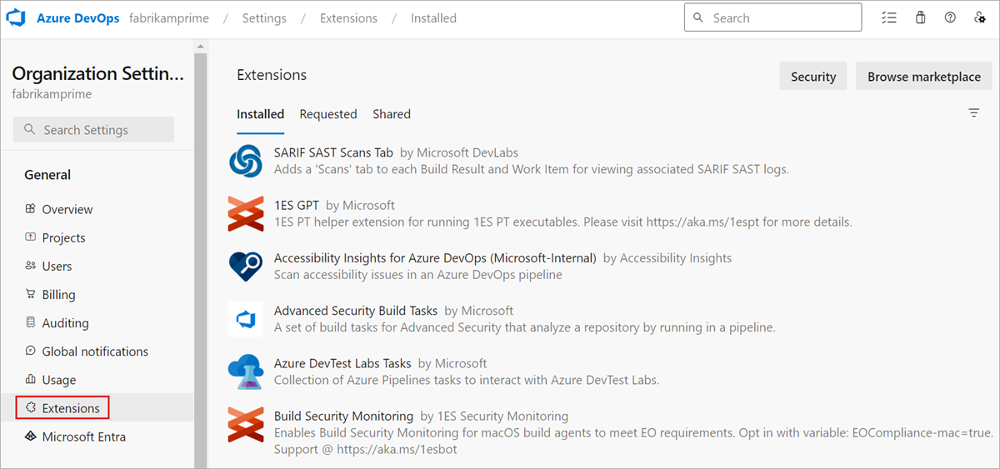
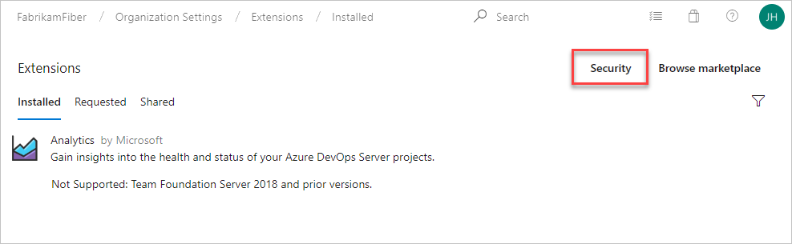
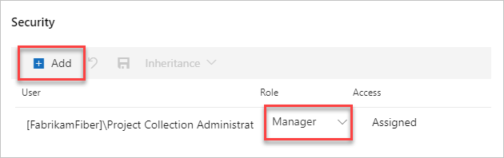

# Manage extension permissions

[!INCLUDE [version-lt-eq-azure-devops](../includes/version-lt-eq-azure-devops.md)]

Learn how to manage permissions for users or groups, so they can manage extensions.

## Prerequisites
::: moniker range="azure-devops"
- You must be a member of the Project Collection Administrators group to manage permissions for users or groups. Organization owners are automatically members of this group.
- Private extensions must be shared with your organization to be installed. Check out the [publishing documentation](../extend/publish/overview.md#upload) for information on how to share private extensions.
::: moniker-end

::: moniker range="< azure-devops"
- You must be a member of the Project Collection Administrators group or have "Edit collection-level information" permissions to manage permissions for users or groups. Organization owners are automatically members of the Project Collection Administrators group.
::: moniker-end

## Manage permissions

::: moniker range="azure-devops"

1. Sign in to your organization (```https://dev.azure.com/{yourorganization}```).
2. Select  **Organization settings**.

    

3. Select **Extensions**.

    

4. Select **Security**.

    

5. Add users or update permission settings.

    

::: moniker-end

::: moniker range="azure-devops-2019 || azure-devops-2020"

1. Sign in to your organization (```https://dev.azure.com/{yourorganization}```).

2. Select  **Admin settings**.

    

3. Select **Extensions**, and then select **Security**.

    

4. Add users or update permission settings.

    

::: moniker-end

::: moniker range="tfs-2018"
To grant permissions for publishing or updating to users or groups, use the [TFSSecurity](/azure/devops/server/command-line/tfssecurity-cmd#permissions) command-line tool.

1. At the server level, create a group, for example, "TFS Extension Publishers".

   ```
   tfssecurity /gcg "TFS Extension Publishers" "publishers who can manage extensions for the server" /server:ServerURL
   ```

2. Grant access to the "TFS Extension Publishers" group to manage extensions.

   ```
   tfssecurity /a+ Publisher "//" CreatePublisher n:"[TEAM FOUNDATION]\TFS Extension Publishers" allow /server:ServerURL
   tfssecurity /a+ Publisher "//" PublishExtension n:"[TEAM FOUNDATION]\TFS Extension Publishers" allow /server:ServerURL
   tfssecurity /a+ Publisher "//" UpdateExtension n:"[TEAM FOUNDATION]\TFS Extension Publishers" allow /server:ServerURL
   tfssecurity /a+ Publisher "//" DeleteExtension n:"[TEAM FOUNDATION]\TFS Extension Publishers" allow /server:ServerURL
   ```
<!--
   For Team Foundation Server "15" RC2 or earlier, use this syntax:

   ```
   tfssecurity /a+ Publisher "//" Create n:"[TEAM FOUNDATION]\TFS Extension Publishers" allow /server:ServerURL
   tfssecurity /a+ Publisher "//" Publish n:"[TEAM FOUNDATION]\TFS Extension Publishers" allow /server:ServerURL
   tfssecurity /a+ Publisher "//" Write n:"[TEAM FOUNDATION]\TFS Extension Publishers" allow /server:ServerURL
   ```
-->
3. Add existing users and groups to the "TFS Extension Publishers" group.

    ```
    tfssecurity /g+ "[TEAM FOUNDATION]\TFS Extension Publishers" n:User /server:ServerURL
    ```
    ```

You can add users later to "TFS Extension Publishers". This permission is a server-level permission. 
When you update or delete an extension, it affects all the project collections that use the extension.
::: moniker-end

## Related articles

- [Install extensions](install-extension.md)
- [Request extensions](request-extensions.md)
- [Uninstall or disable extensions](install-extension.md#uninstall-an-extension)
- [About permissions](../organizations/security/about-permissions.md)
