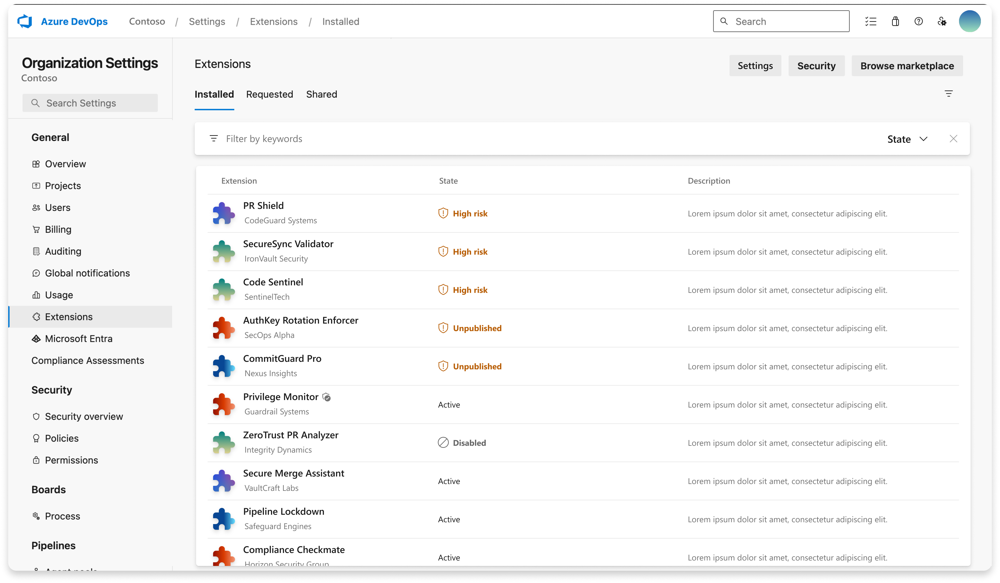
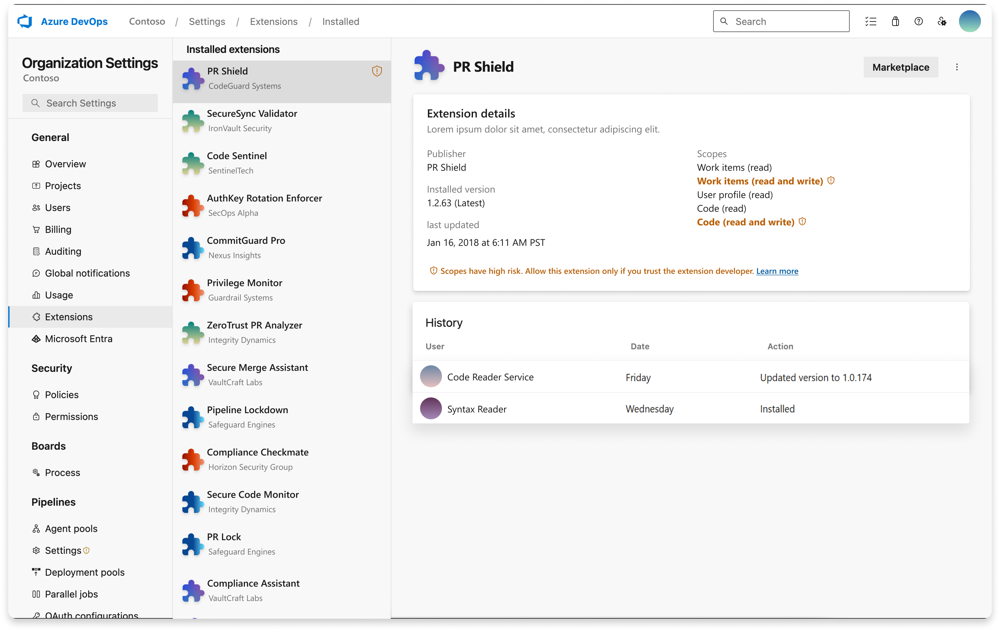
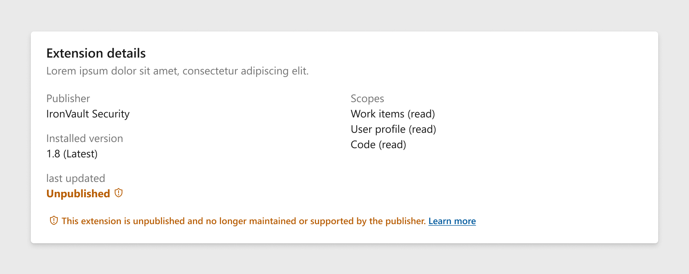
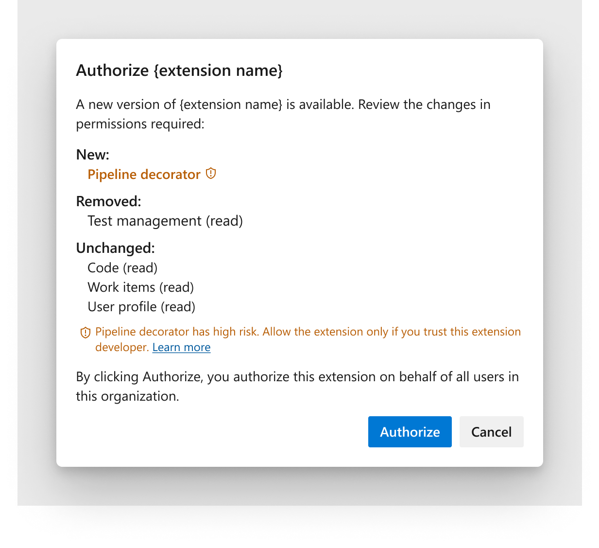
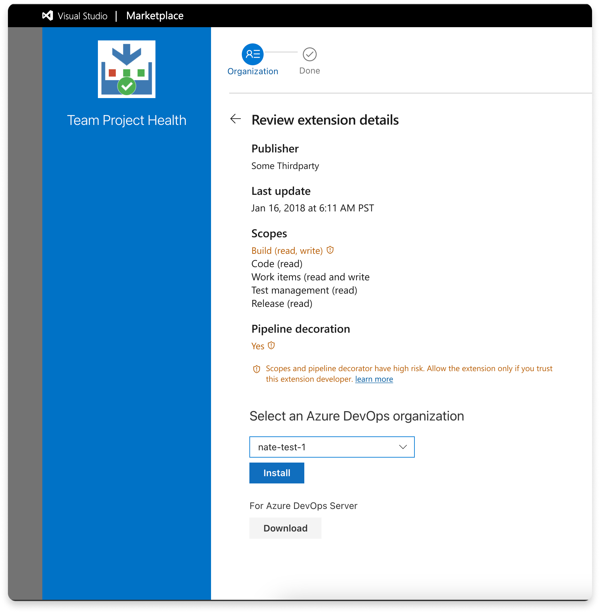

# High-risk extensions

When you install or upgrade extensions, some might be flagged as high-risk. You can check their high-risk status in the **Extensions** section of **Organization settings**. This designation is due to several potential reasons, explained in this article. 

We recommend only installing, upgrading, or using such extensions if you trust them and their publishers. Otherwise, you risk exposing your Azure DevOps organization to various issues, including security vulnerabilities, malfunctioning extensions, and the misuse of extensions with overly permissive scopes.

  
  
For more information about extensions, see the [developing](../extend/overview.md) and [publishing](../extend/publish/overview.md) overviews.

## Extensions with overly permissive scopes

Extensions that require overly permissive scopes are considered high-risk. To determine whether a particular scope falls into the high-risk category, see the [Extension manifest reference](../extend/develop/manifest.md).

## Unpublished extensions

Extensions that were once public on the [Visual Studio Marketplace](https://marketplace.visualstudio.com/) but were later unpublished by their publishers are considered high-risk. Removing an extension from the marketplace typically indicates that it's no longer maintained. We recommend discontinuing the use of such extensions and uninstalling them from your Azure DevOps organization.

## Pipeline decorators

[Pipeline decorators](../extend/develop/add-pipeline-decorator.md) are extensions that can modify and enhance all pipelines within your organization. Therefore, use them cautiously and only if you trust their publishers.

## High risk scopes flagged in the Azure DevOps' Visual Studio Marketplace

You also see the same information on high-risk scopes in the [Azure DevOps Visual Studio Marketplace](https://marketplace.visualstudio.com/azuredevops).

> [!NOTE]
> This feature is being released gradually. If you don't see the high-risk scope in your [Azure DevOps Visual Studio Marketplace](https://marketplace.visualstudio.com/azuredevops) user interface, wait a few more days until it becomes available for you.

## Addition of the unpublished state field in the Azure DevOps Services REST API

With the Azure DevOps Services REST API [version 7.2](/rest/api/azure/devops/extensionmanagement/installed-extensions/list?view=azure-devops-rest-7.2&tabs=HTTP#extensionstateflags&preserve-view=true), the string field 'unpublished' is now available.
