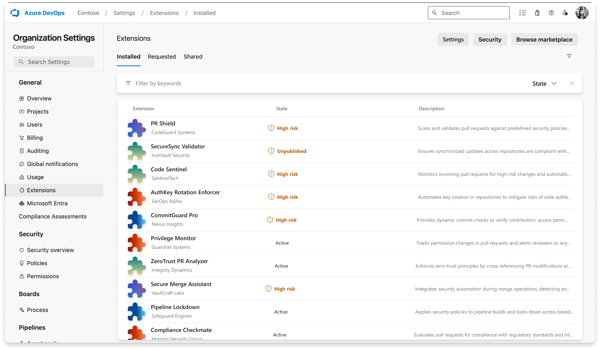
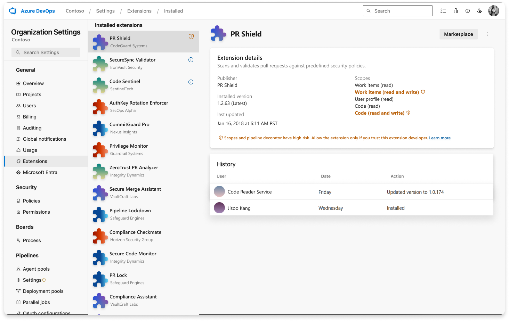
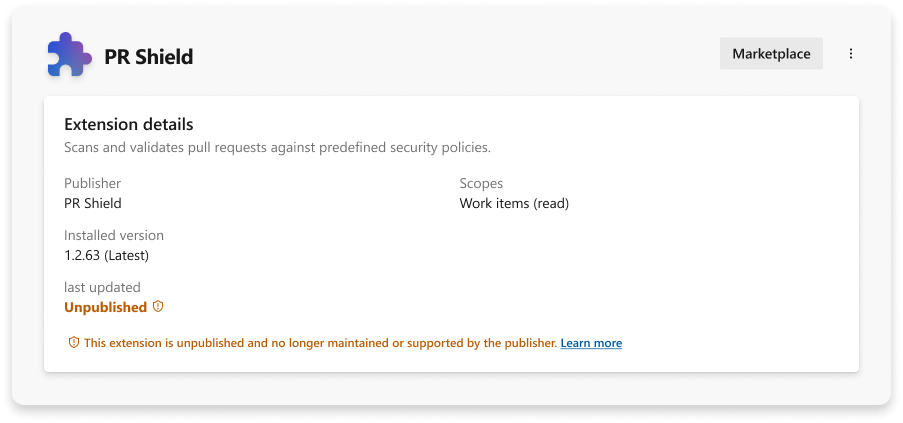
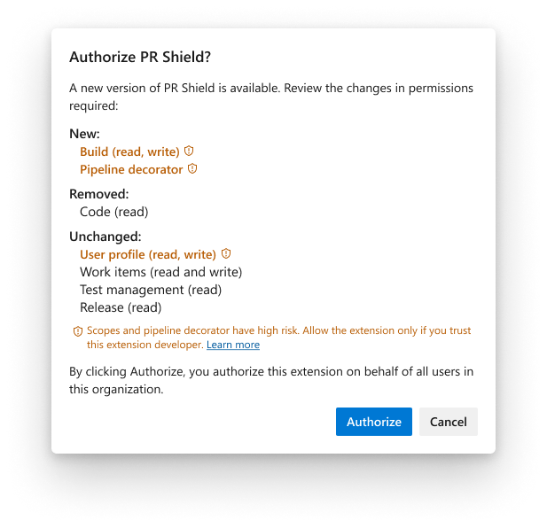

# High-risk extensions

Some extensions are marked as high-risk during the installation or upgrade process. You can also see the high-risk status in the **Extensions** section of **Organization** settings. This is due to one of the reasons explained below. We recommend installing, upgrading, or continuing to use such extensions only if you trust them and their publishers. Otherwise, you may increase the exposure of your Azure DevOps organization to various risks, including possible security risks, the risk of using malfunctioning extensions, and the unintentional misuse of extensions with overly permissive scopes.

  
  
For more information about extensions, see the [developing](../extend/overview.md) and [publishing](../extend/publish/overview.md) overviews.

## Extensions with too permissive scopes

Extensions that require too permissive scopes to be approved by a Project Collection Administrator are considered high-risk. [Go to this article](../extend/develop/manifest.md) to determine if a particular extension falls into the high-risk category.

## Unpublished extensions

Extensions that were once public on VS Marketplace and then were unpublished by their publishers are considered high-risk, as unpublishing usually means an extension is no longer maintained. We recommend stopping the use of such extensions and uninstalling them from your Azure DevOps organization.

## Pipeline decorators

Pipeline decorators are extensions that can augment and make changes in all pipelines of your organization. Because of this, use them cautiously and only if you trust their publishers.

