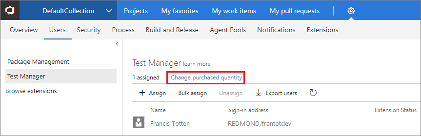
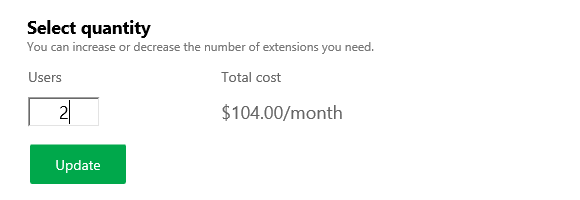

# Change number of paid extension users

**TFS**

To update the total number of extension users that you pay for, go to your Team Foundation Server Users hub.
To cancel paid access to an extension, reduce your users to zero (0). [How do you bill changes in users?](../tfs-extension-faqs.md#bill-period)

### Who can change the number of paid extension users?

[Project collection administrators](../../security/set-project-collection-level-permissions.md) 
with [**Edit collection-level information** permissions](../../security/permissions.md#collection) 
can change the number of paid extension users whose access that you pay for.

0.  From your TFS home page, go to your settings' User hub: (```https://{server}:8080/tfs/_admin/_userHub```)

    

0.  Go to the extension pane, for example, Test Manager. Change the number of extension users that you pay for.

    

0.  Update your total paid extension users.

    

    [Need help?](../tfs-extension-faqs.md#get-support)
