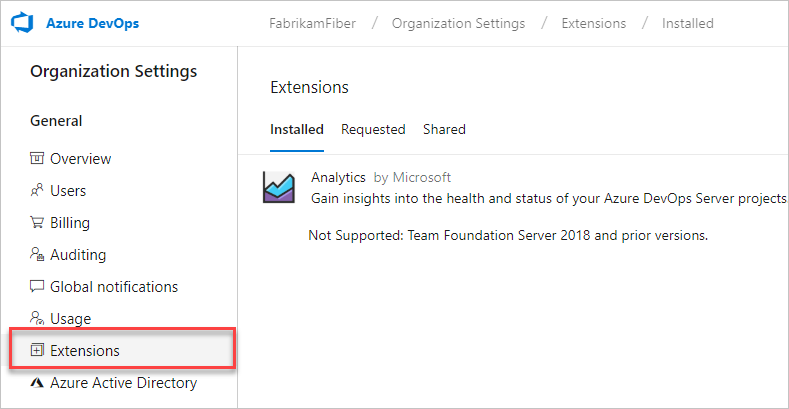
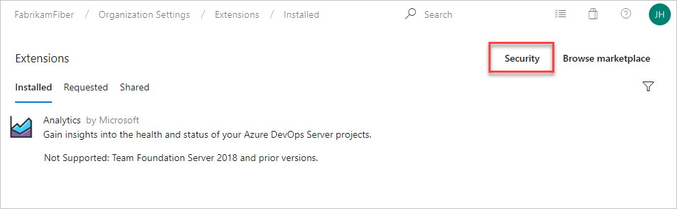

# Grant permissions to manage extensions

[!INCLUDE [version-vsts-tfs-2015-on](../../boards/_shared/version-vsts-tfs-2015-on.md)]

::: moniker range="azure-devops"

In this article, learn how to grant permissions for managing extensions, like install, disable, enable, review, and approve an extension.

::: moniker-end

::: moniker range=">=tfs-2015 < azure-devops"

In this article, learn how to grant permissions for publishing or updating extensions for users or groups.

::: moniker-end

::: moniker range="azure-devops"

1. Sign in to your organization (```https://dev.azure.com/{yourorganization}```).

2. Select  **Organization settings**.

    

3. Select **Extensions**.

    

4. Select **Security** in the upper right of the Extension Security page:

    

5. Add users or update permission settings:

    

::: moniker-end

::: moniker range="azure-devops-2019"

1. Sign in to your organization (```https://dev.azure.com/{yourorganization}```).

2. Select  **Admin settings**.

    

3. Select **Extensions**, and then select **Security**.

    

4. Add users or update permission settings:

    

::: moniker-end

::: moniker range=">=tfs-2015 < azure-devops-2019"

To grant permissions for publishing or updating to users or groups, use [TFSSecurity](/azure/devops/server/command-line/tfssecurity-cmd#permissions) command-line tool.

1. At the server level, create a group, for example, "TFS Extension Publishers":

   ```
   tfssecurity /gcg "TFS Extension Publishers" "publishers who can manage extensions for the server" /server:ServerURL
   ```

2. Grant access to the "TFS Extension Publishers" group to manage extensions:

   ```
   tfssecurity /a+ Publisher "//" CreatePublisher n:"[TEAM FOUNDATION]\TFS Extension Publishers" allow /server:ServerURL
   tfssecurity /a+ Publisher "//" PublishExtension n:"[TEAM FOUNDATION]\TFS Extension Publishers" allow /server:ServerURL
   tfssecurity /a+ Publisher "//" UpdateExtension n:"[TEAM FOUNDATION]\TFS Extension Publishers" allow /server:ServerURL
   tfssecurity /a+ Publisher "//" DeleteExtension n:"[TEAM FOUNDATION]\TFS Extension Publishers" allow /server:ServerURL
   ```

   For Team Foundation Server "15" RC2 or earlier, use this syntax:

   ```
   tfssecurity /a+ Publisher "//" Create n:"[TEAM FOUNDATION]\TFS Extension Publishers" allow /server:ServerURL
   tfssecurity /a+ Publisher "//" Publish n:"[TEAM FOUNDATION]\TFS Extension Publishers" allow /server:ServerURL
   tfssecurity /a+ Publisher "//" Write n:"[TEAM FOUNDATION]\TFS Extension Publishers" allow /server:ServerURL
   ```

3. Add existing users and groups to the "TFS Extension Publishers" group.

    ```
    tfssecurity /g+ "[TEAM FOUNDATION]\TFS Extension Publishers" n:User /server:ServerURL
    ```

You can add users later to "TFS Extension Publishers". This is a server-level permission, 
so updating and deleting an extension will affect all the project collections that use the extension.

::: moniker-end
