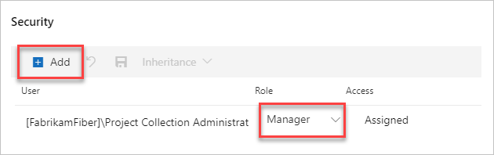

 

# Grant permissions to manage extensions

**Azure DevOps Services** | **TFS** 

::: moniker range="azure-devops"

## Grant management permissions 

To grant permissions to manage extensions (install, disable/enable, review and approve extension requests) for an on-prem collection or Azure DevOps Services organization, go to the collection/organization level Extension settings hub:


Click **Security** in the upper right of the Extension Security page:


Add users or update permission settings:



::: moniker-end

::: moniker range=">=tfs-2013 < azure-devops"

## Grant publish and update permissions on TFS

To grant permissions for publishing or updating to users or groups, use [TFSSecurity](/azure/devops/server/ref/command-line/tfssecurity-cmd#permissions) command-line tool.

0.	At the server level, create a group, for example, "TFS Extension Publishers":

    ```
    tfssecurity /gcg "TFS Extension Publishers" "publishers who can manage extensions for the server" /server:ServerURL
    ```

0. 	Grant access to the "TFS Extension Publishers" group to manage extensions:

    ```
    tfssecurity /a+ Publisher "//" CreatePublisher n:"[TEAM FOUNDATION]\TFS Extension Publishers" allow /server:ServerURL
    tfssecurity /a+ Publisher "//" PublishExtension n:"[TEAM FOUNDATION]\TFS Extension Publishers" allow /server:ServerURL
    tfssecurity /a+ Publisher "//" UpdateExtension n:"[TEAM FOUNDATION]\TFS Extension Publishers" allow /server:ServerURL
    tfssecurity /a+ Publisher "//" DeleteExtension n:"[TEAM FOUNDATION]\TFS Extension Publishers" allow /server:ServerURL
    ```

    For Team Foundation Server "15" RC2 or earlier, use this syntax:

    ```
    tfssecurity /a+ Publisher "//" Create n:"[TEAM FOUNDATION]\TFS Extension Publishers" allow /server:ServerURL
    tfssecurity /a+ Publisher "//" Publish n:"[TEAM FOUNDATION]\TFS Extension Publishers" allow /server:ServerURL
    tfssecurity /a+ Publisher "//" Write n:"[TEAM FOUNDATION]\TFS Extension Publishers" allow /server:ServerURL
    ```

0. Add existing users and groups to the "TFS Extension Publishers" group.

    ```
    tfssecurity /g+ "[TEAM FOUNDATION]\TFS Extension Publishers" n:User /server:ServerURL
    ```

You can add users later to "TFS Extension Publishers". This is a server-level permission, 
so updating and deleting an extension will affect all the project collections that use the extension.

::: moniker-end
