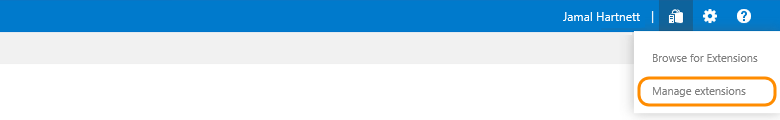
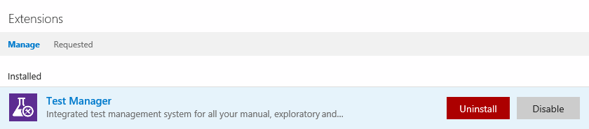

# Uninstall or disable extensions in Team Foundation Server

[!INCLUDE [version-tfs-2018-earlier](../../includes/version-tfs-2018-earlier.md)]

When you no longer need an extension, you can uninstall or disable it. This article shows you how.

> [!NOTE]
> Charges continue for a paid extension until you [reduce all users to zero (0) for this extension](../install-extension.md). 

## Prerequisites

[Project Collection Administrators](../../organizations/security/set-project-collection-level-permissions.md) 
with [**Edit collection-level information** permissions](../../organizations/security/permissions.md#collection) 
can uninstall or disable extensions.

## Uninstall or disable extension

1. From your TFS home page (```https://{server}:8080/tfs/```), go to the project collection where you want to uninstall or disable the extension.

2. Select **Manage extensions**.

   **TFS 2015 Update 3**

   

   **TFS 2017**

   

3. On the extensions tab, select the extension, and then uninstall or disable it.

   

   [[Need help?](../faq-extensions.yml)]