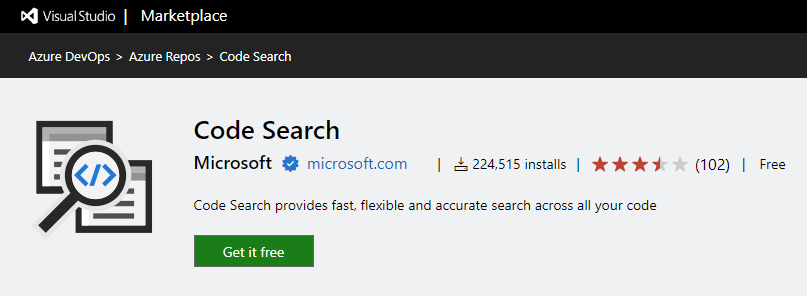
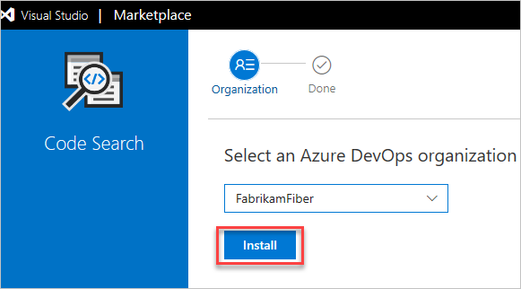
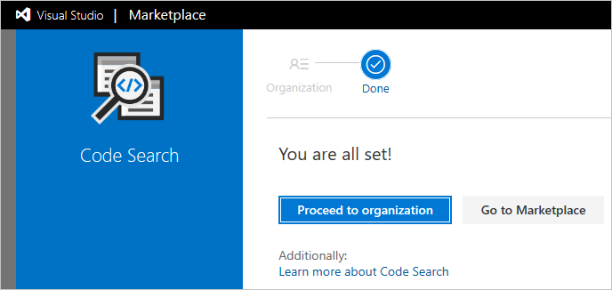

# Install extensions

[!INCLUDE [version-ts-tfs-2015-2016](../includes/version-ts-tfs-2015-2016.md)]

Add new features and capabilities to your organization by installing extensions.

Learn how to [install extensions](#install-extension) for Azure DevOps.

To learn about building your own Azure DevOps extensions, see [developing](../extend/overview.md) and [publishing](../extend/publish/overview.md) extensions.

## Prerequisites

* Only [Project Collection Administrators or organization Owners](faq-extensions.yml) can install extensions. If you don't have permissions, you can [request extensions](./request-extensions.md) instead.
* Private extensions must be shared with your organization to be installed. Check out the [publishing documentation](../extend/publish/overview.md#upload) for information on how to share private extensions.

<a id="install-extension" /> 

## Install extension

#### [Browser](#tab/browser)

1. Sign in to your organization (```https://dev.azure.com/{yourorganization}```).
2. Select the shopping bag, and then select **Browse Marketplace**.

   

3. Find the extension that you want to install.

4. Select **Get it free**.

      

5. Select your organization from the dropdown menu, and then select **Install** to install the extension.

    

   * [Why don't I see any organizations?](./faq-extensions.yml) 

   * [Why can't I install this extension?](./faq-extensions.yml) 

Your extension is now installed! You can now go to your organization to use your extension. Also, tell your team about this extension, so they can start using its capabilities.



#### [Azure DevOps CLI](#tab/azure-devops-cli/)

::: moniker range=">= azure-devops-2020"

You can install an extension with the [az devops extension install](/cli/azure/devops/extension#ext-azure-devops-az-devops-extension-install) command. To get started, see [Get started with Azure DevOps CLI](../cli/index.md).

If necessary, first search for an extension with the [az devops extension search](overview.md#search-extension) command.

```azurecli 
az devops extension install --extension-id
                            --publisher-id
                            [--org]
``` 

#### Parameters 

- **extension-id**: The name of the extension to install.
- **publisher-id**: The name of the extension publisher.
- **org**: Azure DevOps organization URL. You can configure the default organization using `az devops configure -d organization=ORG_URL`. Required if not configured as default or picked up using `git config`. Example: `--org https://dev.azure.com/MyOrganizationName/`.

#### Example 

The following command installs the **Timetracker** extension and shows the result in YAML format.  

```azurecli
az devops extension install --extension-id Timetracker --publisher-id 7pace --output yaml

baseUri: null
constraints: null
contributionTypes: null
contributions: null
demands: null
eventCallbacks: null
extensionId: Timetracker
extensionName: Timetracker
fallbackBaseUri: null
files: null
flags: null
installState:
  flags: none
  installationIssues: null
  lastUpdated: '2019-11-26T16:04:32.907000+00:00'
language: null
lastPublished: '2019-11-13T11:58:37.890000+00:00'
licensing: null
manifestVersion: null
publisherId: 7pace
publisherName: 7pace
registrationId: null
restrictedTo: null
scopes: null
serviceInstanceType: null
version: 5.0.1.34507
```

::: moniker-end

[!INCLUDE [temp](../includes/note-cli-not-supported.md)] 

* * *

## Next steps

  > [!div class="nextstepaction"]
  > [Manage extension permission](how-to/grant-permissions.md)