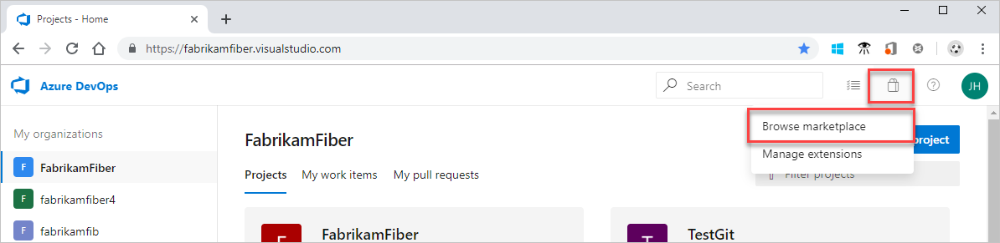
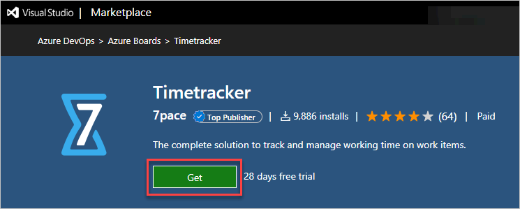
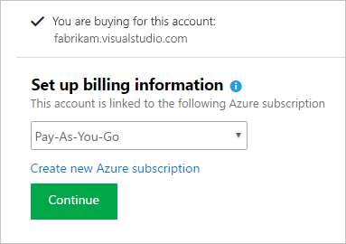
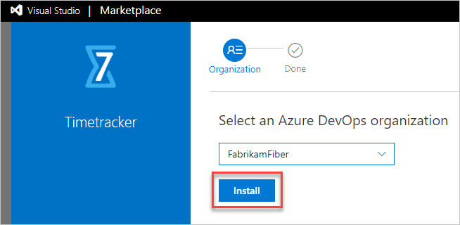
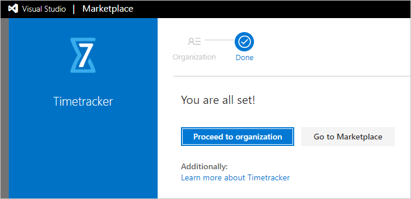
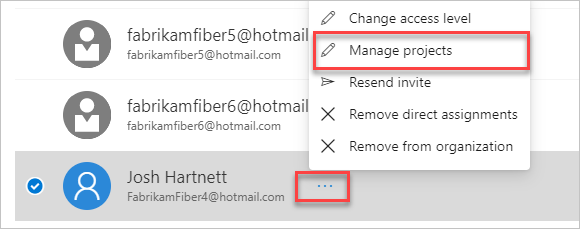
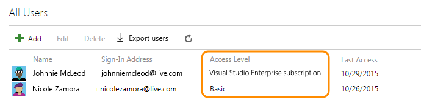

# Quickstart: Install extensions

[!INCLUDE [version-vsts-tfs-2015-on](../boards/_shared/version-vsts-tfs-2015-on.md)]

Add new features and capabilities to your organization by installing extensions.

In this quickstart, learn how to do the following tasks:

- [Install extensions](#install-extension)
- [Assign paid extensions to users](#assign-paid-extensions-to-users)

To learn about building your own Azure DevOps extensions, see [developing](https://aka.ms/vsoextensions) and [publishing](https://aka.ms/vsmarketplace-publish) extensions.

## Prerequisites

* Only [Project Collection Administrators or organization Owners](faq-extensions.md#find-owner) can install extensions. If you don't have permissions, you can [request extensions](request-vsts-extension.md) instead.
* Private extensions must be shared with your organization to be installed. Check out the [publishing documentation](../extend/publish/overview.md#upload) for information on how to share private extensions.

## Install extension

1. Sign in to your organization (```https://dev.azure.com/{yourorganization}```).
2. Select the shopping bag icon, and then select **Browse Marketplace**.

   

3.	Find the extension that you want to install.

4.	Select **Get** or **Get it free**.

    

5.  For a paid extension, do the following tasks:
    1.  Select an [Azure subscription](https://azure.microsoft.com/pricing/purchase-options/) to use to pay for the extension access.
	
    

    2. Select the number of users who need access.

    

6.  Select your organization from the dropdown menu, and then select **Install** to install the extension.

    

    * [Why don't I see any organizations?](./faq-extensions.md#no-organizations) 

    * [Why can't I install this extension?](./faq-extensions.md#no-permissions) 

Your extension is now installed! You can now go to your organization to use your extension. Also, tell your team about this extension, so they can start using its capabilities too.



## Assign paid extensions to users

After you install a paid extension, assign it to your users so they can start using it.
To assign extensions, you need [Project Collection Administrator or organization Owner permissions](./faq-extensions.md#find-owner).

::: moniker range=">= azure-devops-2019"

1. Sign in to your organization (```https://dev.azure.com/{yourorganization}```).

2. Select  **Organization settings**.

   

3. Select **Users**.

    
   
4. Most extensions require that users have at least Basic access, not Stakeholder. Check your users' access levels here:

    

   To find the access that your extension requires, see the extension's description in the [Marketplace > Azure DevOps](https://marketplace.visualstudio.com/azuredevops).

5.	To assign the extension, highlight the user, choose **Manage projects**, and then select the **Extensions tab**.

    

6. Assign the extension and **Save changes**.

    

   Assign the extension to specific users up to the number allowed for free extensions or the number that you purchased for paid extensions.

Tell your team about this extension, so they can start using its capabilities.

::: moniker-end

::: moniker range="<= tfs-2018"

1.	Sign in to your organization: ```https://dev.azure.com/{organization}```.

2.	Go to **Users**.

   

3.	Most extensions require that users have at least Basic access, not Stakeholder. Check your users' access levels here:

   

   To find the access that your extension requires, see the extension's description in the [Marketplace](https://marketplace.visualstudio.com/azuredevops), Azure DevOps tab.

4.	To assign the extension, right-click or select the ellipses (...) for the user you want to assign access to.

   

5.	Assign the extension and **Save changes**.

   

   You can assign the extension to specific users up to the number allowed for free extensions or the number that you purchased for paid extensions.

Tell your team about this extension, so they can start using its capabilities.

::: moniker-end

## Next steps

  > [!div class="nextstepaction"]
  > [Manage extension permission](how-to/grant-permissions.md)
