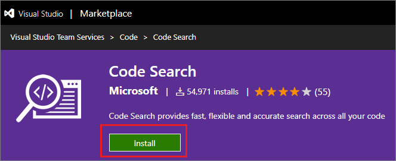
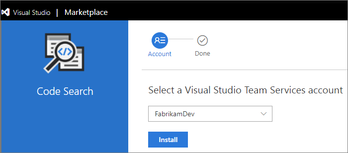

# Install free extensions for Azure DevOps

**Azure DevOps Services**

To add new features and capabilities to your organization in Azure DevOps, install extensions from the [Visual Studio Marketplace](https://marketplace.visualstudio.com/azuredevops). You can install [free, preview, or paid](./faq-extensions.md#difference) In this quickstart, you learn how to install a free extension.

To learn about building your own Azure DevOps extensions, see [developing](https://aka.ms/vsoextensions) and [publishing](https://aka.ms/vsmarketplace-publish) extensions.

## Prerequisites

* Only Azure DevOps [project collection administrators or organization owners](faq-extensions.md#find-owner) can install extensions. If you don't have permissions, you can [request extensions](request-vsts-extension.md) instead.

* Private extensions must be shared with your organization to be installed. Check out the [publishing documentation](../extend/publish/overview.md#upload) for information on how to share private extensions.

## Install the extension

1.  Sign in to the [Visual Studio Marketplace > Azure DevOps](https://marketplace.visualstudio.com/azuredevops).
   
    

2.	Find and select the extension that you want to install. For this quickstart, we select [**Code Search**](https://marketplace.visualstudio.com/items?itemName=ms.vss-code-search).

3.	Choose **Get it free**.

	

1.  Select your organization and select **Install** to install the extension.

	

	*	[Why don't I see any organizations?](./faq-extensions.md#no-organizations) 

	*	[Why can't I install this extension?](./faq-extensions.md#no-permissions) 

Your extension is now installed! You can now go to your organization to use your extension. Also, tell your team about this extension, so they can start using its capabilities too.

## Next steps

> [!div class="nextstepaction"]
   > [Assign paid extensions](assign-paid-extensions.md)

## Related articles

Find answers to common problems on the [troubleshooting](faq-extensions.md) page.
