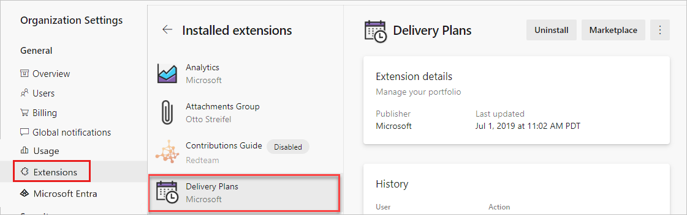
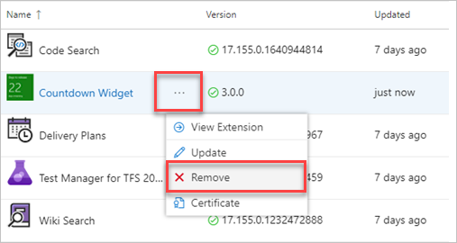

# Install extensions

[!INCLUDE [version-lt-eq-azure-devops](../includes/version-lt-eq-azure-devops.md)]

Learn how to install, assign, disable, and uninstall extensions, which add new features and capabilities for Azure DevOps.

For more information about extensions, see the [developing](../extend/overview.md) and [publishing](../extend/publish/overview.md) overviews.

## Prerequisites
::: moniker range="azure-devops"
- To install extensions, you must be a member of the Project Collection Administrators group. Organization owners are automatically members of this group. If you don't have permissions, you can [request extensions](./request-extensions.md) instead or [look up a project collection administrator](../organizations/security/look-up-project-collection-administrators.md).
- Private extensions must be shared with your organization to be installed. Check out the [publishing documentation](../extend/publish/overview.md#upload) for information on how to share private extensions.
::: moniker-end

::: moniker range="< azure-devops"
- Only members of the Project Collection Administrators group or who have "Edit collection-level information" permissions can install extensions. Organization owners are automatically members of this group. If you don't have permissions, you can [request extensions](./request-extensions.md) instead or [look up a project collection administrator](../organizations/security/look-up-project-collection-administrators.md).

> [!NOTE]
> To use an existing Azure subscription for billing, you must have at least co-administrator permissions for that subscription. If you don't have permissions, an Azure Account Administrator or Service Administrator can [add you as co-administrator](/azure/billing-add-change-azure-subscription-administrator) to the Azure subscription in the Azure portal.

Your project collection reuses your Azure subscription for future Marketplace purchases. 
[Where can I find more info about Azure billing?](faq-extensions.yml)
::: moniker-end

## Install an extension

Install an extension to your organization by doing the following steps.

::: moniker range="azure-devops"
#### [Browser](#tab/browser)

1. Sign in to your organization (```https://dev.azure.com/{yourorganization}```).
2. Select the shopping bag icon, and then select **Browse Marketplace**.

   

3. Find the extension that you want to install and select **Get it free**.

    

4. Select your organization from the dropdown menu, and then select **Install** to install the extension.

    

   * [Why don't I see any organizations?](./faq-extensions.yml) 

   * [Why can't I install this extension?](./faq-extensions.yml) 

Your extension is now installed! You can now go to your organization to use your extension. Also, tell your team about this extension, so they can start using its capabilities.


#### [Azure DevOps CLI](#tab/azure-devops-cli/)

Install an extension with the [az devops extension install](/cli/azure/devops/extension#az-devops-extension-install) command. To get started, see [Get started with Azure DevOps CLI](../cli/index.md).

### Search for an extension

If necessary, first search for an extension with the `az devops extension search` command.

```azurecli
az devops extension search --search-query
```
#### Parameters

- **search-query**: Specify a term to search in the marketplace.

#### Example

The following command searches the marketplace for the term **Timetracker** and returns the *Publisher ID* and *Extension ID* in table format.  

```azurecli 
az devops extension search --search-query Timetracker --output table

Publisher Id    Extension Id    Name
--------------  --------------  -----------
7pace           Timetracker     Timetracker
7pacelabs       kitten          Kitten
```

### Install extension

```azurecli 
az devops extension install --extension-id
                            --publisher-id
                            [--org]
``` 

#### Parameters 

- **extension-id**: The name of the extension to install.
- **publisher-id**: The name of the extension publisher.
- **org**: Azure DevOps organization URL. You can configure the default organization using `az devops configure -d organization=ORG_URL`. Required if not configured as default or picked up using `git config`. Example: `--org https://dev.azure.com/MyOrganizationName/`.

#### Example 

The following command installs the **Timetracker** extension and shows the result in YAML format.  

```azurecli
az devops extension install --extension-id Timetracker --publisher-id 7pace --output yaml

baseUri: null
constraints: null
contributionTypes: null
contributions: null
demands: null
eventCallbacks: null
extensionId: Timetracker
extensionName: Timetracker
fallbackBaseUri: null
files: null
flags: null
installState:
  flags: none
  installationIssues: null
  lastUpdated: '2019-11-26T16:04:32.907000+00:00'
language: null
lastPublished: '2019-11-13T11:58:37.890000+00:00'
licensing: null
manifestVersion: null
publisherId: 7pace
publisherName: 7pace
registrationId: null
restrictedTo: null
scopes: null
serviceInstanceType: null
version: 5.0.1.34507
```

* * *
::: moniker-end

::: moniker range="> tfs-2018 < azure-devops"

1. Open your Azure DevOps Server home page (`https://{server}:DefaultCollection`).

2. Open the extensions menu and choose **Browse Marketplace**.

   

3. Find the extension that you want to install. Use the search box to filter the list of extensions.

   

4. Select the extension and choose **Get** or **Get it free**.
   Or, for some third-party extensions, choose **Get Started** to show pricing information
   and extension-specific installation instructions.

   

   If you don't have permission to install the extension, you can request an administrator
   to install it for you. Your request gets stored in Azure DevOps Server and is ready for attention from an administrator.

5. Select the project collection where you want to install this extension and choose **Install**.

   

6. After installation is complete, go to the project collection or return to the Marketplace to find other extensions. 

   

::: moniker-end

::: moniker range=" tfs-2018"

1. From your Azure DevOps Server home page (```https://{server}:8080/tfs/```), 
   go to the project collection where you want to install the extension.

2. Open the extensions menu and choose **Browse Marketplace**.
   
   :::image type="content" source="media/browse-marketplace2-new.png" alt-text="Screenshot showing highlighted Browse Marketplace button.":::

3. Find and select the extension that you want to install.
   
   :::image type="content" source="media/get-tfs-extensions/connected/marketplace-select-extension.png" alt-text="Screenshot showing selected extension example.":::

4. Select the extension, and then **Install**.

5. Confirm the project collection that you want to install this extension to.
   
   :::image type="content" source="media/get-tfs-extensions/connected/select-team-project-collection.png" alt-text="Selection showing Project collection.":::

5. Finish installing your extension.

6. Assign the extension to users who need access. 
   Otherwise, you can go to your project collection to use your extension. 
   Tell your team about this extension, so they can start using its capabilities too. 
   
   :::image type="content" source="media/get-tfs-extensions/connected/assign-extension-to-users.png" alt-text="Screenshot showing installed extension confirmation.":::

::: moniker-end

::: moniker range=" tfs-2018"
### Install extensions when disconnected

When you're disconnected from Azure DevOps Server, you can install free and preview extensions. First, you [download the extension](#download-from-the-marketplace), then [upload it to Azure DevOps Server](#upload-extension-to-azure-devops), and then [install it in a project collection](#install-extension-in-your-project-collection).

#### Download from the Marketplace

1. Sign in to the [Marketplace > Azure DevOps](https://marketplace.visualstudio.com/azuredevops).

2. Find the extension that you want to install.
   
   :::image type="content" source="media/get-tfs-extensions/standalone/marketplace-find-extension.png" alt-text="Screenshot showing search for extension in the Marketplace.":::
  
   :::image type="content" source="media/get-tfs-extensions/standalone/marketplace-find-extension2.png" alt-text="Screenshot showing search for extension.":::
  
3. Download and save your extension.
   
   :::image type="content" source="media/get-tfs-extensions/standalone/download-extension.png" alt-text="Screenshot showing download extension.":::

#### Upload extension to Azure DevOps

1. Browse for your downloaded extensions (```https://{server}:8080/tfs/_gallery```).

2. Select **Manage extensions**.
   
   :::image type="content" source="media/get-tfs-extensions/standalone/manage-extensions.png" alt-text="Screenshot showing selection, Manage extensions button.":::

3. Select **Upload new extension**.
   
   :::image type="content" source="media/get-tfs-extensions/standalone/upload-extension.png" alt-text="Screenshot showing selection, Upload new extension button.":::

   [Why can't I upload extensions?](faq-extensions.yml)

> [!TIP]
> The maximum size for upload is 25MB. If you can't work around this requirement, **Report a problem** in the [Developer Community](https://developercommunity.visualstudio.com/search?space=21).

#### Install extension in your project collection

1. Select and install the extension that you uploaded. 

   :::image type="content" source="media/get-tfs-extensions/standalone/install-extension.png" alt-text="Screenshot showing extension selection.":::

2. Choose the project collection where you want to install the extension.

   :::image type="content" source="media/get-tfs-extensions/standalone/choose-collection.png" alt-text="Screenshot showing Continue button selection.":::

3. Review the permissions that the extension gets when it's installed. Finish installing your extension.

   :::image type="content" source="media/get-tfs-extensions/standalone/confirm.png" alt-text="Screenshot showing review of permissions granted to the extension.":::

   You can now go to your project collection to use your extension. Tell your team about this extension, so they can start using its capabilities too. 

### Install preinstalled extensions (first-party) for disconnected TFS

>[!NOTE]
> This section is only for adding pre-installed extensions (first-party), if you're installing extensions that aren't pre-installed with TFS, see the section [Install extensions when disconnected](#install-extensions-when-disconnected).

For first-party extensions that come preinstalled with TFS, here's an alternate method of installation that prevents compatibility issues.

1. Hover over the shopping bag and select **Manage extensions**

   

2. Once on the Extensions page, select **Browse local extensions**

   

3. Scroll down until you see the "Plan and track" category, which includes **Delivery Plans**. Select **Delivery Plans**.

   

4. You're redirected to a local extension page for Delivery Plans where you select **Install**. Installation works when you're online and offline.

   

### Install extension from the local gallery

Several extensions are preinstalled in the local extensions gallery.
Users can install these extensions without requiring an external connection to Marketplace or the internet.

> [!TIP]
> Extensions that have previously been installed from Marketplace appear in the local gallery automatically so that they can easily be installed into other project collections.

1. Open the extensions menu and choose **Manage Extensions**.

   

2. In the Extensions page, choose **Browse local extensions**

   

3. Choose the extension you want to install.

   

4. Select the project collection where you want to install this extension and choose **Install**.

   

5. After installation is complete, go to the project collection or return to the Marketplace to find other extensions.

   

::: moniker-end

<a id="uninstall-disable-extension">  </a>

## Uninstall or disable an extension

::: moniker range="azure-devops"
#### [Browser](#tab/browser)

1. Sign in to your organization (```https://dev.azure.com/{yourorganization}```).
2. Select  **Organization settings**.

   

3. Select **Extensions**, and then select the extension that you want to uninstall or disable.

   

4. Select **Uninstall** or select the ellipses (**...**), and then select **Disable**.

   

#### [Azure DevOps CLI](#tab/azure-devops-cli/)

[Uninstall extension](#uninstall-an-extension) | [Disable extension](#disable-extension)

### Uninstall an extension

Uninstall an extension with the [az devops extension uninstall](/cli/azure/devops/extension#az-devops-extension-uninstall) command. To get started, see [Get started with Azure DevOps CLI](../cli/index.md).

```azurecli 
az devops extension uninstall --extension-name
                              --publisher-name
                              [--org]
                              [--yes]
``` 

#### Parameters - uninstall extension

- **extension-name**: The name of the extension to uninstall.
- **publisher-name**: The name of the extension publisher.
- **org**: Azure DevOps organization URL. Configure the default organization with `az devops configure -d organization=ORG_URL`. Required if not configured as default or picked up using `git config`. Example: `--org https://dev.azure.com/MyOrganizationName/`.
- **yes**: Optional. Don't prompt for confirmation.

#### Example - uninstall extension

The following command uninstalls the "Timetracker" extension without prompts for confirmation.  

```azurecli
az devops extension uninstall --extension-name Timetracker --publisher-name 7pace --yes
```
<a id="disable-extension" /> 

### Disable an extension

Disable an extension with the [az devops extension disable](/cli/azure/devops/extension#az-devops-extension-disable) command. To get started, see [Get started with Azure DevOps CLI](../cli/index.md).

```azurecli 
az devops extension disable --extension-name
                            --publisher-name
                            [--org]
``` 

#### Parameters - disable extension

- **extension-name**: The name of the extension to disable.
- **publisher-name**: The name of the extension publisher.
- **org**: Azure DevOps organization URL. Configure the default organization with `az devops configure -d organization=ORG_URL`. Required if not configured as default or picked up using `git config`. Example: `--org https://dev.azure.com/MyOrganizationName/`.

#### Example - disable extension

The following command disables the **Timetracker** extension and shows the result in table format.  

```azurecli
az devops extension disable --extension-name Timetracker --publisher-name 7pace --output table

Publisher Id    Extension Id    Name         Version      Last Updated     States
--------------  --------------  -----------  -----------  ---------------  --------
7pace           Timetracker     Timetracker  5.0.1.34507  2019-11-13       disabled
```

::: moniker-end

* * *

::: moniker range="< azure-devops"

To uninstall extensions in a collection, perform the following steps. 

1. Go to the local gallery management portal (```http://{server}:8080/tfs/_gallery/manage```).

2. For the wanted extension, select the ellipses (**...**), and then select **Remove**.

   

::: moniker-end 

::: moniker range="azure-devops"
## Enable or list extensions through the command line

Enable an extension with the [az devops extension enable](/cli/azure/devops/extension#az-devops-extension-enable) command. To get started, see [Get started with Azure DevOps CLI](../cli/index.md).

```azurecli 
az devops extension enable --extension-name
                           --publisher-name
                           [--org]
``` 

### Parameters - enable extension

- **extension-name**: The name of the extension to enable.
- **publisher-name**: The name of the extension publisher.
- **org**: Azure DevOps organization URL. Configure the default organization with `az devops configure -d organization=ORG_URL`. Required if not configured as default or picked up using `git config`. Example: `--org https://dev.azure.com/MyOrganizationName/`.

### Example - enable extension

The following command enables the **Timetracker** extension and shows the result in table format.  

```azurecli 
az devops extension enable --extension-name Timetracker --publisher-name 7pace --output table

Publisher Id    Extension Id    Name         Version      Last Updated     States
--------------  --------------  -----------  -----------  ---------------  --------
7pace           Timetracker     Timetracker  5.0.1.34507  2019-11-13       none
```

## List extensions

You can list the extensions that are installed in your organization with the [az devops extension list](/cli/azure/devops/extension#az-devops-extension-list) command. To get started, see [Get started with Azure DevOps CLI](../cli/index.md).

```azurecli
az devops extension list [--include-built-in {false, true}]
                         [--include-disabled {false, true}]
                         [--org]
``` 

### Optional parameters - list extensions

- **include-built-in**: Include the built-in extensions. Accepted values are *true* (default) and *false*.
- **include-disabled**: Include the disabled extensions. Accepted values are *true* (default) and *false*.
- **org**: Azure DevOps organization URL. You can configure the default organization using `az devops configure -d organization=ORG_URL`. Required if not configured as default or picked up using `git config`. Example: `--org https://dev.azure.com/MyOrganizationName/`.

### Example - list extensions

The following command lists extensions in your organization. It excludes the **disabled** and **built-in** extensions, and shows the results in table format.

```azurecli 
az devops extension list --include-built-in false --include-disabled false -output table

Publisher Id    Extension Id             Name                     Version              Last Updated     States         		 Flags
--------------  -----------------------  -----------------------  -------------------  ---------------  -----------------------  -------
ms              vss-analytics            Analytics                18.160.0.2130149925  2019-11-22       multiVersion, truste...  trusted
ms              vss-code-search          Code Search              18.160.0.1640944814  2019-11-22       multiVersion, truste...  trusted
ms              vss-plans                Delivery Plans           18.160.0.1266795967  2019-11-25       multiVersion, truste...  trusted
ms-eswm         dependencytracker        Dependency Tracker       2.1910.12801         2019-10-28       none
ms-devlabs      workitem-feature-tim...  Feature timeline and...  0.0.357              2019-10-14       none
AgileParts      gantt                    GANTT chart              1.0.79               2019-10-25       none
gordon-bee...   github                   GitHub Widget            0.10.0               2016-03-16       none
ms-devlabs      vsts-extensions-mult...  Multivalue control       2.2.26               2019-11-15       none
agile-exte...   product-vision           Product Vision           2.0.6                2019-06-04       none
mohitbagra      related-workitems        Related Work items       2.0.4                2017-11-12       none
YodLabs         TagsManager2             Tags Manager             0.9.31               2019-02-04       none
ms-devlabs      team-calendar            Team Calendar            2.0.15               2019-11-01       none
ms              vss-testmanager-web      Test Manager for TFS...  18.160.0.2130893445  2019-11-25       multiVersion, truste...  trusted
mmanela         vsts-workitem-recent...  Who recently viewed ...  1.0.4                2019-03-22       none
ottostreif...   wiql-editor              Wiql Editor              2.0.90               2019-06-21       none
mohitbagra      workitem-checklist       Work item checklist      3.2.4                2019-06-24       none
mohitbagra      witoneclickactions       Work item form one c...  2.3.2                2018-04-03       none
ms-devlabs      WorkItemVisualizatio...  Work Item Visualizat...  1.4.64               2018-04-03       none
``` 

## List extension information

You can list the details about an extension with the [az devops extension show](/cli/azure/devops/extension#az-devops-extension-show) command. To get started, see [Get started with Azure DevOps CLI](../cli/index.md).

```azurecli 
az devops extension show --extension-name
                         --publisher-name
                         [--org]
```

### Parameters - list extension information

- **extension-name**: The name of the extension.
- **publisher-name**: The name of the extension publisher.
- **org**: Azure DevOps organization URL. You can configure the default organization using `az devops configure -d organization=ORG_URL`. Required if not configured as default or picked up using `git config`. Example: `--org https://dev.azure.com/MyOrganizationName/`.

### Example - list extension information

The following command shows information about the **Timetracker** extension in table format.  

```azurecli 
az devops extension show --extension-name Timetracker --publisher-name 7pace --output table

Publisher Id    Extension Id    Name         Version      Last Updated     States
--------------  --------------  -----------  -----------  ---------------  --------
7pace           Timetracker     Timetracker  5.0.1.34507  2019-11-13       disabled
```

::: moniker-end


## Frequently asked questions (FAQs)

::: moniker range=" < azure-devops"
### Q: Why don't I see my organization from the Marketplace installation page? 
A: If you don't see your organization when buying from the Azure DevOps Marketplace, try the following steps:
1. Check the identity that you use to sign in to the Visual Studio Marketplace. In the upper-right corner, select your user name to view your profile. 
1. On the left, make sure your email address and directory are correct.
1. Close all browser windows.
1. Open a private or incognito browsing session.
1. Sign in to the Visual Studio Marketplace. Use the identity of a user in the organization that you want.

> [!TIP]
> Azure DevOps might ask you to choose between "work or school account" or "personal account". If so, then you used an email address that's the same for a Microsoft account and a "work or school account" that your organization manages in Azure Active Directory. Although these identities have the same email address, they're still separate identities with different profiles, security settings, and permissions.
> Choose the identity for the user in the organization that you want to select.
 
### Q: Why can't I install an extension?
A: You can't install extensions for one of the following reasons.  
- You must be a member of the [**Project Collection Administrators** group](../organizations/security/look-up-project-collection-administrators.md) or are the [**Organization owner**](../organizations/security/look-up-organization-owner.md). If you don't have permissions, but you're a project member, you can [request extensions](request-extensions.md) instead.
- For an "already installed or requested" error, check with your Project Collection Administrator and ask them to assign the extension to you.  

### Q: Why can't users access extension features?
A: Users can't access an extension for one of the following reasons:  
- Most extensions require that users have at least Basic access, not Stakeholder. For example, you can install the free [Code Search extension](https://marketplace.visualstudio.com/items?itemName=ms.vss-code-search), but each user must have at least Basic access to search for code. To help your team improve app quality, you can install the free [Test & Feedback extension](https://marketplace.visualstudio.com/items?itemName=ms.vss-exploratorytesting-web). You experience different capabilities, based on your access level and whether you work offline or connected to Azure DevOps Services or on-premises Azure DevOps Server. For more information, see the extension's description in the [Visual Studio Marketplace](https://marketplace.visualstudio.com/azuredevops), Azure DevOps tab.
- If you're using an organization and you started a free extension trial, your trial might have expired. To check whether your trial expired:
   1. On your organization toolbar, select **Users**.
   2. Go to the extension pane.
   3. Check for an expiration message to find if or when your extension expired.

- If you're using an organization and you paid for this extension, make sure that you assigned this extension to users.
   1. On your organization toolbar, go to **Users**.
   2. Go to the extension pane.
   3. Check whether the extension is assigned to the user. If it isn't, assign the extension to the user.

For more information, see [Assign extensions to users](../marketplace/install-extension.md).

### Q: What happened to my preview extension?
A: Your extension may have been moved out of preview. After a preview period, an extension longer is generally available as a paid extension. A grace period may be offered before you have to buy the extension. All preview extensions automatically convert to a [free trial](../organizations/billing/try-additional-features-vs.md) before you have to buy the extension.

::: moniker-end

::: moniker range=" < azure-devops"

### Q: Why can't I install extensions for Azure DevOps Server?  (on-premises)
A: You can't install extensions for Azure DevOps Server for one of the following reasons:
- You must be a member of the **Project Collection Administrators** group or have the **Edit collection-level information** permission set to **Allow** in the project collection where you want to install extensions. If you don't have permissions, you can [request extensions](./request-extensions.md) instead.
- You might get an error that says you already installed or requested the extension. If so, check with a member of the **Project Collection Administrators** group and ask them to assign the extension to you. For more information, see [Request an increase in permission levels](../organizations/security/request-changes-permissions.md).   
 
### Q: Why don't I see the project collection I want? (on-premises)
A: You must be a member of your project collection. Follow these steps to check your identity that you use to sign in to the Marketplace.
1. On your Azure DevOps Server web portal home page (```https://{server}:8080/tfs/```), go to the top-right corner of the page, and select your user name to view your profile.
1. On the left side of your profile, make sure that your email address and directory are correct.
1. Close all browser windows.
1. Open a private or incognito browsing session.
1. Sign in to your Azure DevOps Server home page (```https://{server}:8080/tfs/```) with the identity that's a user in the project collection where you want to install the extension.

   Azure DevOps might ask you to choose between a "work or school organization" or "personal account." This message means that you used an email address that's the same for a Microsoft account and a "work or school account" managed by your organization in Azure Active Directory. Although these identities have the same email address, they're still separate identities with different profiles, security settings, and permissions. Choose the identity that's the user in your project collection.

2. From your project collection, go to the Marketplace.

### Q: Why doesn't the extension that I want show a download button? (on-premises)
A: Some extensions work only with Azure DevOps Services for one of the following reasons:  
- The extension uses Azure DevOps features that aren't released yet for Azure DevOps Server.
- The [extension manifest](../extend/develop/manifest.md) indicates that the extension is available only for Azure DevOps Services (targets = Microsoft.Visualstudio.Services.Cloud).
- The extension manifest indicates that the extension is an integration (targets = Microsoft.Visualstudio.Services.Integration).

### Q: Why can't I upload extensions to Azure DevOps Server? (on-premises)
A: You must be a member of the [Team Foundation Administrators group](/azure/devops/server/admin/add-administrator#add-a-user-to-the-server-administrators-group). You must also have [**Edit instance-level information** permissions](../organizations/security/permissions.md#server) for the Azure DevOps Server where you want to upload extensions.
::: moniker-end

### Q: How do I get support for Azure subscriptions, billing, and Marketplace?
A: Depending on the support you need, choose from the following articles:
- [Azure Billing and Subscription FAQs](https://azure.microsoft.com/pricing/faq/)
- [Azure support](https://azure.microsoft.com/support/options/).
- [Azure billing support](https://portal.azure.com/#blade/Microsoft_Azure_Support/HelpAndSupportBlade)
- [Visual Studio subscriptions support](https://visualstudio.microsoft.com/subscriptions/support)

> [!NOTE]
> The Azure DevOps support team is unable to support Visual Studio Marketplace extensions. To get support on marketplace extensions, locate the extension you're using in the [Visual Studio Marketplace](https://marketplace.visualstudio.com/search?target=AzureDevOps&category=Azure%20Pipelines&sortBy=Installs). On the extension page, you can find a link to the GitHub repository where you can create an issue, or a link to get community support.

## Next steps

  > [!div class="nextstepaction"]
  > [Manage extension permissions](grant-permissions.md)

## Related articles

- [Request extensions and approve extension requests](request-extensions.md)
- [Develop a web extension](../extend/get-started/node.md)
