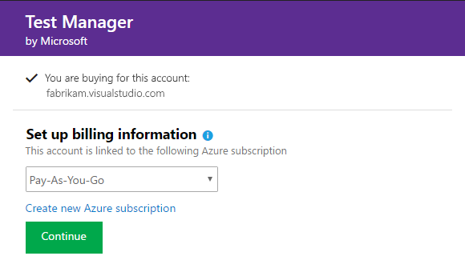

# Quickstart: Buy, install, assign paid extensions

[!INCLUDE [version-vsts-tfs-2015-on](../boards/_shared/version-vsts-tfs-2015-on.md)]

Extensions provide new capabilities when they're installed in Azure DevOps.

In this quickstart, learn how to do the following tasks:

	- [Find and buy the extension](#Find-and-buy-the-extension)
	- [Assign the extension to your users](#Assign-the-extension-to-your-users)


## Prerequisites

Ensure you have the following permissions:

1. [Azure DevOps Project Collection Administrator or organization Owner permissions](../organizations/accounts/faq-add-delete-users.md#find-owner)
2. [The **Owner** or **Contributor** role on your Azure subscription](../organizations/billing/add-backup-billing-managers.md)

## Find and buy the extension

1.  Sign in to the [Marketplace > Azure DevOps](https://marketplace.visualstudio.com/azuredevops).
	
    

2.	Find and select the extension that you want to install.

3.	Choose **Buy**.
	
	> For extensions that you've already [paid for access](./faq-extensions.md#paid-access), expand **Buy**, and select **Install for paid users**.

	

4.	Select an [Azure subscription](https://azure.microsoft.com/pricing/purchase-options/) to use to pay for extension access.
	
	

	Select the number of users who need paid access.

	

5.	Now that you've bought the extension, you need to assign the extension to users who need access.

	

## Assign the extension to your users

After you install a paid extension, assign it to your users so they can start using it.
To assign extensions, you need [Project Collection Administrator or organization Owner permissions](./faq-extensions.md#find-owner).

::: moniker range=">= azure-devops-2019"

1. Sign in to your organization (```https://dev.azure.com/{yourorganization}```).

2. Select  **Organization settings**.

    

3. Select **Users**.

   
   
4. Most extensions require that users have at least Basic access, not Stakeholder. Check your users' access levels here:

   

	To find the access that your extension requires, see the extension's description in the [Marketplace](https://marketplace.visualstudio.com/azuredevops), Azure DevOps tab.

5.	To assign the extension, right-click or choose the ellipses (...) for the user you want to assign access to. Select **Manage extensions**.

   

6. Assign the extension and **Save changes**.

    

	Assign the extension to specific users up to the number allowed for free extensions or the number that you purchased for paid extensions.

Tell your team about this extension, so they can start using its capabilities.

::: moniker-end

::: moniker range="<= tfs-2018"

1.	Sign in to your organization: ```https://dev.azure.com/{organization}```.

2.	Go to **Users**.

	

3.	Most extensions require that users have at least Basic access, not Stakeholder. Check your users' access levels here:

	

	To find the access that your extension requires, see the extension's description in the [Marketplace](https://marketplace.visualstudio.com/azuredevops), Azure DevOps tab.

4.	To assign the extension, right-click or select the ellipses (...) for the user you want to assign access to.

	

5.	Assign the extension and **Save changes**.

    

	You can assign the extension to specific users up to the number allowed for free extensions or the number that you purchased for paid extensions.

Tell your team about this extension, so they can start using its capabilities.

::: moniker-end

## Next steps

> [!div class="nextstepaction"]
> [Assign a paid extension](assign-paid-extensions.md)

## Related articles

- [FAQs](faq-extensions.md)
- [Set up billing](../organizations/billing/set-up-billing-for-your-organization-vs.md)
- [Azure DevOps pricing](https://azure.microsoft.com/pricing/details/devops/azure-devops-services/)
- [Azure DevOps billing support](https://azure.microsoft.com/support/devops/)
- [Assign access levels and extensions by group membership](../organizations/accounts/assign-access-levels-and-extensions-by-group-membership.md)
