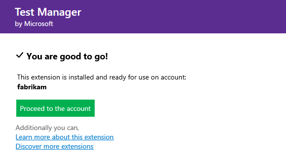

# Buying, installing, and assigning paid extensions to users in VSTS

This Quickstart covers the following steps of buying an extension in Visual Studio Team Services (VSTS):
* Finding extensions in the Marketplace
* Buying a paid extension and selecting number of licenses
* Assigning users with paid licenses to use the extension

## Before you start

For paid extensions, you'll need an [Azure subscription](https://azure.microsoft.com/en-us/pricing/purchase-options/) 
to bill your purchase. If you don't have an Azure subscription, you can create a new subscription when you make your first purchase. 

> [!NOTE]
> To use an existing Azure subscription for billing, you must have at least Co-administrator permissions for that subscription. 
> If you don't have permissions, have an Azure Account Administrator or Service Administrator go to the Azure classic portal and 
> [add you as Co-administrator](https://docs.microsoft.com/en-us/azure/billing-add-change-azure-subscription-administrator) 
> to the Azure subscription that you want to use for billing. Co-administrator permissions are available only in the classic Azure portal.

Your VSTS account will reuse your Azure subscription for future Visual Studio Marketplace purchases or for VSTS purchased through Azure, 
like Cloud-based Load Testing. [Where can I find more info about Azure billing?](./faq-extensions.md#billing)


## Find and buy the extension

0.  Sign in to the [Visual Studio Marketplace > VSTS](https://marketplace.visualstudio.com/vsts).
	
	

0.	Find and select the extension that you want to install. For this Quickstart, you can choose [**Code Search**](https://marketplace.visualstudio.com/items?itemName=ms.vss-code-search).

0.	Click *Buy*.
	
	> For extensions that you've already [paid for access](./faq-extensions.md#paid-access), expand **Buy**, and select **Install for paid users**. 

	

0.	Select an [Azure subscription](https://azure.microsoft.com/en-us/pricing/purchase-options/) that you'll use to pay for extension access.
	
	

	Then select the number of users who will need paid access.

	

0.	Now that you've bought the extension, you need to assign the extension to users who need access.

	

## Assign paid users for the extension

After you install a paid extension, you must assign that extension to users who need access, so they can start using that extension's capabilities. To assign extensions, you'll need VSTS [project collection administrator or account owner permissions](./faq-extensions.md#find-owner).

0.	Sign in to your VSTS account: ```https://{youraccount}.visualstudio.com```.

0.	Go to **Users**.

	

0.	Most extensions require that users have at least Basic access, not Stakeholder. Check your users' access levels here:

	

	To find the access that your extension requires, see the extension's description in the [Visual Studio Marketplace}(https://marketplace.visualstudio.com).

0.	To assign the extension, right click or click the ellipses (...) for the user you want to assign access to:

	

0.	Assign the extension:

    

	You can assign the extension to specific users up to the number allowed for free extensions or the number that you purchased for paid extensions.

0.	Tell your team about this extension, so they can start using its capabilities.

## Next steps

You can find answers to common problems on the [troubleshooting](faq-extensions.md) page.