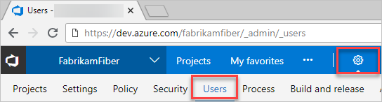

# Buy and install paid extensions and assign to users in Azure DevOps Services

This Quickstart covers the following steps of buying an extension in Azure DevOps Services:
* Finding extensions in the Visual Studio Marketplace
* Buying a paid extension for a specific number of users
* Assigning the extension to users in your team

## Prerequisites

The first time that you set up billing for your Azure DevOps Services organization--whether you do this via the Azure portal or as part of making a purchase in the Visual Studio Marketplace, you will need:

0. [Azure DevOps Services project collection administrator or organization owner permissions](../organizations/accounts/faq-add-delete-users.md#find-owner)
0. [The **owner** or **contributor** role on your Azure subscription](../organizations/billing/add-backup-billing-managers.md)

To make subsequent edits to paid quantities in your Azure DevOps Services organization, you only need the owner or contributor role on your Azure subscription.


## Find and buy the extension

0.  Sign in to the [Visual Studio Marketplace > Azure DevOps Services](https://marketplace.visualstudio.com/vsts).
	
	

0.	Find and select the extension that you want to install. 

0.	Click *Buy*.
	
	> For extensions that you've already [paid for access](./faq-extensions.md#paid-access), expand **Buy**, and select **Install for paid users**. 

	

0.	Select an [Azure subscription](https://azure.microsoft.com/pricing/purchase-options/) that you'll use to pay for extension access.
	
	

	Then select the number of users who will need paid access.

	

0.	Now that you've bought the extension, you need to assign the extension to users who need access.

	

## Assign the extension to your users

After you install a paid extension, you will need to assign it to your users so they can start using it. 
To assign extensions, you'll need Azure DevOps Services [project collection administrator or organization owner permissions](./faq-extensions.md#find-owner).

0.	Sign in to your Azure DevOps Services organization: ```https://dev.azure.com/{organization}```.

0.	Go to **Users**.

	

0.	Most extensions require that users have at least Basic access, not Stakeholder. Check your users' access levels here:

	

	To find the access that your extension requires, see the extension's description in the [Visual Studio Marketplace](https://marketplace.visualstudio.com).

0.	To assign the extension, right click or click the ellipses (...) for the user you want to assign access to:

	

0.	Assign the extension:

    

	You can assign the extension to specific users up to the number allowed for free extensions or the number that you purchased for paid extensions.

0.	Tell your team about this extension, so they can start using its capabilities.

## Related information

- [Troubleshoot installing extensions](faq-extensions.md)
- [Set up billing](../organizations/billing/set-up-billing-for-your-organization-vs.md)
- [Add backup billing managers](../organizations/billing/add-backup-billing-managers.md)
- [Change the Azure subscription for billing](../organizations/billing/change-azure-subscription.md)
- [Azure DevOps Services billing FAQ](../organizations/billing/vsts-billing-faq.md)
- [Azure DevOps Services pricing](https://azure.microsoft.com/pricing/details/visual-studio-team-services/)
- [Azure DevOps Services billing support](https://azure.microsoft.com/support/devops/)
