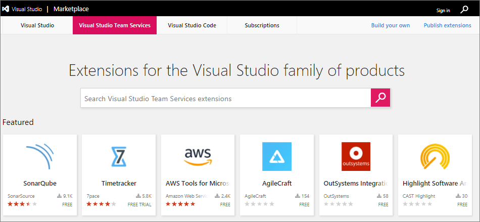
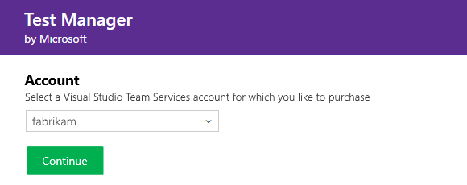

# Install free extensions for VSTS

**VSTS**

To add new features and capabilities to your Visual Studio Team Services (VSTS) account, install extensions from the [Visual Studio Marketplace](https://marketplace.visualstudio.com/vsts). You can install [free, preview, or paid](./faq-extensions.md#difference) extensions, this quickstart goes covers installing a free extension.

> [!TIP]
> To learn about building your own VSTS extensions, see [developing](http://aka.ms/vsoextensions) and 
> [publishing](http://aka.ms/vsmarketplace-publish) extensions.

## What do I need to install an extension?
* Only VSTS [project collection administrators or account owners](faq-extensions.md#find-owner) can install extensions. If you don't have permissions, you can [request extensions](request-vsts-extension.md) instead. 
* Private extensions must be shared with your VSTS account to be installed. Check out the
[publishing documentation](../extend/publish/overview.md#upload) for information on how to share private extensions.

## Install the extension

0.  Sign in to the [Visual Studio Marketplace > VSTS](https://marketplace.visualstudio.com/vsts).
	
	

0.	Find and select the extension that you want to install. For this Quickstart, you can choose [**Code Search**](https://marketplace.visualstudio.com/items?itemName=ms.vss-code-search).

0.	Click *Get it free*.

	

0.  Now you're on the acquisition page, select your VSTS account and click *Install* to install this extension. 

	

	*	[Why don't I see any VSTS accounts?](./faq-extensions.md#no-accounts) 

	*	[Why can't I install this extension?](./faq-extensions.md#no-permissions) 

0. Your extension is now installed! You can now go to your VSTS account to use your extension. Also, tell your team about this extension, so they can start using its capabilities too.

	

## Next Steps

You can find answers to common problems on the [troubleshooting](faq-extensions.md) page.
