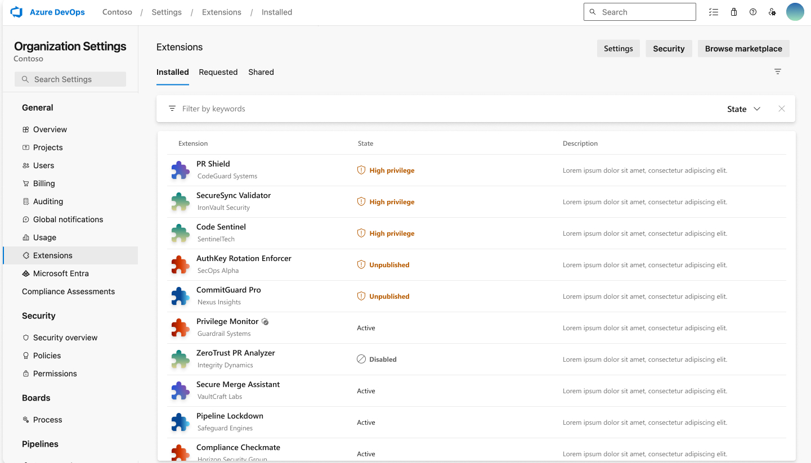
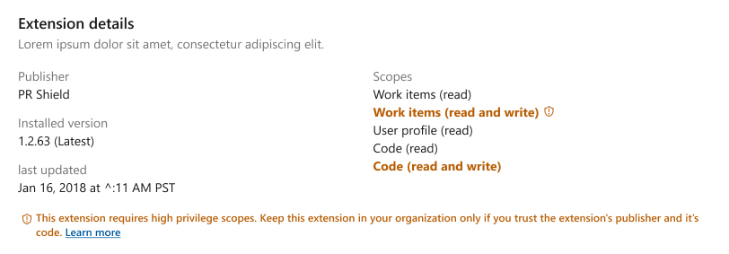
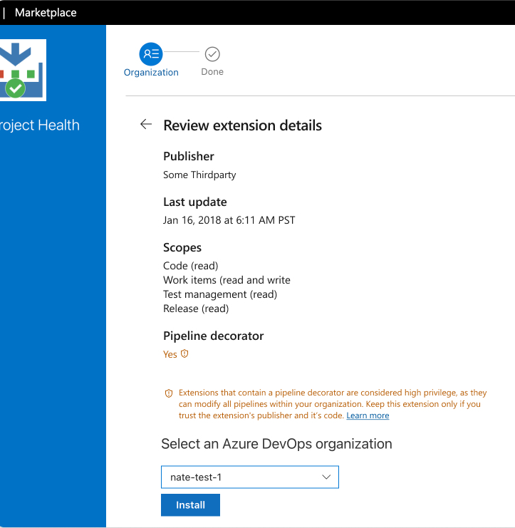
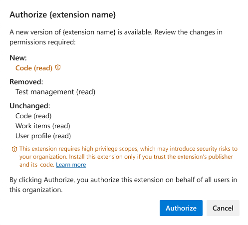

# Manage high privilege scopes, pipeline decorators, and unpublished extensions

> [!IMPORTANT]
> This feature is in **public preview**. Features in public preview could undergo changes before becoming generally available.

Extensions in Azure DevOps enhance functionality and streamline workflows, but some extensions might pose security vulnerabilities due to their high privilege scopes or unpublished status. This article explains how to identify and manage high privilege, pipeline decorators, and unpublished extensions to protect your Azure DevOps organization from potential security vulnerabilities or unexpected behavior.

By following these practices, you can ensure your organization remains secure while benefiting from the capabilities of Azure DevOps extensions.

## What are high privilege scopes and high privilege extensions?

### High privilege scopes

In your extension, you can define one or more scopes. These scopes determine which resources your extension can access and the operations permitted to perform on those resources.

If no scopes are specified, extensions only gain access to user profile and extension data.
High privilege scopes are dedined as overly permissive scopes. For a list of scopes, including high privilege scopes, see the [Manifest reference](../extend/develop/manifest.md#scopes).
Examples of high privilege scopes include:
- Read, update, and delete source code
- Read, write, and manage identities and groups
- Create, read, update, and delete projects

### High privilege extensions

High privilege extensions make use of one or more high privilege scopes. These extensions have the potential to introduce security vulnerabilities or risks if they're not properly vetted or maintained. High privilege extensions can access sensitive resources and perform critical operations, making it essential to evaluate them carefully to ensure they align with your organization's security and operational standards.

When you manage high privilege extensions, consider the following actions:
- **Trust the publisher**: Install and use extensions only if you trust their code and publisher
- **Review the requested scopes**: Ensure the requested scopes are necessary for the extension's functionality
- **Limit usage**: Install high privilege extensions only if they're critical to your workflows

## Evaluate the usage of high privilege scopes in Azure DevOps extensions

Few of your already installed extensions might be flagged for high privilege scope usage. You can check their state in the **Extensions** section of **Organization settings**. This designation is due to several potential reasons, explained in this article.

We recommend that you only install, update, or use extensions if you trust their code and their publishers.

This feature only highlights in the user interface whether a specific extension uses high privilege scopes. Microsoft runs a virus scan on each new and updated extension package that gets published. For more information, see [Publish your extension](../extend/publish/overview.md#publish-your-extension).

> [!div class="mx-imgBorder"]  
> 

By understanding and managing high privilege scopes and extensions, you can safeguard your Azure DevOps organization while still using the capabilities of trusted extensions.

## Manage extensions with high privilege scopes

Extensions that use high privilege scopes can potentially expose your Azure DevOps organization to security vulnerabilities or other risks. High privilege scopes grant extensive access to your organization's resources, making it essential to evaluate their necessity carefully. To better understand which scopes fall into the high privilege category, see the Supported scopes section of the [Extension manifest reference](../extend/develop/manifest.md).

If you identify an extension with high privilege scopes, take the following actions:
- **Evaluate necessity**: Assess whether the requested scopes are essential for your use case
- **Avoid unnecessary risks**: If the extension's functionality doesn't justify the high privilege scopes, we recommend not installing or using the extension to safeguard your Azure DevOps environment

> [!div class="mx-imgBorder"]  
> 

You can also identify high privilege scopes flagged in the [Azure DevOps Visual Studio Marketplace](https://marketplace.visualstudio.com/azuredevops). The Marketplace provides similar indications to those extensions shown in the admin page for high privilege scopes. 

When you select an extension with high privilege scopes, think critically about whether the extension's functionality justifies the use of these scopes. Only proceed with installation if you trust the publisher and the extension's code.

> [!div class="mx-imgBorder"]  
> 

> [!NOTE]
> This feature is being released gradually. If you don't see the high privilege scope insights in your [Azure DevOps Visual Studio Marketplace](https://marketplace.visualstudio.com/azuredevops) user interface, wait a few more days until it becomes available for you too.

## Discontinue use of unpublished extensions

In the extension's administration page, extensions are visually marked to show whether they're unpublished by their publishers.

When an extension is unpublished from the [Visual Studio Marketplace](https://marketplace.visualstudio.com/) by its publisher, it typically signifies that the extension is no longer maintained.

Discontinue the use of unpublished extensions by uninstalling them from your Azure DevOps organization.

> [!div class="mx-imgBorder"]  
> 

## Use pipeline decorators safely

[Pipeline decorators](../extend/develop/add-pipeline-decorator.md) are private extensions that modify and enhance all pipelines within your organization. Use pipeline decorator extensions cautiously and only if you trust their publishers and code.

> [!div class="mx-imgBorder"]  
> 

## Use the unpublished state field in the Azure DevOps Services REST API

With the Azure DevOps Services REST API [version 7.2](/rest/api/azure/devops/extensionmanagement/installed-extensions/list?view=azure-devops-rest-7.2&tabs=HTTP#extensionstateflags&preserve-view=true), the string field `unpublished` is now available. This field allows you to programmatically identify extensions that are unpublished from the Visual Studio Marketplace. 

By using this field, you can build your own process of detecting and managing unpublished extensions within your Azure DevOps organization.

## Related articles

- [Make your Azure DevOps secure](../organizations/security/security-overview.md)
- [Publish extensions to the Visual Studio Marketplace](../extend/publish/overview.md)
- [Add pipeline decorators](../extend/develop/add-pipeline-decorator.md)
- [Reference the extension manifest](../extend/develop/manifest.md)
