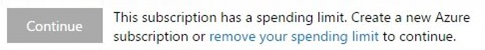

#	Marketplace billing and support overview

[!INCLUDE [version-ts-tfs-2015-2016](../_shared/version-ts-tfs-2015-2016.md)]

Here you will find answers to many common questions around the Visual Studio Marketplace and Azure billing.

*	[Purchasing Visual Studio subscriptions](#purchasingvs)  
*	[Azure billing](#billing)  
*	[Marketplace support](#marketplace-support)  

##	Purchasing Visual Studio subscriptions

<!-- BEGINSECTION class="m-qanda" -->

Visual Studio Professional and Visual Studio Enterprise 
are both available as monthly and annual subscriptions. 
The annual subscriptions provide incremental subscriber benefits, 
such as a monthly Azure credit and software for dev and test.

Learn more about Visual Studio subscriptions from this short video. To compare subscription options and select the best option for you, see [How to Buy Visual Studio](https://www.visualstudio.com/products/how-to-buy-vs).

<iframe src="//channel9.msdn.com/Events/Visual-Studio/Connect-event-2015/How-to-buy-Visual-Studio-cloud-subscriptions/player" width="600" height="315" allowFullScreen="true" frameBorder="0"></iframe>

###Q: What are the key differences between cloud subscriptions and standard subscriptions?

A:	Here are the key differences:

*	Your rights to use the included software expire when your 
cloud subscription expires.

	Standard subscriptions, like Visual Studio Professional 
	with MSDN and Visual Studio Enterprise with MSDN,
	usually include perpetual rights to use the included software.

*	You must sign in to the Visual IDE when you have 
a cloud subscription.

	Cloud subscriptions aren't the right option if you're disconnected 
	from the Internet for more than 30 days at a time. The Visual 
	Studio IDE will revert to a trial if a cloud subscription expires 
	(or reassigned to another user.)

	With a standard subscription, you can unlock the Visual Studio 
	IDE by using the provided product key, so you don't have to sign in.

*	You can only buy Visual Studio cloud subscriptions from the Visual Studio Marketplace.
You pay either monthly or annually based on the subscription, 
use an Azure subscription for billing, and pay with a credit card 
(or by invoice, if you set up invoicing).

	You buy standard subscriptions as usual directly from the online 
	Microsoft Store	or from a reseller.

###Q:	Who should consider buying cloud subscriptions?

A:	Here's some considerations:

*	*Monthly* subscriptions: You just need the Visual Studio IDE 
and already have licenses for other Microsoft software running 
in your dev and test environments.

*	*Annual* subscriptions: You need both the Visual Studio IDE
**and** a license to use other Microsoft software running 
in your dev and test environments. You also get 
[additional benefits](https://www.visualstudio.com/products/subscriber-benefits-vs), 
like a monthly Azure credit, technical support, special offers, and more. 

For both subscriptions, you get Basic access 
to any Visual Studio Team Services account.

###Q:	What's the difference between annual cloud subscriptions and standard subscriptions?

A:	Currently, Visual Studio Professional annual 
has the same benefits as Visual Studio Professional 
with MSDN. Visual Studio Enterprise annual has the 
same benefits as Visual Studio Enterprise with MSDN. 

###Q:	Do I get new versions of Visual Studio IDEs if I buy a Visual Studio subscription?

A:	Yes, if you have an active subscription, 
you can use any version of Visual Studio 2013 or later. 
Just download the trial version, 
sign in with the username and password that 
you used with your Visual Studio subscription, 
which unlocks the trial, and start coding!

###Q:	Are you going to discontinue standard Visual Studio subscriptions?

A:	Standard Visual Studio subscriptions are still the best option if you have
long-term software development needs, or if you need to work 
in fully offline development environments without Internet access. 
We understand that cloud subscriptions will not meet the needs for all customers.

If you buy through volume licensing, these subscriptions are still 
the most cost effective way to get Visual Studio and other 
Microsoft software and services for dev and test. 
There's no plan to stop selling standard Visual Studio subscriptions, 
so they're still available through Microsoft Volume Licensing 
resellers and the online Microsoft Store.

###Q:	Where are Visual Studio subscriptions offered?

A:	Visual Studio subscriptions are sold worldwide, 
in the markets where Microsoft Azure is 
[commercially available](https://azure.microsoft.com/en-us/pricing/faq/).

###Q:	Why don't I see Visual Studio subscriptions in the Azure classic portal and Azure portal?

A:	You can only buy Visual Studio subscriptions 
through the Visual Studio Marketplace.

###Q:	Can I buy Visual Studio cloud subscriptions from my software reseller?

A:	No, you can only buy these subscriptions from the 
[Visual Studio Marketplace](https://marketplace.visualstudio.com). 
Resellers can sell prepaid amounts of Azure services 
through the Enterprise Agreement (EA), Microsoft Products 
and Services Agreement (MPSA), and Open programs. 
Although you can use prepaid Azure funds from EA and 
MPSA toward most Azure services, you can't 
use these funds to pay for Visual Studio cloud subscriptions. 

You can use prepaid funds from Open to pay for Visual Studio subscriptions.

###Q:	What kind of volume discounts are available for Visual Studio subscriptions?

A:	You get a 5% discount on the 6th and all subsequent 
subscriptions within each type of subscription: 

*	Visual Studio Professional monthly
*	Visual Studio Professional annual
*	Visual Studio Enterprise monthly
*	Visual Studio Enterprise annual

So for example, if you buy 6 Visual Studio Professional 
monthly subscriptions and 5 Visual Studio Enterprise 
monthly subscriptions, you'll pay the regular price on 
5 Professional, get a 5% discount on the 6th Professional, 
and pay regular price on all 5 Enterprise subscriptions. 

Also, the discount only applies to charges in a given monthly 
billing period. So if you buy 5 Visual Studio Professional annual 
subscriptions in one month, and then you buy 5 more the next month, 
you'll pay the regular price on all 10 subscriptions.

###Q:	Are there renewal discounts?

A:	No, prices for Visual Studio subscriptions are flat. 
The same price is offered for new customers and continuing customers.

###Q:	Are there supplemental Enterprise Agreement discounts available for Visual Studio subscriptions?

A:	No, the only discounts available are based on volume of purchases.

<!-- ENDSECTION -->

##	Azure billing

When you buy from the Visual Studio Marketplace, 
you select an Azure subscription to use for billing. 
If you don't have an Azure subscription, 
you can [sign up](https://account.windowsazure.com/Subscriptions) 
either before or during your first purchase. 
You can set up payment with a credit card, 
or by invoice in some cases. Charges for your 
purchases will show up on your monthly Azure bill.

>[!NOTE]  
>You must keep your Azure subscription in good 
standing to use your Visual Studio Marketplace purchases. 

If your Azure subscription is canceled or becomes disabled, 
for example, because the credit card used for payment expires, 
then any purchases with this Azure subscription will be 
deactivated on the 1st day of next month. 
To continue using your Visual Studio Marketplace purchases, 
please keep your Azure subscription active and updated.

For example, if you bought a Visual Studio Professional subscription, 
and you used an Azure subscription that becomes disabled, 
your Visual Studio Professional IDE will stop working on 
the 1st of the following month. This also applies to annual 
Visual Studio subscriptions that are paid in full for the year. 

###Q:	Can I use an Enterprise Agreement to buy from the Visual Studio Marketplace?

A:	Yes, please buy directly from the Visual Studio Marketplace 
where you can bill purchases to the Azure subscription that was created 
under your [Enterprise Agreement (EA)](https://azure.microsoft.com/en-us/pricing/enterprise-agreement/). 
Don't order Visual Studio Marketplace services through your reseller.

###Q: How can I tell whether I have the necessary privileges to buy services in the Visual Studio Marketplace through my organization's Enterprise Agreement?

A: The easiest approach to determine if you have the right privileges is to click the **Buy** button for a service offered in the Visual Studio Marketplace. You need to select an Azure subscription (which is a billing account) from a presented list of Azure subscriptions that are currently linked to your login. Because the name of the Azure subscription defaults to the type of billing account ("Pay-As-You-Go", "Enterprise Agreement", etc.), it is often clear if the Azure subscription is part of your Enterprise Agreement.

Another approach is to attempt to visit the [Azure Enterprise Portal](http://ea.azure.com).  If you can reach it successfully, then you already have either the Enterprise Admin or the Account Owner role. Only Account Owners can set up new Azure billing accounts in an Enterprise Agreement. If you cannot access the Azure Enterprise Portal, then please inquire within your organization to find out who your Enterprise Admin is, and ask that person to add you as an Account Owner within the Azure Enterprise Portal.  If you are unable to find this person, you can [submit a support ticket](http://aka.ms/AzureEntSupport) and request the contact information.  You need your organization's name and your Enterprise Agreement enrollment number for the support ticket.

###Q:	Can I use the Azure Monetary Commitment funds from my Enterprise Agreement to buy from the Visual Studio Marketplace?

A:	You can use these prepaid funds to pay for: 

*	[Team Services users](https://marketplace.visualstudio.com/items?itemName=ms.vss-vstsuser) 
*	[Microsoft-published extensions for Team Services and Team Foundation Server](https://marketplace.visualstudio.com/vsts)
*	[Virtual user minutes for Cloud-based Load Testing](https://www.visualstudio.com/docs/setup-admin/team-services/buy-more-build-vs )
*	[HockeyApp plans](https://marketplace.visualstudio.com/subscriptions)

You can't use these funds to pay for Visual Studio cloud 
subscriptions and non-Microsoft extensions for Team Services and Team Foundation Server.

###Q:	Can I use the Azure Free Trial to buy from the Visual Studio Marketplace?

A:	No, you can't use the 
[Azure Free Trial](https://azure.microsoft.com/en-us/pricing/free-trial/) 
to pay for Visual Studio Marketplace purchases, 
which applies to Visual Studio Team Services, HockeyApp user plans, and so on. 
Instead, set up a separate Pay-As-You-Go Azure subscription,
which you can do before or during your purchase. 

###Q:	Can I use the monthly Azure credits from Visual Studio subscriptions or Visual Studio Dev Essentials to buy from the Visual Studio Marketplace?

A:	No, you can't use the monthly Azure credits from 
[Visual Studio subscriptions](https://www.visualstudio.com/products/subscriber-benefits-vs) 
and [Visual Studio Dev Essentials](https://www.visualstudio.com/en-us/products/visual-studio-dev-essentials-vs.aspx) 
to pay for Visual Studio Marketplace purchases. 
However, you can use the included Azure subscriptions to bill your purchases. 
Before you make purchases though, you must 
[remove your spending limit](https://azure.microsoft.com/en-us/pricing/spending-limits/) 
from these subscriptions.

>[!IMPORTANT]  
>Remove your spending limit indefinitely.
This prevents disabling your Azure subscription 
when your monthly charges are billed the next month.
Otherwise, all resources billed to this subscription will be suspended,
including virtual machines and all other workloads. 

###Q:	How often am I billed for Visual Studio subscriptions?

A: Your billing frequency depends on the subscriptions that you purchased:

*	Monthly subscriptions are prorated during the 1st month. 
After that, they're billed on the 1st day of the calendar month. 

    Increases for monthly subscriptions are prorated, 
    while updated charges for decreases take effect on the 1st of next month.

*	Annual subscriptions are always purchased in whole 
increments and are never prorated. Charges for subsequent 
years will be billed on the 1st day of the calendar month 
after the anniversary date of your subscription purchase.

[!INCLUDE [azure-bill-larger](../_shared/qa-azure-bill-larger.md)]

[!INCLUDE [azure-billing-support](./_shared/qa-azure-billing-support.md)]

[!INCLUDE [azure-subscriptions-for-billing](../_shared/qa-azure-subscriptions-for-billing.md)]

##Marketplace support  

[!INCLUDE [marketplace-support](./_shared/qa-marketplace-support.md)]

### Related notes

####Q:	What's happening to Visual Studio Online Professional?

A:	[Learn more here](https://go.microsoft.com/fwlink/?LinkId=698858).

[!INCLUDE [get-team-services-support](../_shared/qa-get-team-services-support.md)]