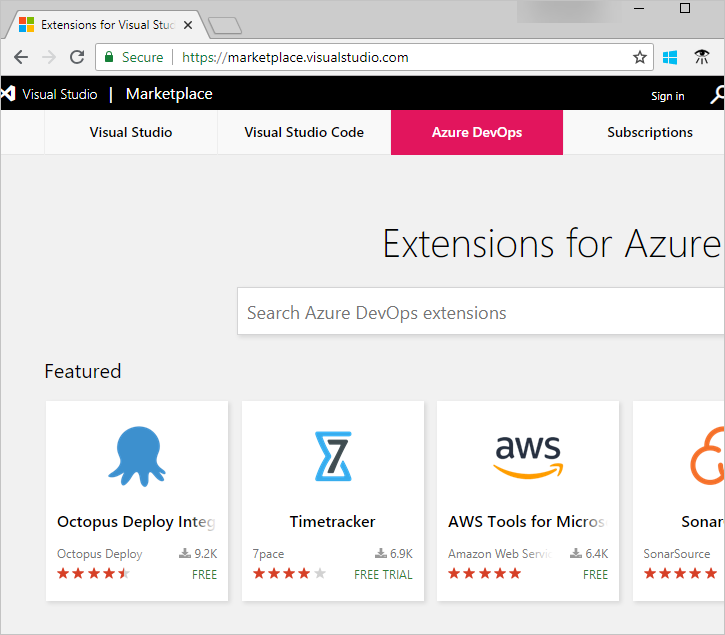

# Marketplace extensions for Azure DevOps

[!INCLUDE [version-ts-tfs-2015-2016](../includes/version-ts-tfs-2015-2016.md)]

Extensions are simple add-ons that can be used to customize and extend your experience with Azure DevOps. The [Marketplace](https://marketplace.visualstudio.com/azuredevops) is home to hundreds of extensions that can be installed to help with the following tasks:

- Planning and tracking of work items, sprints, scrums, and so on
- Pipelines build and release flows
- Code testing and tracking
- Collaboration among team members

In the Azure DevOps Marketplace you can do the following tasks:

- Discover and install extensions for Azure DevOps, Visual Studio, and Visual Studio Code
- Purchase Visual Studio subscriptions



Most extensions are available for free.
For information on purchasing, see the following articles:

- [Azure DevOps billing overview](../organizations/billing/overview.md)
- [How to pay for TFS users](../organizations/billing/buy-access-tfs-test-hub.md)
- [How to buy Visual Studio cloud subscriptions](/visualstudio/subscriptions/vscloud-overview)

## Add an extension

#### [Browser](#tab/browser)

You can quickly add extensions to your organization by doing the following steps:

1. Search and find extensions for your organization in the [Marketplace > Azure DevOps](https://marketplace.visualstudio.com/azuredevops).
2. Install the extension from the Marketplace and start using it in Azure DevOps.

To upload, install, or assign extensions you need [Project Collection Administrator or organization Owner permissions](./faq-extensions.yml).

#### [Azure DevOps CLI](#tab/azure-devops-cli/)

::: moniker range="= azure-devops"

Add an extension to your organization by first searching for and then installing the extension from the [Marketplace > Azure DevOps](https://marketplace.visualstudio.com/azuredevops).

[Search for extension](#search-extension) | [Install extension](install-extension.md#install-extension) 

<a id="search-extension" />

### Search for an extension

You can search for extensions from the marketplace with the [az devops extension search](/cli/azure/devops/extension#ext-azure-devops-az-devops-extension-search) command. To get started, see [Get started with Azure DevOps CLI](../cli/index.md).

```azurecli
az devops extension search --search-query
```

#### Parameters

- **search-query**: Specify a term to search in the marketplace.

#### Example

The following command searches the marketplace for the term **Timetracker** and returns the *Publisher ID* and *Extension ID* in table format.  

```azurecli 
az devops extension search --search-query Timetracker --output table

Publisher Id    Extension Id    Name
--------------  --------------  -----------
7pace           Timetracker     Timetracker
7pacelabs       kitten          Kitten
```

::: moniker-end

[!INCLUDE [temp](../includes/note-cli-not-supported.md)]

* * *

## Get or build extensions

| Product | Articles |
|-----------------------------|--------------------------------------------------------------------------------------------------|
| Azure DevOps | [Get extensions for Azure DevOps](install-extension.md) <br/> [Develop extensions for Azure DevOps](../extend/overview.md) |
| Visual Studio | [Get extensions for Visual Studio](https://marketplace.visualstudio.com/vs) <br/> [Develop extensions for Visual Studio](https://aka.ms/extendvs) |
| Visual Studio Code | [Get extensions for Visual Studio Code](https://marketplace.visualstudio.com/vscode) <br/> [Develop extensions for Visual Studio Code](https://go.microsoft.com/fwlink/?LinkID=703825) |

## Related articles

- [Install extensions](install-extension.md)
- [Request extensions and approve extension requests](request-extensions.md)
- [Manage extension permissions](how-to/grant-permissions.md)
- [Uninstall or disable extensions](uninstall-disable-extensions.md)
- [Extension FAQs](faq-extensions.yml)