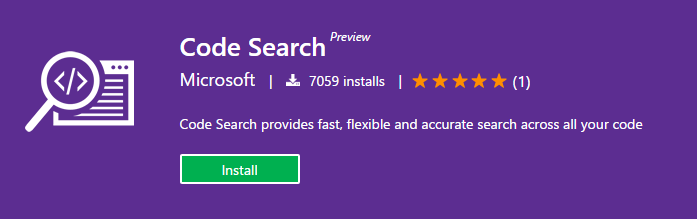
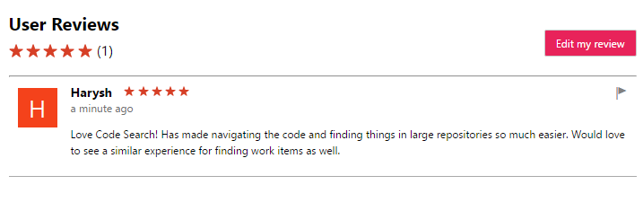

#  Ratings & Reviews

Find out what others think about an extension, or rate and review 
extensions yourself in Visual Studio Marketplace. If you're a 
publisher, you can respond to reviews directly on your extension 
page.

## Find reviews, rate and review extensions

You can see an extension's average rating on its tile or on the extension
page. To leave a rating or a review
 
1. Sign in to the Visual Studio Marketplace. 
2. Find the extension description page.
3. Go to the rating and review section by clicking the stars in the header 
or scrolling down the page. Click **Write a review** to leave your rating or review.

You can leave only one review, but you can edit your review at any time.

 

## Publisher response to reviews

As a publisher, you can respond to reviews that customers leave for your 
extensions in the Visual Studio Marketplace. If you have owner, creator, or 
contributor permissions as the publisher, you can find and click **Reply** 
next to a review.

 

Your response will show up under the review. 

 

You can leave only one response. Please avoid using reviews as a support forum. If 
you need more details, please provide a support alias for the reviewer to 
contact. You can then resolve their problems externally and then update your 
reply with a resolution.

### Guidelines for publisher response to reviews

As publishers, please help keep the Visual Studio Marketplace an open, 
inviting, respectful, and helpful place for customers to find, try, install, 
and review extensions. Communication plays an important role in keeping a 
healthy community. To help create this environment, here are guidelines for 
publishers responding to customer reviews. Please think deeply about your 
customer interactions and reflect on the spirit of the customer experience 
that the Marketplace is trying to create.

* Reviews are reserved for customer comments. Use *Reply* only to respond to 
a review. 
* Reviews are for sharing customer opinions, so *all opinions are valid*. 
Customers are entitled to their opinions, so please treat comments respectfully
as feedback without debate, criticism, or argument.
* Make sure that your responses add value and are relevant to your customers' 
comments.
* Focus on precisely addressing questions or problems. If you need more details, 
ask the customer to contact you over email, rather discuss in reviews. When you 
resolve the problem, please update your reply with the resolution. You can edit 
your reply, just like customers can edit their reviews.
* If you come across any inappropriate reviews, like spam, abusive, or offensive
content, for any extension, please flag it for our review.

## Publisher request to void a review

As a publisher, you can appeal to void a review if the issue reported is due to the Marketplace or the underlying platform. If the issue is valid, Marketplace admins will void the rating. 
You can **Appeal** from ratings and review section on your extension hub page.  

