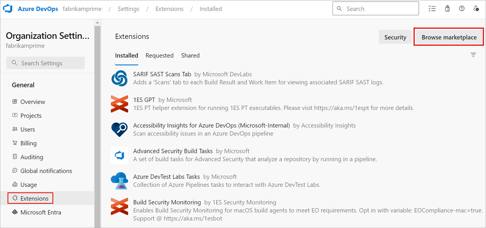
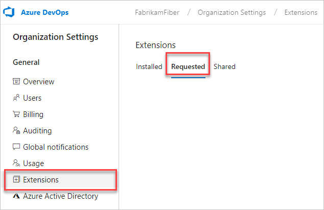
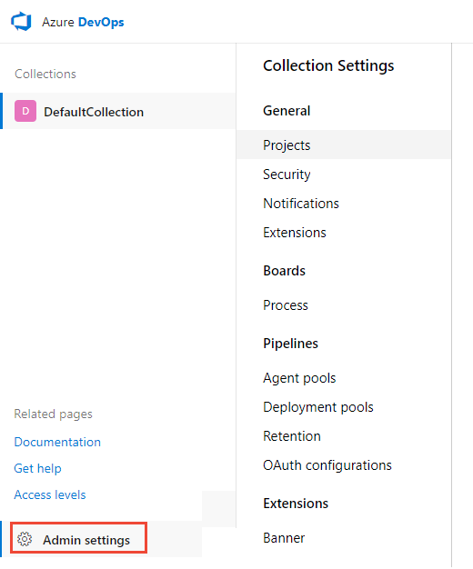
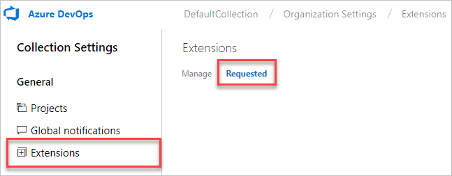
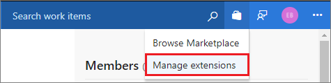
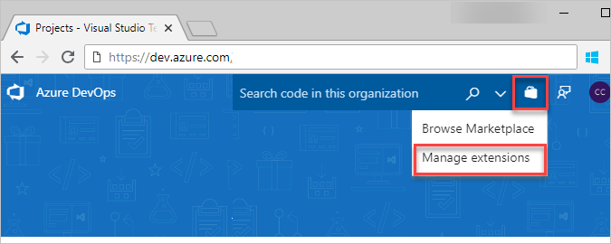

# Request and approve extensions

[!INCLUDE [version-ts-tfs-2015-2016](../includes/version-ts-tfs-2015-2016.md)]

If you don't have permissions to install extensions, you can request extensions instead. As a Project Collection Administrator, you get an email when another project member requests an extension. After you approve the request, the extension is automatically installed to Azure DevOps. Learn how to do the following tasks:

- [Request and approve extensions](#request-and-approve-extensions)
  - [Prerequisites](#prerequisites)
  - [Request an extension](#request-an-extension)
  - [Approve extension requests](#approve-extension-requests)
  - [Related articles](#related-articles)

## Prerequisites

- To request extensions, you must be a contributor for your organization.
- To approve extensions, you must be a member of the Project Collection Administrators group and have [**Edit collection-level information** permissions](../organizations/security/permissions.md#collection).

## Request an extension

::: moniker range=" azure-devops"

1. Sign in to your organization (```https://dev.azure.com/{yourorganization}```).

2. Select  **Organization settings**.

    

3. Select **Extensions**, and then **Browse marketplace**.

     

4. Select an extension to install.
5. If you don't have permission to install the extension, you can request it now.

Review your requests after the Marketplace sends the request to your Project Collection Administrator.

Your requests appear on the **Extensions** page, **Requested** tab.



::: moniker-end

::: moniker range="= azure-devops-2019 || azure-devops-2020"

1. Sign in to your organization (```https://dev.azure.com/{yourorganization}```).

2. Select  **Admin settings**.

    

3. Select **Extensions**, and then **Browse Marketplace**.

    

4. Select an extension to install.
5. If you don't have permission to install the extension, request it now.

Review your requests after the Marketplace sends the request to your Project Collection Administrator.

Your requests appear on the **Extensions** page, **Requested** tab.



::: moniker-end

::: moniker range=">=tfs-2015 < azure-devops-2019"

1. Select an extension from the [Visual Studio Marketplace > Azure DevOps](https://marketplace.visualstudio.com/azuredevops).

2. Select the project collection where you want to install the extension. If you don't have permission to install the extension, request it now.

You can review your requests after the Marketplace sends the request to your Project Collection or Project Administrator.

Your requests appear on your **Manage extensions** page.



::: moniker-end

To approve extensions, you must have [**edit collection-level information** permissions](../organizations/security/permissions.md#collection).

## Approve extension requests

::: moniker range=">= azure-devops-2019"

1. Go to your Azure DevOps home page, and then go to your project:

- Azure DevOps:```https://dev.azure.com/{organization}/{project}```

1. Select the shopping bag, and then **Manage extensions**.

   

2. Review and approve your requested extensions.

   > [!div class="mx-imgBorder"] 
   > 

   After you approve extension requests, the extensions are automatically installed.

3. [Assign those extensions](./install-extension.md) to users who need access.

::: moniker-end

::: moniker range="<= tfs-2018"

1. Go to your FS home page, then go to your project:

- TFS: ```https://{server}:8080/tfs/{team-project-collection}/{team-project}```

1. Select the shopping bag, and then **Manage extensions**.

   

2. Review and approve your requested extensions.

   > [!div class="mx-imgBorder"] 
   > 

   After you approve extension requests, the extensions are automatically installed.

3. [Assign those extensions](./install-extension.md) to users who need access.

::: moniker-end

Tell your team about installed extensions, so they can start using their capabilities.

## Related articles

- [FAQs](faq-extensions.yml)
- [Set up billing](../organizations/billing/set-up-billing-for-your-organization-vs.md)
- [Azure DevOps pricing](https://azure.microsoft.com/pricing/details/devops/azure-devops-services/)
- [Azure DevOps billing support](https://azure.microsoft.com/support/devops/)
- [Assign access levels by group membership](../organizations/accounts/assign-access-levels-by-group-membership.md)