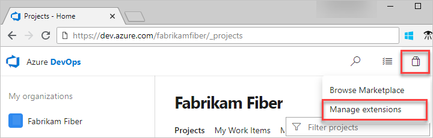

# Quickstart: Request and approve extensions

[!INCLUDE [version-vsts-tfs-2015-on](../boards/_shared/version-vsts-tfs-2015-on.md)]

If you don't have permissions to install extensions, you can request extensions instead. As a Project Collection Administrator, you get an email when another project member requests an extension. After you approve the request, the extension is automatically installed to Azure DevOps. In this article, learn how to do the following tasks:
- [Request an extension](#request-an-extension)
- [Approve extension requests](#approve-extension-requests)

## Prerequisites

- To request extensions, you must be a contributor for your organization
- To approve extensions, you must be a member of the Project Collection Administrators group or have [**edit collection-level information** permissions](../organizations/security/permissions.md#collection) set to *Allow*

## Request an extension

::: moniker range=" azure-devops"

1. Sign in to your organization (```https://dev.azure.com/{yourorganization}```).

2. Select  **Organization settings**.

    

3. Select **Extensions**, and then **Browse marketplace**.

     

4. Select an extension to install.
5. If you don't have permission to install the extension, you can request it now.

Review your requests after the Marketplace sends the request to your Project Collection Administrator.

Your requests appear on the **Extensions** page, **Requested** tab.


Your Project Collection Administrator can review your request after they get it.

::: moniker-end

::: moniker range="= azure-devops-2019"

1. Sign in to your organization (```https://dev.azure.com/{yourorganization}```).

2. Select  **Admin settings**.

    

3. Select **Extensions**, and then **Browse Marketplace**.

    

4. Select an extension to install.
5. If you don't have permission to install the extension, you can request it now.

Review your requests after the Marketplace sends the request to your Project Collection Administrator.

Your requests appear on the **Extensions** page, **Requested** tab.


Your Project Collection Administrator can review your request after they get it.

::: moniker-end

::: moniker range=">=tfs-2015 < azure-devops-2019"

1. Try to install the extension from the [Visual Studio Marketplace > Azure DevOps](https://marketplace.visualstudio.com/azuredevops).

2. Select the project collection (TFS) where you want to install the extension. If you don't have permission to install the extension, you can request it now.

You can review your requests after the Marketplace sends the request to your Project Collection or Project Administrator.

Your requests appear on your **Manage extensions** page.


Your Project Collection or Project Administrator can review your request after they get it.

::: moniker-end

To approve extensions, you must have [**edit collection-level information** permissions](../organizations/security/permissions.md#collection).

## Approve extension requests

::: moniker range=">= azure-devops-2019"

1. Go to your Azure DevOps or TFS home page, then go to your project:

   * Azure DevOps:```https://dev.azure.com/{organization}/{project}```
   * TFS: ```https://{server}:8080/tfs/{team-project-collection}/{team-project}```

2. Select the shopping bag icon and **Manage extensions**.

   

3. Review and approve your requested extensions.

   > [!div class="mx-imgBorder"] 
   > 

   After you approve extension requests, the extensions are automatically installed.

4. If you installed paid extensions, go to the next section to [assign those extensions](./assign-paid-extensions.md) to users who need access.

::: moniker-end

::: moniker range="<= tfs-2018"

1. Go to your Azure DevOps or TFS home page, then go to your project:

   * Azure DevOps: ```https://dev.azure.com/{organization}/{project}```
   * TFS: ```https://{server}:8080/tfs/{team-project-collection}/{team-project}```

2. Select the shopping bag icon and **Manage extensions**.

   

3. Review and approve your requested extensions.

   > [!div class="mx-imgBorder"] 
   > 

   After you approve extension requests, the extensions are automatically installed.

4. If you installed paid extensions, go to the next section to [assign those extensions](./assign-paid-extensions.md) to users who need access.

::: moniker-end

Tell your team about installed extensions, so they can start using their capabilities.

## Next steps

  > [!div class="nextstepaction"]
  > [Assign extension](install-extension.md#assign-paid-extensions-to-users)

## Related articles

- [FAQs](faq-extensions.md)
- [Set up billing](../organizations/billing/set-up-billing-for-your-organization-vs.md)
- [Azure DevOps pricing](https://azure.microsoft.com/pricing/details/devops/azure-devops-services/)
- [Azure DevOps billing support](https://azure.microsoft.com/support/devops/)
- [Assign access levels and extensions by group membership](../organizations/accounts/assign-access-levels-and-extensions-by-group-membership.md)

