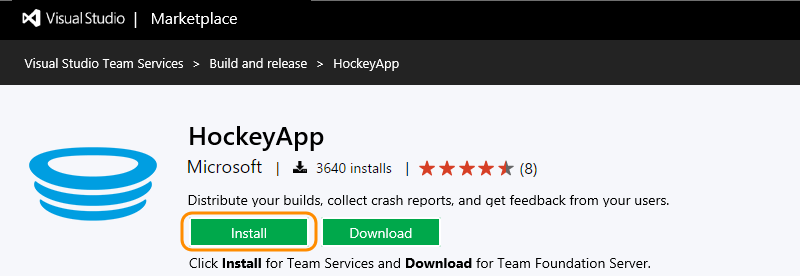
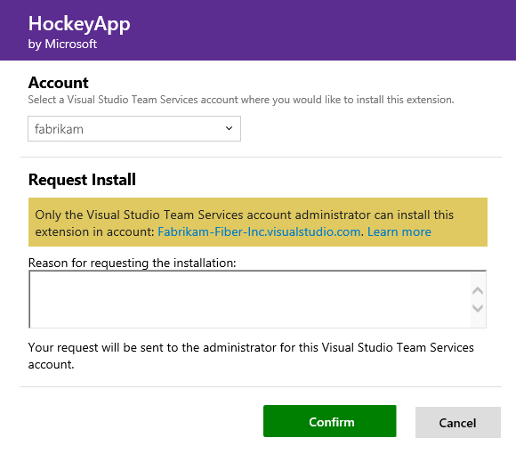

# Request permission for an extension for Visual Studio Team Services

**Team Services**

You need Team Services [project collection administrators or account owners](faq-extensions.md#find-owner) permissions to install extensions.

If you don't have permissions, you can request extensions instead:

0.  Sign in to [Visual Studio Marketplace > Visual Studio Team Services](https://marketplace.visualstudio.com/vsts).
	
	

0. Find and select the extension that you want to request.

0. Try to install the extension.

	

0. Select the Team Services account where you want to install the extension. 
If you don't have permissions to install the extension, 
you can request it now.

	

	You can review your requests after the Visual Studio Marketplace sends the request to the account owner.	

	

	Your requests appear on your Team Services account's extensions page.

	

	Your Team Services account owner or project collection administrator 
	can review your request after they get it.

	[Need help?](faq-extensions.md#get-support)

[Troubleshooting](faq-extensions.md)
