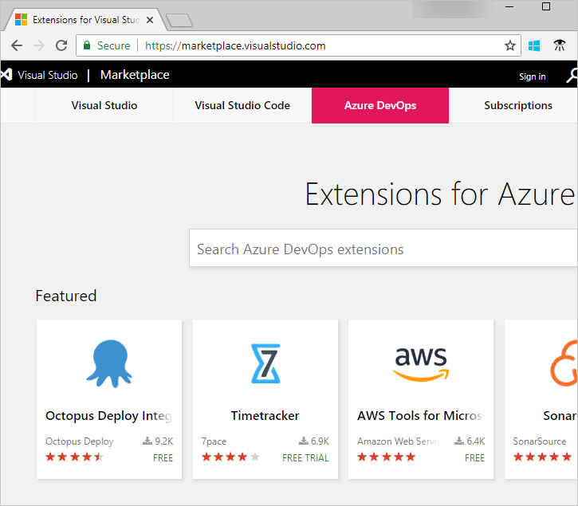

# Start the free trial for a paid extension in Azure DevOps 

**Azure DevOps Services**

To add new features and capabilities to your organization in Azure DevOps, install extensions from the [Visual Studio Marketplace](https://marketplace.visualstudio.com/azuredevops). You can install [free, preview, or paid](./faq-extensions.md#difference) extensions. In this quickstart, you learn how to start a free trial for a preview extension.

To learn about building your own Azure DevOps extensions, see [developing](https://aka.ms/vsoextensions) and [publishing](https://aka.ms/vsmarketplace-publish) extensions.

## Install an extension for your organization

### What do I need to install an extension?

* Only Azure DevOps [project collection administrators or organization owners](faq-extensions.md#find-owner) can install extensions. If you don't have permissions, you can [request extensions](request-vsts-extension.md) instead.

* Private extensions must be shared with your organization to be installed. Check out the [publishing documentation](../extend/publish/overview.md#upload) for information on how to share private extensions.

1. Sign in to the [Visual Studio Marketplace > Azure DevOps](https://marketplace.visualstudio.com/azuredevops).

    

2.	Find and select the extension that you want to install. For this quickstart, we choose [**Timetracker**](https://marketplace.visualstudio.com/items?itemName=Berichthaus.TfsTimetracker).

3.	Choose **Get**.

	

1.  Select your organization and **Start 30 day free trial**.

    > You can check the Permissions this extension requires and read the Terms of Services from this page.

	

	*	[Why don't I see any organizations?](./faq-extensions.md#no-organizations) 

	*	[Why can't I install this extension?](./faq-extensions.md#no-permissions) 

2. Your trial is now started and you can go to your organization to use your extension. Also, tell your team about this extension, so they can start using its capabilities too.

## Next steps

> [!div class="nextstepaction"]
   > [Uninstall disable extensions](uninstall-disable-extensions.md)

### Remaining trial period

You can check how many days are remaining in the trial period by revisiting the extension, selecting **Get**, and then choosing your organization.

Once the trial has ended, you will receive an email notifying you of the end of the trial period and the Marketplace acquisition page will show that the trial has expired. To continue to use the extension, you can choose to **Buy **the extension:

### Purchase the extension
You can buy the extension during the trial period, or you can buy it after the trial period is ended. Check out [Install paid Azure DevOps extension](./install-paid-extension.md) to learn how.

### Get help
You can find answers to common problems on the [troubleshooting](faq-extensions.md) page.
