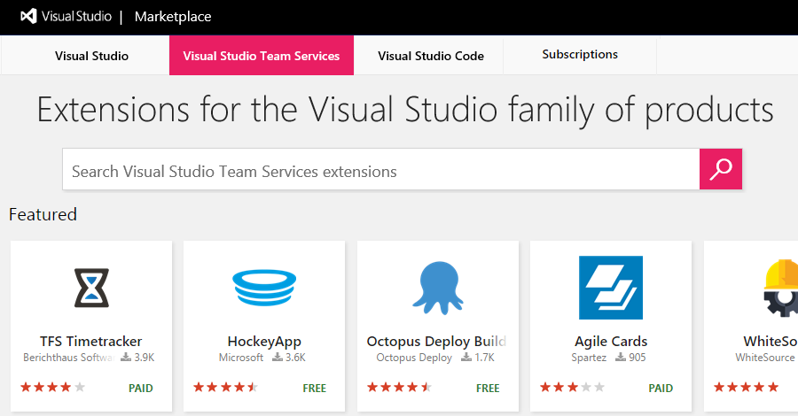

# Start the free trial for a paid extension in VSTS

**VSTS**

To add new features and capabilities to your Visual Studio Team Services (VSTS) account, install extensions from the [Visual Studio Marketplace](https://marketplace.visualstudio.com/vsts). You can install [free, preview, or paid](./faq-extensions.md#difference) extensions, this Quickstart covers starting the free trial for a preview extension. 

> [!TIP]
> To learn about building your own VSTS extensions, see [developing](http://aka.ms/vsoextensions) and 
> [publishing](http://aka.ms/vsmarketplace-publish) extensions.

## Install an extension for your VSTS account

### What do I need to install an extension?
* Only VSTS [project collection administrators or account owners](faq-extensions.md#find-owner) can install extensions. If you don't have permissions, you can [request extensions](request-vsts-extension.md) instead. 
* Private extensions must be shared with your VSTS account to be installed. Check out the
[publishing documentation](../extend/publish/overview.md#upload) for information on how to share private extensions.

0.  Sign in to the [Visual Studio Marketplace > VSTS](https://marketplace.visualstudio.com/vsts).
	
	

0.	Find and select the extension that you want to install. For this Quickstart, you can choose [**Timetracker**](https://marketplace.visualstudio.com/items?itemName=Berichthaus.TfsTimetracker).

0.	Click *Get*.

	

0.  Select your VSTS account and click to start your free trial. 

    > You can check the Permissions this extension requires and read the Terms of Services from this page. 

	

	*	[Why don't I see any VSTS accounts?](./faq-extensions.md#no-accounts) 

	*	[Why can't I install this extension?](./faq-extensions.md#no-permissions) 

0. Your trial is now started and you can go to your VSTS account to use your extension. Also, tell your team about this extension, so they can start using its capabilities too.

## Next steps

### Remaining trial period
You can check how many days are remaining in the trial period by revisiting the extension, clicking *Get*, and choosing your account.

Once the trial has ended, you will receive an email notifying you of the end of the trial period and the Marketplace acquisition page will show that the trial has expired. To continue to use the extension, you can choose to *Buy* the extension:

### Purchase the extension
You can buy the extension during the trial period, or you can buy it after its ended. Check out [Install paid VSTS extension](./install-paid-vsts-extension.md) to learn how.

### Get help
You can find answers to common problems on the [troubleshooting](faq-extensions.md) page.